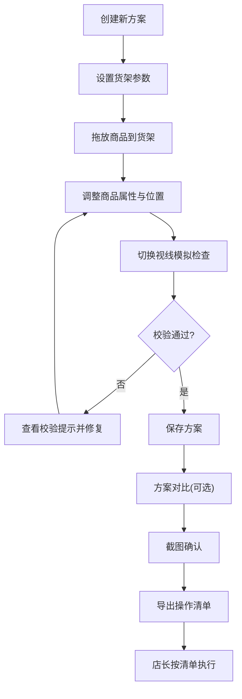

## 1. 产品概述

货架陈列高度模拟工具，面向便利店督导、前台和财务人员，在3D虚拟货架中拖放商品、调整层板高度与商品尺寸，模拟成人视线、儿童视线和补货可达范围，自动校验陈列问题并导出可执行的门店操作清单。解决手工画陈列图导致的商品遮挡、补货困难等痛点。

- 目标用户：便利店督导、前台运营、财务、区域经理、店长
- 核心价值：减少陈列方案与实际执行的偏差，降低门店调整成本，提升新品上架效率

## 2. 核心功能

### 2.1 用户角色

| 角色 | 使用场景 | 核心权限 |
|------|----------|----------|
| 督导 | 设计陈列方案、导出操作清单 | 创建/编辑/删除方案、导出清单 |
| 前台/财务 | 共用审核陈列方案 | 查看/评论方案 |
| 区域经理 | 对比确认方案、截图审批 | 查看/对比方案、截图 |
| 店长 | 按清单执行陈列调整 | 查看清单 |

### 2.2 功能模块

1. **3D货架编辑器**：3D货架场景、商品拖放、层板高度调整、商品尺寸设置、重点展示面标记
2. **视线与可达模拟**：成人视线平面（160cm）、儿童视线平面（110cm）、补货可达范围可视化
3. **陈列校验系统**：商品超出层板、同位置重叠、重量层板不匹配的自动提示
4. **方案管理**：方案保存、方案对比（左右并排）、方案截图导出
5. **导出中心**：每层摆放清单、需调整商品列表、补货注意点、截图下载

### 2.3 页面详情

| 页面名称 | 模块名称 | 功能描述 |
|----------|----------|----------|
| 3D货架编辑器 | 3D货架场景 | 渲染多层货架3D模型，支持旋转、缩放、平移查看 |
| 3D货架编辑器 | 商品面板 | 左侧商品列表，按类别分组，可拖拽到货架上 |
| 3D货架编辑器 | 属性面板 | 右侧选中商品/层板的属性编辑（尺寸、重量、展示面） |
| 3D货架编辑器 | 视线切换 | 底部工具栏切换成人/儿童/补货视角，高亮可见与不可见区域 |
| 3D货架编辑器 | 校验提示 | 实时校验并以标签形式显示问题（超出、重叠、重量） |
| 方案管理页 | 方案列表 | 所有已保存方案卡片展示，支持创建/删除/复制 |
| 方案管理页 | 方案对比 | 左右并排两个3D货架，差异高亮标注 |
| 导出中心页 | 摆放清单 | 按层板分组列出商品名称、位置、尺寸、展示面朝向 |
| 导出中心页 | 调整建议 | 自动生成的需调整商品列表及原因 |
| 导出中心页 | 补货注意点 | 补货可达范围外的商品提醒 |
| 导出中心页 | 截图导出 | 当前3D视图截图下载，支持双方案并排截图 |

## 3. 核心流程

1. 督导创建新方案 → 设置货架参数（层数、层板高度、货架宽度）
2. 从商品面板拖放商品到货架 → 调整位置和属性
3. 切换视线视角检查可见性 → 查看校验提示修复问题
4. 保存方案 → 区域经理打开对比视图 → 截图确认
5. 督导导出操作清单 → 店长按清单执行

## 4. 用户界面设计

### 4.1 设计风格

- **主色调**：深灰底色 (#1a1a2e) + 琥珀色强调 (#f59e0b)，营造专业仓储氛围
- **辅助色**：钢蓝 (#3b82f6) 用于信息提示，翠绿 (#10b981) 用于校验通过，玫红 (#f43f5e) 用于错误警告
- **按钮风格**：圆角矩形（8px），微3D效果（box-shadow），hover时上浮
- **字体**：标题使用 Noto Sans SC Bold，正文使用 Noto Sans SC Regular
- **布局**：左侧商品面板（280px）+ 中间3D视图（自适应）+ 右侧属性面板（300px）
- **图标**：Lucide Icons，线型风格，2px描边

### 4.2 页面设计概览

| 页面名称 | 模块名称 | UI 元素 |
|----------|----------|---------|
| 3D货架编辑器 | 3D货架场景 | 深色背景3D画布，金属质感货架，商品以彩色方块+标签呈现 |
| 3D货架编辑器 | 商品面板 | 可折叠分类树，拖拽手柄，商品缩略图+名称+尺寸 |
| 3D货架编辑器 | 属性面板 | 表单式布局，滑块调整尺寸，色块选择展示面 |
| 3D货架编辑器 | 视线切换 | 底部工具栏图标按钮组，选中态琥珀色高亮 |
| 3D货架编辑器 | 校验提示 | 顶部浮动标签栏，按严重程度红/黄/蓝着色 |
| 方案管理页 | 方案列表 | 卡片网格，缩略图+名称+时间，hover浮现操作按钮 |
| 方案管理页 | 方案对比 | 双栏3D视图，差异商品闪烁高亮 |
| 导出中心页 | 全部模块 | 分区卡片，打印友好排版，截图预览区 |

### 4.3 响应式策略

- 桌面优先设计，最小宽度1280px
- 3D视图自适应容器，属性面板可收起
- 平板端（1024px）隐藏商品面板为抽屉，属性面板为底部弹出

### 4.4 3D场景指引

- **环境/氛围**：冷白顶光模拟店内照明，弱环境光阴影，地面淡灰网格
- **灯光**：主方向光（模拟顶灯）+ 弱环境光 + 补货视角时侧光
- **相机**：默认45度俯视，可旋转/缩放；切换视角时相机平滑过渡到对应高度
- **构图焦点**：货架居中，商品突出，背景虚化
- **交互**：OrbitControls旋转缩放，Raycasting选中商品，拖拽移动
- **后处理**：轻微Bloom突出选中的商品，AO增强层次
- **性能预算**：单场景≤200个Mesh，60fps目标

## 5. 数据模型

### 商品定义

| 字段 | 类型 | 说明 |
|------|------|------|
| id | string | 商品唯一标识 |
| name | string | 商品名称 |
| category | string | 分类（饮料/零食/日用/冷柜） |
| width | number | 宽度(cm) |
| height | number | 高度(cm) |
| depth | number | 深度(cm) |
| weight | number | 重量(kg) |
| displayFace | enum | 重点展示面(front/back/left/right/top) |
| color | string | 3D渲染颜色 |

### 货架定义

| 字段 | 类型 | 说明 |
|------|------|------|
| id | string | 货架唯一标识 |
| name | string | 货架名称 |
| width | number | 货架宽度(cm) |
| depth | number | 货架深度(cm) |
| shelves | Shelf[] | 层板列表 |

### 层板定义

| 字段 | 类型 | 说明 |
|------|------|------|
| id | string | 层板唯一标识 |
| heightFromGround | number | 离地高度(cm) |
| maxLoad | number | 最大承重(kg) |

### 陈列方案

| 字段 | 类型 | 说明 |
|------|------|------|
| id | string | 方案唯一标识 |
| name | string | 方案名称 |
| shelf | ShelfConfig | 货架配置 |
| placements | Placement[] | 商品摆放列表 |
| createdAt | string | 创建时间 |
| updatedAt | string | 更新时间 |

### 摆放位置

| 字段 | 类型 | 说明 |
|------|------|------|
| productId | string | 商品ID |
| shelfId | string | 所在货架ID |
| shelfLayerId | string | 所在层板ID |
| positionX | number | X坐标(cm) |
| positionZ | number | Z坐标(cm) |
| rotationY | number | Y轴旋转角度 |
