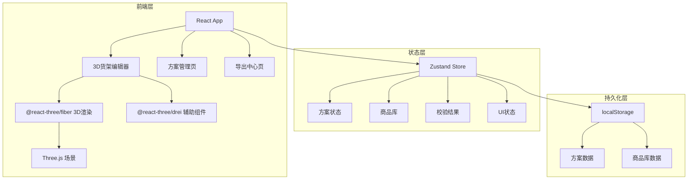
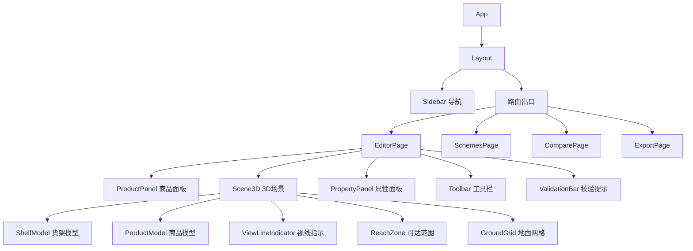

## 1. 架构设计



## 2. 技术说明

- **前端框架**：React@18 + TypeScript + Vite
- **3D渲染**：three@0.170 + @react-three/fiber@8 + @react-three/drei@9 + @react-three/postprocessing
- **样式方案**：Tailwind CSS@3
- **状态管理**：Zustand（轻量、无Provider）
- **路由**：react-router-dom@6
- **图标**：lucide-react
- **后端**：无（纯前端，数据存localStorage）
- **数据库**：无（localStorage持久化，可扩展至IndexedDB）
- **截图导出**：html2canvas + Three.js renderer.domElement.toDataURL()

## 3. 路由定义

| 路由 | 用途 |
|------|------|
| / | 重定向到 /editor |
| /editor | 3D货架编辑器主页面 |
| /schemes | 方案管理列表页 |
| /compare | 方案对比页（支持 ?left=id&right=id 参数） |
| /export/:id | 导出中心页 |

## 4. 核心组件架构



## 5. Zustand Store 设计

### schemeStore（方案状态）

```typescript
interface SchemeStore {
  currentSchemeId: string | null
  schemes: Map<string, Scheme>
  createScheme: (name: string) => string
  deleteScheme: (id: string) => void
  duplicateScheme: (id: string, newName: string) => string
  updateScheme: (id: string, partial: Partial<Scheme>) => void
  addPlacement: (schemeId: string, placement: Placement) => void
  removePlacement: (schemeId: string, placementId: string) => void
  updatePlacement: (schemeId: string, placementId: string, partial: Partial<Placement>) => void
  updateShelfConfig: (schemeId: string, shelfConfig: Partial<ShelfConfig>) => void
}
```

### productStore（商品库）

```typescript
interface ProductStore {
  products: Product[]
  addProduct: (product: Product) => void
  removeProduct: (id: string) => void
  updateProduct: (id: string, partial: Partial<Product>) => void
  getByCategory: (category: string) => Product[]
}
```

### uiStore（UI状态）

```typescript
interface UIStore {
  selectedPlacementId: string | null
  viewMode: 'free' | 'adult' | 'child' | 'restock'
  showValidation: boolean
  leftPanelCollapsed: boolean
  rightPanelCollapsed: boolean
  compareLeftId: string | null
  compareRightId: string | null
  setViewMode: (mode: UIStore['viewMode']) => void
  setSelectedPlacement: (id: string | null) => void
}
```

### validationStore（校验结果）

```typescript
interface ValidationStore {
  issues: ValidationIssue[]
  validate: (scheme: Scheme) => void
}

interface ValidationIssue {
  type: 'overflow' | 'overlap' | 'weight'
  severity: 'error' | 'warning' | 'info'
  placementIds: string[]
  message: string
  shelfLayerId: string
}
```

## 6. 3D场景核心逻辑

### 6.1 坐标系

- X轴：货架宽度方向（左右）
- Y轴：高度方向（上下），0为地面
- Z轴：深度方向（前后）

### 6.2 视线模拟

| 视角 | 相机高度(Y) | 相机朝向 | 可视化 |
|------|------------|---------|--------|
| 成人视线 | 160cm | 水平向前 | 半透明平面标示可视区域 |
| 儿童视线 | 110cm | 水平向前 | 半透明平面标示可视区域 |
| 补货可达 | 0-190cm | 侧视 | 弧形区域标示可达范围 |

### 6.3 校验规则

| 规则 | 触发条件 | 严重程度 |
|------|----------|---------|
| 商品超出层板 | 商品顶部高度 > 上层板底部高度 | error |
| 商品重叠 | 两个商品在XZ平面投影面积重叠 > 10% | error |
| 重量超限 | 单层层板商品总重量 > 层板最大承重 | error |
| 展示面被遮挡 | 商品重点展示面朝向被相邻商品遮挡 | warning |
| 补货困难 | 商品位置高度 > 190cm | warning |
| 儿童视线不可见 | 商品全部在儿童视线以下或以上 | info |

## 7. 导出功能设计

### 7.1 摆放清单格式

按层板从上到下分组，每行：序号、商品名称、位置(X坐标)、尺寸(W×H×D)、展示面朝向

### 7.2 调整建议格式

每条：商品名称、问题描述、建议操作（如"建议移至第2层"、"建议降低层板高度5cm"）

### 7.3 补货注意点格式

每条：商品名称、所在层、注意点（如"最上层，需踏步台补货"）

### 7.4 截图

- 单方案截图：当前3D视图（含校验标注）
- 双方案对比截图：左右并排两个3D视图
- 格式：PNG，分辨率1920×1080

## 8. 预置商品数据

提供4个分类的预置商品库（可扩展）：

| 分类 | 示例商品 | 尺寸范围(W×H×D cm) |
|------|----------|-------------------|
| 饮料 | 大瓶可乐、小瓶矿泉水、罐装咖啡 | 6-12 × 12-32 × 6-12 |
| 零食 | 薯片袋、巧克力盒、口香糖 | 5-25 × 5-20 × 3-10 |
| 日用 | 牙膏、纸巾、洗手液 | 5-12 × 10-25 × 3-10 |
| 冷柜 | 饭团、三明治、酸奶 | 8-15 × 5-12 × 4-8 |
