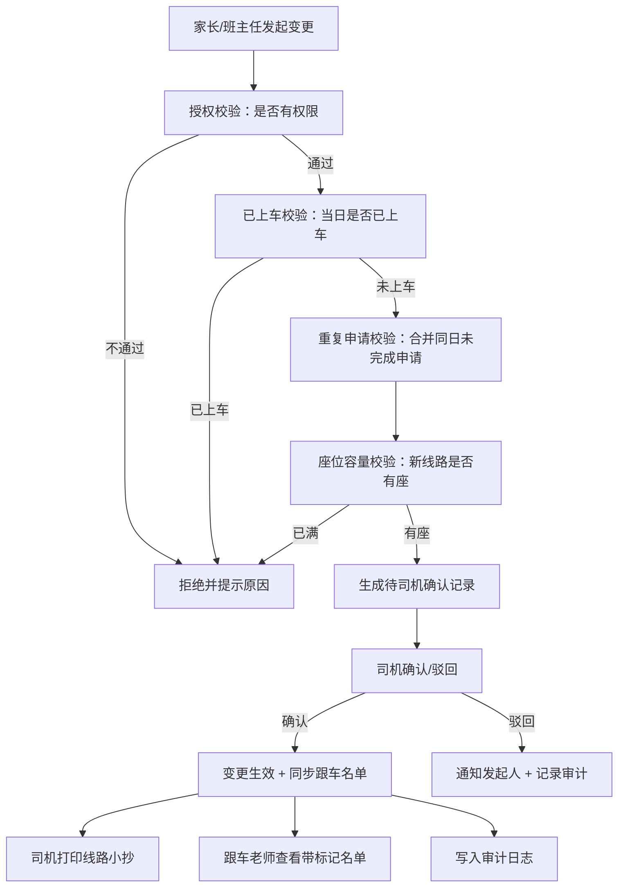

## 1. 产品概述

校车上车点变更服务是一套面向小学家校协同场景的业务系统，解决校车早班期间家长临时告知"孩子今天去外婆家上车"等上车点变更需求，导致班主任、司机、跟车老师多方消息不同步的痛点。系统通过标准化的申请-校验-确认-同步流程，确保变更信息准确、可追溯、可审计。

- 目标用户：家长、班主任、校车司机、跟车老师、校务处/督导
- 核心价值：消除信息不对称，避免漏接/错接学生，提供完整审计留痕

---

## 2. 核心功能

### 2.1 用户角色

| 角色 | 登录方式 | 核心权限 |
|------|----------|----------|
| 家长 | 账号密码 | 仅能为自己授权的孩子发起/查看变更申请 |
| 班主任 | 账号密码 | 为本班任意学生发起变更，查看本班变更记录 |
| 司机 | 账号密码 | 查看自己负责线路的待确认变更，确认/驳回，打印线路小抄 |
| 跟车老师 | 账号密码 | 查看跟车线路当日学生名单（含特殊变更及确认状态） |
| 校务处/督导 | 账号密码 | 全局查看所有变更记录，导出审计 CSV |

### 2.2 功能模块

1. **登录与角色切换**：统一登录入口，根据角色渲染不同首页
2. **发起变更申请**：家长/班主任选择学生、日期、原线路、新上车点提交
3. **变更校验引擎**：座位容量、已上车锁定、重复申请合并、授权校验
4. **司机确认工作台**：待确认变更列表、一键确认/驳回、按线路打印小抄
5. **跟车名单查询**：当日线路完整名单，特殊变更高亮标注
6. **审计记录导出**：按日期范围筛选并导出变更历史 CSV

### 2.3 页面详情

| 页面名称 | 模块名称 | 功能描述 |
|----------|----------|----------|
| 登录页 | 登录表单 | 账号密码登录，错误提示 |
| 家长首页 | 我的孩子列表 + 发起变更 | 展示授权孩子、当前有效变更、新建变更表单 |
| 班主任首页 | 班级学生列表 + 发起变更 | 本班学生、变更记录、快速发起 |
| 司机工作台 | 待确认列表 + 线路小抄打印 | 按线路分组待确认项、确认/驳回操作、打印按钮 |
| 跟车老师名单页 | 当日线路名单 | 学生名单、变更标记（颜色区分确认状态） |
| 校务处审计页 | 变更历史 + 筛选导出 | 日期/线路/状态筛选、导出 CSV |

---

## 3. 核心流程

家长或班主任登录后，选择需变更的学生与出行日期，系统自动带出原乘车线路与默认上车点，用户选择新上车点后提交。系统进行四维修订：① 该用户是否有权为该学生发起变更；② 该学生当日是否已被标记上车（已上车则拒绝）；③ 同一学生当日是否存在未完成的重复申请（有则合并为最新）；④ 新上车点所属的线路在该日期是否仍有剩余座位。校验通过后，变更进入"待司机确认"状态。

司机登录后看到按线路分组的待确认变更，可逐条或批量确认/驳回。确认后变更生效，跟车老师与司机端实时同步。跟车老师在发车前查看名单时，已变更学生以醒目颜色标注并显示确认状态。司机可一键打印当前线路的临时变更小抄（含学生姓名、原站点、新站点、联系方式）。校务处可按任意时间范围导出全部变更审计记录。

---

## 4. 用户界面设计

### 4.1 设计风格

- **主色**：温暖橙 `#FF7A45`（校车安全色） + 深蓝 `#1E3A5F`（专业稳重）
- **辅助色**：确认绿 `#10B981`、驳回红 `#EF4444`、待处理琥珀 `#F59E0B`
- **按钮风格**：大圆角（12px）、实心底色、hover 轻微上浮阴影
- **字体**：标题用 "Noto Sans SC" 700，正文用 "Noto Sans SC" 400/500
- **布局风格**：卡片式布局，顶部角色导航，侧边角色快捷入口
- **图标**：emoji 风格图标（🚌 📋 ✅ ❌ 📝 🖨️），保持友好童真感

### 4.2 页面设计概览

| 页面名称 | 模块名称 | UI 元素 |
|----------|----------|---------|
| 登录页 | 登录卡片 | 居中卡片、校车插画背景、橙蓝渐变按钮、角色切换标签 |
| 家长首页 | 孩子卡片 + 表单 | 孩子头像卡片、时间轴展示变更历史、表单分步引导 |
| 司机工作台 | 线路分组列表 | 可折叠线路卡片、每条变更带学生头像、状态彩色徽标、打印按钮带打印机动画 |
| 跟车名单页 | 名单表格 | 斑马纹表格、变更行背景高亮、状态气泡标签 |
| 审计页 | 筛选 + 表格 | 日期范围选择器、多条件筛选、导出按钮带下载动效 |

### 4.3 响应式

桌面优先设计，平板自适应，手机端单列堆叠；所有操作按钮在移动端保持 ≥44px 触达区域；打印小抄专门适配 A5 纸张打印样式。
