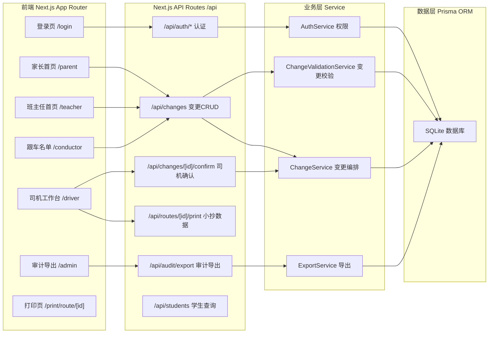
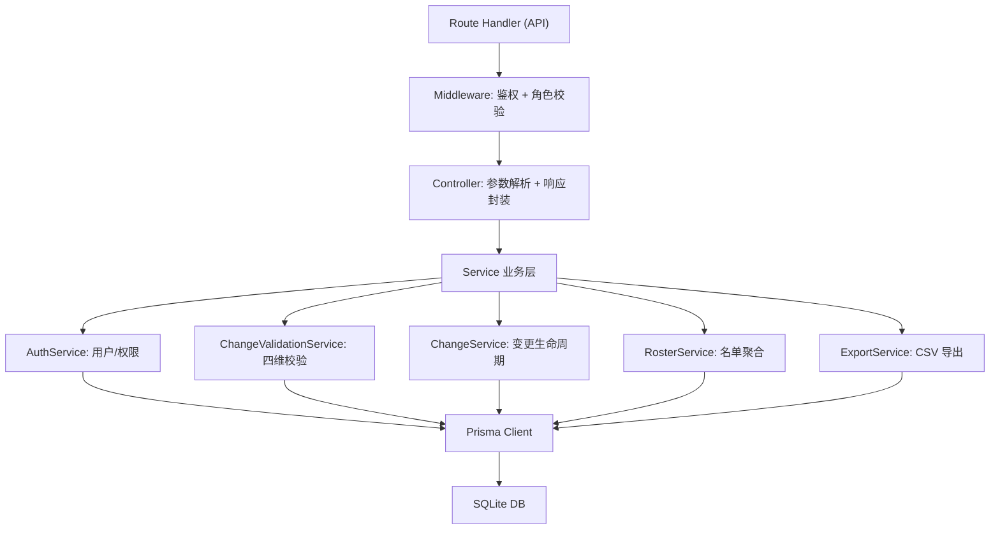

## 1. 架构设计



---

## 2. 技术说明

- **前端框架**：Next.js 14 (App Router) + React 18 + TypeScript 5
- **样式方案**：TailwindCSS 3 + CSS Variables（主题色变量化）
- **状态管理**：React Server Components 为主，客户端用 useState + SWR
- **后端能力**：Next.js Route Handlers（/api 目录）
- **ORM**：Prisma 5
- **数据库**：SQLite（单文件 `prisma/dev.db`，零配置）
- **认证**：基于 JWT 的自实现简易认证（HttpOnly Cookie），不引入 NextAuth 以保持轻量
- **打印**：浏览器 window.print() + 专门 `/print/*` 路由 + @media print 样式
- **导出**：服务端生成 CSV 流，Content-Disposition 触发下载
- **初始化工具**：`create-next-app@latest` --ts --tailwind --eslint --app --no-src-dir --import-alias "@/*"

---

## 3. 路由定义

| 路由 | 用途 | 权限角色 |
|------|------|----------|
| `/login` | 登录页 | 公开 |
| `/` | 角色分发首页（根据登录角色跳转） | 需登录 |
| `/parent` | 家长首页：我的孩子、发起变更、变更历史 | 家长 |
| `/teacher` | 班主任首页：班级学生、发起变更 | 班主任 |
| `/driver` | 司机工作台：待确认列表、打印小抄 | 司机 |
| `/conductor` | 跟车老师：当日线路名单 | 跟车老师 |
| `/admin` | 校务处：审计筛选与导出 | 校务处 |
| `/print/route/[routeId]?date=YYYY-MM-DD` | 线路临时变更小抄（打印专用） | 司机 |
| `/api/auth/login` | 登录接口 | 公开 |
| `/api/auth/logout` | 登出接口 | 需登录 |
| `/api/auth/me` | 当前用户信息 | 需登录 |
| `/api/changes` | GET 查询变更列表 / POST 发起变更 | 家长/班主任 |
| `/api/changes/[id]` | GET 详情 / PATCH 撤回 | 发起人 |
| `/api/changes/[id]/confirm` | POST 司机确认/驳回 | 司机 |
| `/api/students` | GET 学生列表（按权限过滤） | 家长/班主任 |
| `/api/routes` | GET 线路列表（含站点、容量） | 全部登录 |
| `/api/routes/[id]/roster?date=YYYY-MM-DD` | GET 当日线路名单（含变更标记） | 跟车老师/司机 |
| `/api/audit/export` | GET 导出审计 CSV | 校务处 |

---

## 4. API 定义

```typescript
// ========== 认证 ==========
interface LoginRequest { email: string; password: string }
interface LoginResponse { user: User; token: string }
interface User {
  id: string;
  name: string;
  email: string;
  role: 'PARENT' | 'TEACHER' | 'DRIVER' | 'CONDUCTOR' | 'ADMIN';
  classId?: string;        // 班主任所属班级
  routeId?: string;        // 司机/跟车老师所属线路
}

// ========== 学生 ==========
interface Student {
  id: string;
  name: string;
  studentNo: string;
  classId: string;
  className: string;
  defaultRouteId: string;
  defaultStopId: string;
  parentIds: string[];     // 授权家长列表
}

// ========== 线路 ==========
interface BusStop { id: string; name: string; address: string; routeId: string; sequence: number }
interface BusRoute {
  id: string;
  name: string;
  plateNo: string;
  capacity: number;         // 总座位
  stops: BusStop[];
  driverId?: string;
  conductorId?: string;
}

// ========== 变更申请 ==========
type ChangeStatus = 'PENDING' | 'CONFIRMED' | 'REJECTED' | 'CANCELLED' | 'MERGED';
interface ChangeRequest {
  id: string;
  studentId: string;
  studentName: string;
  date: string;             // YYYY-MM-DD
  originalRouteId: string;
  originalStopId: string;
  newRouteId: string;
  newStopId: string;
  reason: string;
  initiatorId: string;
  initiatorName: string;
  initiatorRole: User['role'];
  status: ChangeStatus;
  confirmedById?: string;
  confirmedAt?: string;
  createdAt: string;
  updatedAt: string;
}
interface CreateChangeRequest {
  studentId: string;
  date: string;
  newRouteId: string;
  newStopId: string;
  reason?: string;
}
interface ConfirmChangeRequest { decision: 'CONFIRMED' | 'REJECTED'; comment?: string }

// ========== 上车记录 ==========
interface BoardingRecord {
  id: string;
  studentId: string;
  routeId: string;
  stopId: string;
  date: string;
  boardedAt: string;        // 已上车则存在，用于锁定变更
  markedById: string;
}

// ========== 审计日志 ==========
interface AuditLog {
  id: string;
  action: string;            // CREATE/CONFIRM/REJECT/CANCEL/MERGE/EXPORT
  changeId?: string;
  operatorId: string;
  operatorName: string;
  operatorRole: User['role'];
  detail: string;            // JSON string
  createdAt: string;
}
```

---

## 5. 服务端架构图



---

## 6. 数据模型

### 6.1 ER 图

```mermaid
erDiagram
    User ||--o{ ParentStudent : "授权"
    User ||--o{ ChangeRequest : "发起"
    User ||--o{ ChangeRequest : "确认"
    User ||--o{ AuditLog : "操作"
    User ||--o{ BoardingRecord : "标记"
    User }o--|| Class : "班主任"
    User }o--|| BusRoute : "司机"
    User }o--|| BusRoute : "跟车老师"
    Student ||--o{ ParentStudent : "被授权"
    Student }o--|| Class : "属于"
    Student }o--|| BusRoute : "默认线路"
    Student }o--|| BusStop : "默认站点"
    Student ||--o{ ChangeRequest : "变更"
    Student ||--o{ BoardingRecord : "上车"
    Class ||--o{ Student : "包含"
    BusRoute ||--o{ BusStop : "站点"
    BusRoute ||--o{ ChangeRequest : "原线路"
    BusRoute ||--o{ ChangeRequest : "新线路"
    BusRoute ||--o{ BoardingRecord : "乘车"
    BusStop ||--o{ ChangeRequest : "原站点"
    BusStop ||--o{ ChangeRequest : "新站点"
    BusStop ||--o{ BoardingRecord : "上车站点"
    ChangeRequest ||--o{ AuditLog : "关联"
```

### 6.2 Prisma Schema (关键片段)

```prisma
model User {
  id        String   @id @default(cuid())
  email     String   @unique
  password  String
  name      String
  role      String   // PARENT/TEACHER/DRIVER/CONDUCTOR/ADMIN
  classId   String?
  routeId   String?
  createdAt DateTime @default(now())
  class     Class?   @relation(fields: [classId], references: [id])
  route     BusRoute? @relation(fields: [routeId], references: [id])
}

model Class {
  id         String    @id @default(cuid())
  name       String    @unique
  grade      Int
  students   Student[]
  teachers   User[]
}

model Student {
  id              String          @id @default(cuid())
  name            String
  studentNo       String          @unique
  classId         String
  defaultRouteId  String
  defaultStopId   String
  class           Class           @relation(fields: [classId], references: [id])
  defaultRoute    BusRoute        @relation("StudentDefaultRoute", fields: [defaultRouteId], references: [id])
  defaultStop     BusStop         @relation("StudentDefaultStop", fields: [defaultStopId], references: [id])
  parentLinks     ParentStudent[]
  changes         ChangeRequest[]
  boardings       BoardingRecord[]
}

model ParentStudent {
  id        String  @id @default(cuid())
  parentId  String
  studentId String
  parent    User    @relation(fields: [parentId], references: [id])
  student   Student @relation(fields: [studentId], references: [id])
  @@unique([parentId, studentId])
}

model BusRoute {
  id            String          @id @default(cuid())
  name          String          @unique
  plateNo       String
  capacity      Int
  stops         BusStop[]
  defaultStudents Student[]     @relation("StudentDefaultRoute")
  originalChanges ChangeRequest[] @relation("ChangeOriginalRoute")
  newChanges    ChangeRequest[] @relation("ChangeNewRoute")
  boardings     BoardingRecord[]
  drivers       User[]
  conductors    User[]
}

model BusStop {
  id             String          @id @default(cuid())
  name           String
  address        String
  routeId        String
  sequence       Int
  route          BusRoute        @relation(fields: [routeId], references: [id])
  defaultStudents Student[]      @relation("StudentDefaultStop")
  originalChanges ChangeRequest[] @relation("ChangeOriginalStop")
  newChanges     ChangeRequest[] @relation("ChangeNewStop")
  boardings      BoardingRecord[]
  @@unique([routeId, sequence])
}

model ChangeRequest {
  id               String   @id @default(cuid())
  studentId        String
  date             String   // YYYY-MM-DD 索引
  originalRouteId  String
  originalStopId   String
  newRouteId       String
  newStopId        String
  reason           String?
  initiatorId      String
  initiatorRole    String
  status           String   // PENDING/CONFIRMED/REJECTED/CANCELLED/MERGED
  mergedToId       String?
  confirmedById    String?
  confirmedAt      DateTime?
  createdAt        DateTime @default(now())
  updatedAt        DateTime @updatedAt
  student          Student  @relation(fields: [studentId], references: [id])
  originalRoute    BusRoute @relation("ChangeOriginalRoute", fields: [originalRouteId], references: [id])
  newRoute         BusRoute @relation("ChangeNewRoute", fields: [newRouteId], references: [id])
  originalStop     BusStop  @relation("ChangeOriginalStop", fields: [originalStopId], references: [id])
  newStop          BusStop  @relation("ChangeNewStop", fields: [newStopId], references: [id])
  initiator        User     @relation("ChangeInitiator", fields: [initiatorId], references: [id])
  confirmedBy      User?    @relation("ChangeConfirmer", fields: [confirmedById], references: [id])
  mergedTo         ChangeRequest? @relation("MergeChain", fields: [mergedToId], references: [id])
  auditLogs        AuditLog[]
  @@index([studentId, date])
  @@index([newRouteId, date, status])
}

model BoardingRecord {
  id         String   @id @default(cuid())
  studentId  String
  routeId    String
  stopId     String
  date       String
  boardedAt  DateTime? // 存在即已上车
  markedById String
  student    Student  @relation(fields: [studentId], references: [id])
  route      BusRoute @relation(fields: [routeId], references: [id])
  stop       BusStop  @relation(fields: [stopId], references: [id])
  markedBy   User     @relation(fields: [markedById], references: [id])
  @@unique([studentId, date])
  @@index([routeId, date])
}

model AuditLog {
  id           String   @id @default(cuid())
  action       String
  changeId     String?
  operatorId   String
  operatorRole String
  detail       String   // JSON
  createdAt    DateTime @default(now())
  change       ChangeRequest? @relation(fields: [changeId], references: [id])
  @@index([createdAt])
}
```
