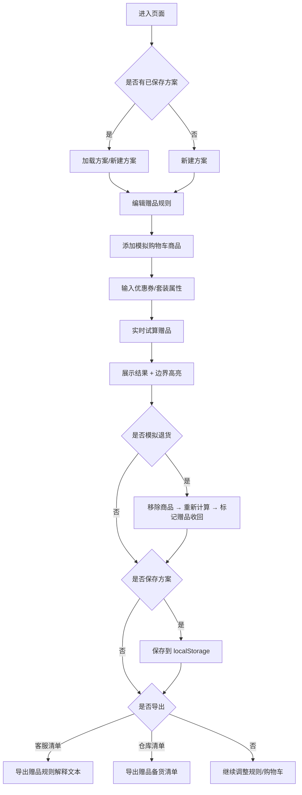

## 1. 产品概述
直播间赠品规则试算工具，帮助直播运营在开播前快速验证赠品规则的正确性，避免因主播临时改规则或复杂场景导致赠品计算错误。
- 核心用户：直播运营、客服、仓库管理人员
- 核心价值：减少赠品错发漏发、降低运营人工计算成本、提升直播前规则验证效率

## 2. 核心功能

### 2.1 用户角色
| 角色 | 使用场景 | 核心权限 |
|------|----------|----------|
| 直播运营 | 开播前配置并试算赠品规则 | 编辑规则、模拟购物车、试算、保存方案、导出 |
| 客服人员 | 查看赠品解释清单回复用户 | 查看方案、导出解释清单 |
| 仓库人员 | 按清单准备赠品发货 | 查看方案、导出解释清单 |

### 2.2 功能模块
1. **赠品规则管理模块**：添加/编辑/删除赠品规则，支持多种规则类型
2. **模拟购物车模块**：添加商品、设置价格、数量、优惠券、是否套装
3. **赠品试算引擎**：实时计算命中规则、发放赠品、库存扣减、退货回收
4. **试算结果展示模块**：高亮显示边界情况（卡线、多规则命中、限量用完等）
5. **方案保存与导出模块**：localStorage 持久化、导出客服/仓库解释清单

### 2.3 页面详情
| 页面名称 | 模块名称 | 功能描述 |
|----------|----------|----------|
| 主页面 | 赠品规则管理 | 支持满额送、限量送、排除条件（套装不参与）、优先级设置 |
| 主页面 | 模拟购物车 | 商品列表、单价、数量、是否套装、优惠券金额、小计实时计算 |
| 主页面 | 试算结果 | 命中规则列表、发放赠品、剩余库存、边界情况高亮提示 |
| 主页面 | 退货模拟 | 移除购物车商品后，自动重新计算赠品是否需要收回 |
| 主页面 | 方案管理 | 保存多个方案、切换方案、删除方案、刷新后保留 |
| 主页面 | 导出功能 | 导出客服解释文本、导出仓库备货清单 |

## 3. 核心流程

### 3.1 主流程描述
1. 运营进入页面，创建或加载一个赠品方案
2. 配置多条赠品规则（满额送、限量送、排除条件）
3. 在模拟购物车中添加商品、设置价格/数量/套装属性、输入优惠券
4. 系统实时试算，显示命中规则、发放赠品、库存剩余
5. 运营检查边界提示（卡线金额、多规则冲突、限量耗尽）
6. 模拟退货（移除商品），观察赠品是否被收回
7. 保存方案，分别导出给客服和仓库的解释清单

### 3.2 流程图

## 4. 用户界面设计

### 4.1 设计风格
- 主色调：直播运营场景，采用 **深紫 (#6D28D9) + 橙红 (#F97316)** 的强对比配色，体现直播的活力与专业感
- 辅助色：成功绿 (#10B981)、警告黄 (#F59E0B)、危险红 (#EF4444) 用于边界情况高亮
- 按钮风格：圆角 8px，主按钮渐变填充，次要按钮描边
- 字体：标题使用 **"Noto Serif SC"** 衬线字体体现稳重，正文使用 **"PingFang SC"** 保持清晰易读
- 布局风格：三栏卡片式布局（左侧规则、中间购物车、右侧结果），顶部方案管理栏
- 图标/emoji：使用 emoji 增强识别（🎁 赠品、🛒 购物车、⚠️ 警告、📦 仓库、💬 客服）

### 4.2 页面设计概览
| 页面名称 | 模块名称 | UI 元素 |
|----------|----------|----------|
| 主页面 | 顶部方案栏 | 方案名称输入、保存按钮、方案下拉切换、导出菜单 |
| 主页面 | 赠品规则卡片 | 规则列表、每条规则可展开编辑、类型标签（满额/限量）、优先级拖拽 |
| 主页面 | 模拟购物车卡片 | 商品行（名称/单价/数量/套装开关/小计）、优惠券输入、合计金额 |
| 主页面 | 试算结果卡片 | 命中规则分组、赠品列表（带库存条）、边界警告横幅、退货影响说明 |
| 主页面 | 退货模拟区 | 已添加商品可快速移除，结果区标记"赠品将被收回" |

### 4.3 响应式
- 桌面端优先（≥1280px）：三栏并排布局
- 平板端（768px-1279px）：上下两栏（规则+购物车上，结果下）
- 移动端（<768px）：单栏垂直堆叠，支持横滑切换卡片

### 4.4 边界情况视觉强调
- **金额刚好卡线**：黄色边框 + ⚠️ 图标 + "刚好达标，少 0.01 元将不享受"提示
- **优惠券后是否达标**：显示原价金额（删除线）+ 券后金额（高亮）+ 达标/不达标标签
- **同一赠品被多条规则命中**：赠品卡片右上角"多重命中"红色徽章 + 列出所有命中规则
- **限量用完**：库存条红色 + "已抢光"标签 + 置灰显示
