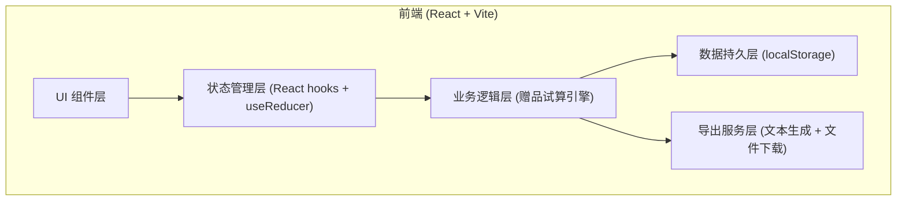
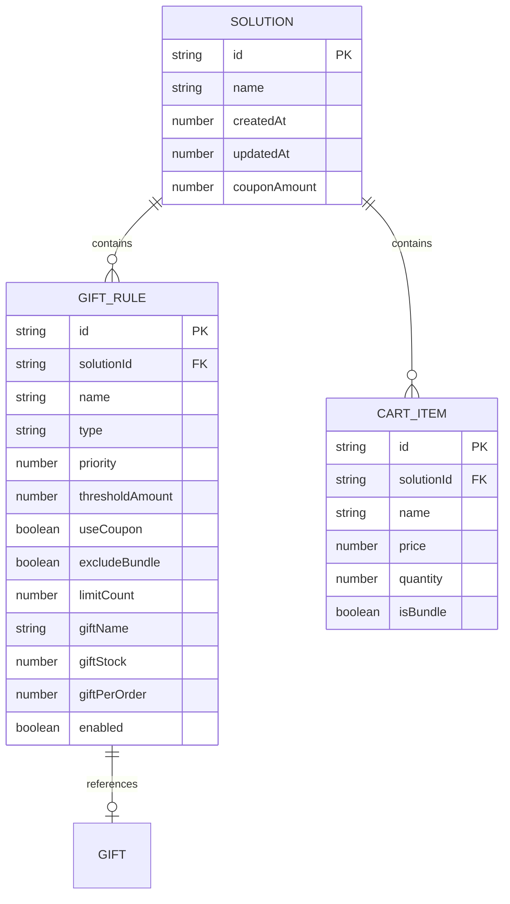

## 1. 架构设计



## 2. 技术描述
- 前端框架：React 18 + TypeScript
- 构建工具：Vite 5
- 样式方案：Tailwind CSS 3
- 状态管理：React useState + useReducer（轻量级，无需 Redux）
- 数据持久化：localStorage（方案保存）
- 后端服务：无（纯前端应用）
- 数据库：无（使用 localStorage 模拟）

## 3. 路由定义
| 路由 | 用途 |
|------|------|
| / | 主页面（包含所有功能模块） |

## 4. 数据模型

### 4.1 核心类型定义

```typescript
// 赠品规则类型
type RuleType = 'threshold' | 'limit_first';

interface GiftRule {
  id: string;
  name: string;                 // 规则名称，如"满199送杯子"
  type: RuleType;               // threshold=满额送, limit_first=前N单送
  priority: number;             // 优先级，数字越大越先执行
  // 满额送参数
  thresholdAmount?: number;     // 满额金额（券前/券后由 useCoupon 决定）
  useCoupon?: boolean;          // 是否按券后金额计算
  excludeBundle?: boolean;      // 是否排除套装商品
  // 限量送参数
  limitCount?: number;          // 前N单
  // 赠品
  giftId: string;
  giftName: string;
  giftStock: number;            // 库存总量
  giftPerOrder: number;         // 每单送几件
  enabled: boolean;             // 是否启用
}

// 购物车商品
interface CartItem {
  id: string;
  name: string;
  price: number;                // 单价
  quantity: number;
  isBundle: boolean;            // 是否套装
}

// 方案
interface Solution {
  id: string;
  name: string;
  createdAt: number;
  updatedAt: number;
  rules: GiftRule[];
  cart: CartItem[];
  couponAmount: number;         // 优惠券总金额
}

// 试算结果
interface GiftResult {
  giftId: string;
  giftName: string;
  quantity: number;             // 本单获得数量
  remainingStock: number;       // 剩余库存
  hitRules: string[];           // 命中的规则ID列表
  isMultiHit: boolean;          // 是否被多条规则命中
  willRecall: boolean;          // 退货时是否会被收回
}

interface RuleHitDetail {
  ruleId: string;
  ruleName: string;
  hit: boolean;
  reason: string;               // 命中/未命中原因
  isBoundary: boolean;          // 是否边界卡线
}

interface TrialResult {
  originalTotal: number;        // 原价总金额
  couponAmount: number;
  finalTotal: number;           // 券后总金额
  ruleDetails: RuleHitDetail[];
  gifts: GiftResult[];
  warnings: string[];           // 边界警告信息
}
```

### 4.2 数据模型 ER 图



## 5. 赠品试算引擎核心算法

### 5.1 计算流程
1. 计算购物车总金额（区分套装/非套装）
2. 应用优惠券得到券后金额
3. 按优先级从高到低遍历所有启用的规则
4. 对每条规则判断是否命中：
   - 满额送：检查对应金额是否≥阈值（注意排除套装时需扣除套装金额）
   - 限量送：检查当前是否在前N单范围内（模拟订单序号输入）
5. 记录命中规则，扣减对应赠品库存
6. 合并同一赠品被多条规则命中的情况
7. 检测边界情况并生成警告

### 5.2 边界情况检测
- 卡线检测：finalTotal === threshold 或 finalTotal - threshold < 0.01
- 券前达标但券后不达标：originalTotal ≥ threshold 且 finalTotal < threshold
- 多规则命中同一赠品：gifts 中 hitRules.length > 1
- 库存不足/耗尽：remainingStock ≤ 0
- 套装排除后不达标：含套装时达标，扣除后不达标

## 6. 组件划分

```
src/
├── components/
│   ├── Header.tsx              # 顶部方案管理栏
│   ├── RuleEditor.tsx          # 赠品规则编辑卡片
│   ├── RuleItem.tsx            # 单条规则编辑组件
│   ├── CartSimulator.tsx       # 模拟购物车卡片
│   ├── CartItemRow.tsx         # 购物车单行组件
│   ├── TrialResult.tsx         # 试算结果卡片
│   ├── GiftCard.tsx            # 单个赠品结果卡片
│   ├── WarningBanner.tsx       # 边界警告横幅
│   └── ExportMenu.tsx          # 导出菜单
├── engine/
│   └── giftCalculator.ts       # 赠品试算引擎（纯函数）
├── hooks/
│   └── useSolution.ts          # 方案状态管理 hook
├── utils/
│   ├── storage.ts              # localStorage 封装
│   └── export.ts               # 导出文本生成
├── types/
│   └── index.ts                # TypeScript 类型定义
├── App.tsx
├── main.tsx
└── index.css
```

## 7. 导出格式

### 7.1 客服解释清单（文本格式）
```
【直播间赠品规则说明 - {方案名}】
更新时间：{时间}

一、赠品规则明细：
1. {规则1名称}：{条件}，送{赠品名称}x{数量}
   注意事项：{排除条件/限量说明}
...

二、常见问题：
Q: 为什么我没有收到赠品？
A: 请检查您的订单...
```

### 7.2 仓库备货清单（CSV 格式）
```
赠品名称,每单数量,预估备货量,库存限制,备注
定制马克杯,1,500,500,满199赠送
香薰小样,1,200,200,前200单赠送
```
