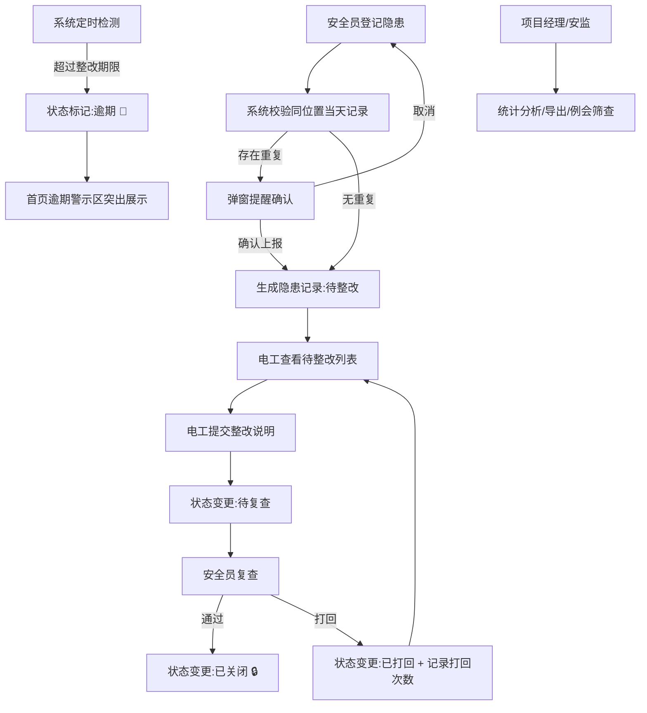

## 1. 产品概述
工地临电巡检台是一套面向建筑施工场景的临时用电隐患闭环管理系统，解决纸质巡检记录丢失、整改追踪困难、复查无依据等痛点。
- 目标用户：安全员（登记/复查）、电工（整改）、项目经理（统计/导出）、安监人员（班组问题筛查）
- 产品价值：隐患全流程可追溯、逾期自动预警、重复问题智能提醒、整改数据可视化统计

## 2. 核心功能

### 2.1 用户角色
| 角色 | 登录方式 | 核心权限 |
|------|---------|---------|
| 安全员 | 角色切换 | 登记配电箱隐患、上传照片、指定整改期限、复查验收、关闭隐患 |
| 电工 | 角色切换 | 查看待整改任务、提交整改说明、等待复查 |
| 项目经理 | 角色切换 | 全局数据看板、按状态/班组统计、导出整改单 |
| 安监人员 | 角色切换 | 按班组筛选、查看反复打回问题记录、例会点名支持 |

### 2.2 功能模块
1. **首页仪表盘**：逾期隐患高亮区、状态统计卡片、快捷入口、最新隐患列表
2. **隐患登记页**：配电箱编号、位置、隐患描述、照片链接、责任班组、整改期限表单
3. **隐患列表页**：多条件筛选（状态/班组/时间）、列表视图、详情展开
4. **整改处理页**：电工提交整改说明、补充整改后照片
5. **复查验收页**：安全员复查通过/打回、填写复查意见
6. **统计分析页**：未闭环/逾期/打回数量、各班组分布、导出CSV整改单
7. **安监例会页**：按班组筛选、反复打回问题排序、快速点名列表

### 2.3 页面详情
| 页面名称 | 模块名称 | 功能描述 |
|---------|---------|---------|
| 首页仪表盘 | 逾期警示区 | 红色醒目卡片展示所有超期未闭环隐患，点击可跳转详情 |
| 首页仪表盘 | 统计卡片行 | 总数/待整改/待复查/已关闭/逾期/打回 6项指标卡片 |
| 首页仪表盘 | 班组分布 | 各班组隐患数量柱状图/进度条可视化 |
| 首页仪表盘 | 最新动态 | 最近10条隐患登记/整改/复查时间线 |
| 隐患登记页 | 登记表单 | 配电箱编号(必填)、位置(必填)、隐患描述(必填)、照片链接、责任班组下拉(必填)、整改期限日期(必填) |
| 隐患登记页 | 重复提醒 | 提交时校验同位置当天已有登记，弹窗提示确认是否重复上报 |
| 隐患列表页 | 筛选栏 | 状态筛选(全部/待整改/待复查/已关闭/逾期/已打回)、班组筛选、日期范围 |
| 隐患列表页 | 列表卡片 | 编号+位置+状态标签+班组+倒计时/剩余天数+操作按钮组 |
| 隐患详情页 | 状态流转条 | 登记→整改→复查→关闭 四步进度条，当前节点高亮 |
| 隐患详情页 | 信息面板 | 基础信息、隐患描述与照片、整改说明与照片、复查记录时间线 |
| 整改处理页 | 整改表单 | 整改说明文本域(必填)、整改后照片链接、提交按钮 |
| 复查验收页 | 复查表单 | 通过/打回单选、复查意见(打回时必填)、已关闭隐患禁止编辑 |
| 统计分析页 | 指标概览 | 未闭环、逾期、复查打回、各班组数量 汇总数字 |
| 统计分析页 | 班组排行 | 按隐患总数/打回次数 排序的班组排行榜 |
| 统计分析页 | 导出功能 | 一键导出CSV格式整改单，含所有筛选条件下的完整字段 |
| 安监例会页 | 班组筛选 | 班组下拉筛选、打回次数阈值滑块筛选 |
| 安监例会页 | 问题列表 | 按打回次数倒序排列，显示问题位置、描述、打回次数、最后状态 |

## 3. 核心流程
安全员发现配电箱隐患后，在系统登记并指定班组和期限；电工接单后进行整改，提交整改说明与照片；安全员复查，通过则关闭隐患，打回则电工重新整改；逾期隐患自动在首页红色警示；全流程数据持久化不丢失。

## 4. 用户界面设计

### 4.1 设计风格
- **主色调**：工业安全橙 `#FF6B35`（警示/行动）+ 深钢蓝 `#1E3A5F`（专业/稳重）
- **辅助色**：危险红 `#DC2626`（逾期）、通过绿 `#16A34A`（关闭）、警告黄 `#CA8A04`（打回）、待办蓝 `#2563EB`（待整改/待复查）
- **按钮风格**：直角微圆角(4px)、实线边框、悬停有轻微上浮阴影、危险按钮使用红色渐变
- **字体**：标题使用「思源黑体 Bold / Noto Sans SC Bold」，正文使用「思源黑体 Regular」，数字等宽显示
- **布局风格**：顶部导航栏 + 左侧角色切换 + 卡片式内容区，数据密集区域使用表格，列表使用信息卡片
- **图标风格**：线性图标（stroke-width 1.5px），状态使用彩色圆形徽章 + 文字标签组合

### 4.2 页面设计概述
| 页面名称 | 模块名称 | UI元素 |
|---------|---------|--------|
| 首页仪表盘 | 逾期警示区 | 红色渐变背景卡片 + 闪烁脉冲动画 + 数量角标 + 紧急图标 |
| 首页仪表盘 | 统计卡片 | 6宫格彩色卡片，左侧大数字右侧趋势小箭头，底部状态描述 |
| 首页仪表盘 | 班组分布 | 横向进度条图，每条不同色，末端显示数量百分比 |
| 隐患登记页 | 表单区 | 左侧标签右侧输入，两列栅格，必填项红星标记，照片链接预览缩略图 |
| 隐患列表页 | 筛选栏 | 胶囊状标签组 + 下拉选择器 + 日期范围，筛选条件汇总显示 |
| 隐患列表页 | 列表卡片 | 顶部编号+状态徽章，中部位置+描述两行截断，底部班组标签+剩余天数+操作按钮 |
| 隐患详情页 | 状态流转 | 四节点横向时间轴，已完成节点打勾，当前节点脉冲高亮 |
| 统计分析页 | 数据图表 | 卡片内含数字+迷你趋势线，班组排行使用奖牌图标(金银铜) |
| 安监例会页 | 问题列表 | 打回次数使用大号红色徽章，点击行可展开完整历史记录 |

### 4.3 响应式
- 桌面端优先（1280px+）：两列/三列栅格布局，完整功能展示
- 平板端（768-1279px）：单列堆叠，侧边栏收起为抽屉
- 移动端（<768px）：顶部导航简化，卡片全宽，表格横向滚动，底部悬浮快捷操作栏
- 触摸优化：所有可点击元素最小高度44px，滑动删除/快捷操作支持

