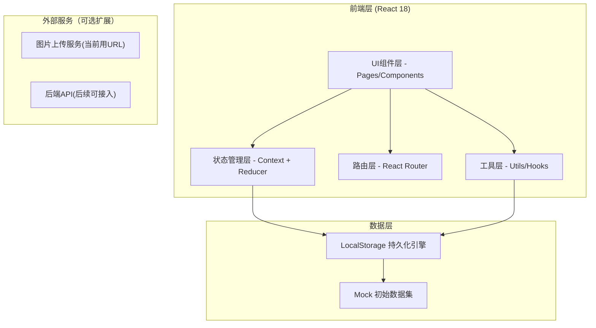
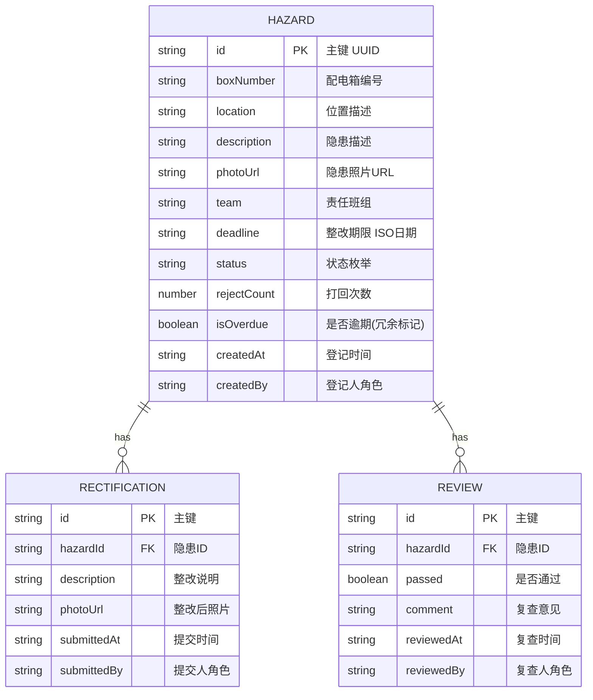
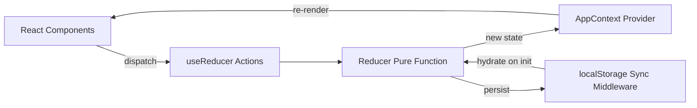

## 1. 架构设计



## 2. 技术描述
- **前端框架**：React@18 + TypeScript
- **构建工具**：Vite@5 (快速冷启动、HMR)
- **样式方案**：TailwindCSS@3 + CSS Variables (主题定制)
- **路由管理**：react-router-dom@6
- **状态管理**：React Context + useReducer (轻量级全局状态，无需Redux)
- **图标库**：lucide-react (线性图标，符合设计风格)
- **图表库**：recharts (React图表组件，班组分布图用)
- **日期处理**：date-fns (轻量级日期库)
- **数据持久化**：浏览器 localStorage (JSON序列化，自动同步)
- **后端**：None (纯前端架构，localStorage存储数据，刷新不丢失)
- **数据库**：localStorage (模拟后端存储)
- **初始化方式**：Vite官方模板 `npm create vite@latest`

## 3. 路由定义
| 路由路径 | 页面组件 | 用途 |
|---------|---------|------|
| `/` | Dashboard | 首页仪表盘：逾期警示、统计卡片、班组分布、最新动态 |
| `/register` | HazardRegister | 隐患登记页：表单录入 + 重复上报校验 |
| `/hazards` | HazardList | 隐患列表页：多条件筛选 + 卡片列表 |
| `/hazards/:id` | HazardDetail | 隐患详情页：状态流转 + 完整信息 + 整改/复查操作 |
| `/statistics` | Statistics | 统计分析页：指标概览 + 班组排行 + CSV导出 |
| `/meeting` | SafetyMeeting | 安监例会页：班组筛选 + 反复打回问题筛查 |

## 4. 数据模型

### 4.1 数据模型定义 (ER图)



### 4.2 TypeScript 类型定义

```typescript
// 隐患状态枚举
type HazardStatus = 
  | 'PENDING_RECTIFICATION'  // 待整改
  | 'PENDING_REVIEW'          // 待复查
  | 'CLOSED'                  // 已关闭
  | 'REJECTED';               // 已打回

// 角色枚举
type UserRole = 'SAFETY_OFFICER' | 'ELECTRICIAN' | 'PROJECT_MANAGER' | 'SAFETY_INSPECTOR';

// 班组枚举
type Team = 'A班' | 'B班' | 'C班' | 'D班';

interface Hazard {
  id: string;
  boxNumber: string;
  location: string;
  description: string;
  photoUrl?: string;
  team: Team;
  deadline: string;          // ISO date string
  status: HazardStatus;
  rejectCount: number;
  isOverdue: boolean;
  createdAt: string;
  createdBy: UserRole;
  rectifications: Rectification[];
  reviews: Review[];
}

interface Rectification {
  id: string;
  hazardId: string;
  description: string;
  photoUrl?: string;
  submittedAt: string;
  submittedBy: UserRole;
}

interface Review {
  id: string;
  hazardId: string;
  passed: boolean;
  comment: string;
  reviewedAt: string;
  reviewedBy: UserRole;
}

interface AppState {
  hazards: Hazard[];
  currentRole: UserRole;
  filters: {
    status?: HazardStatus;
    team?: Team;
    dateFrom?: string;
    dateTo?: string;
  };
}
```

## 5. 状态管理架构



### 核心 Actions 列表：
| Action Type | Payload | 说明 |
|-------------|---------|------|
| `SET_ROLE` | `{ role: UserRole }` | 切换当前用户角色 |
| `ADD_HAZARD` | `{ hazard: Omit<Hazard, 'id' | 'createdAt' | 'rejectCount' | 'isOverdue' | 'rectifications' | 'reviews'> }` | 安全员登记隐患 |
| `SUBMIT_RECTIFICATION` | `{ hazardId, rectification: Omit<Rectification, 'id'|'submittedAt'> }` | 电工提交整改 |
| `SUBMIT_REVIEW` | `{ hazardId, review: Omit<Review, 'id'|'reviewedAt'> }` | 安全员复查通过/打回 |
| `CHECK_OVERDUE` | 无 | 扫描所有未关闭记录并标记逾期 |
| `SET_FILTERS` | `Partial<Filters>` | 设置列表筛选条件 |

## 6. 目录结构

```
src/
├── assets/              # 静态资源
├── components/          # 可复用组件
│   ├── layout/          # 布局组件 (Header, Sidebar, RoleSwitcher)
│   ├── hazard/          # 隐患相关组件 (HazardCard, StatusBadge, Timeline)
│   ├── ui/              # 基础UI (Button, Modal, Input, Badge)
│   └── charts/          # 图表组件 (TeamBarChart, StatCard)
├── contexts/            # Context定义
│   └── AppContext.tsx   # 全局状态 Provider
├── hooks/               # 自定义Hooks
│   ├── useHazards.ts    # 隐患CRUD操作封装
│   ├── useOverdue.ts    # 逾期检测逻辑
│   └── useExport.ts     # CSV导出逻辑
├── pages/               # 页面组件
│   ├── Dashboard.tsx
│   ├── HazardRegister.tsx
│   ├── HazardList.tsx
│   ├── HazardDetail.tsx
│   ├── Statistics.tsx
│   └── SafetyMeeting.tsx
├── types/               # TypeScript类型
│   └── index.ts
├── utils/               # 工具函数
│   ├── storage.ts       # localStorage封装
│   ├── dateUtils.ts     # 日期格式化/计算
│   ├── idGenerator.ts   # UUID生成
│   ├── duplicateCheck.ts # 重复上报校验
│   └── csvExport.ts     # CSV导出工具
├── data/                # Mock初始数据
│   └── seedData.ts
├── App.tsx              # 路由配置
├── main.tsx             # 入口文件
└── index.css            # 全局样式 + Tailwind指令
```

## 7. 关键技术方案

### 7.1 重复上报校验算法
- **触发时机**：隐患登记表单提交时
- **匹配规则**：`location` 字段模糊匹配 + `createdAt` 日期为今天
- **实现**：遍历 `hazards` 数组，取 `createdAt.slice(0,10)` 与今天比较，`location.includes()` 匹配位置关键词
- **交互**：命中则弹出 Modal 显示重复项摘要，用户确认后继续提交，取消则返回表单

### 7.2 逾期检测机制
- **被动检测**：每次 App 初始化 / 路由切换时执行 `CHECK_OVERDUE`
- **判定条件**：`status !== 'CLOSED'` 且 `new Date(deadline) < new Date()`（截止日期不含当天结束）
- **持久化**：`isOverdue` 字段写入 localStorage，列表页通过此字段筛选

### 7.3 已关闭隐患防篡改
- **Reducer 层面拦截**：`SUBMIT_RECTIFICATION` 和 `SUBMIT_REVIEW` action 执行前，先校验 `hazard.status === 'CLOSED'` 则返回原 state 并报错
- **UI 层面拦截**：详情页检查 `status === 'CLOSED'` 时隐藏所有操作按钮，输入框设为 `disabled`，页面顶部显示「已关闭」锁定横幅

### 7.4 CSV 导出方案
- **列字段**：编号、配电箱编号、位置、隐患描述、责任班组、登记时间、整改期限、当前状态、打回次数、是否逾期、整改说明、复查意见
- **编码**：UTF-8 BOM 头（解决 Excel 中文乱码）
- **触发**：动态创建 `<a>` 元素，设置 `href = 'data:text/csv;charset=utf-8,' + encodeURI(csvContent)`，文件名：`临电整改单_YYYYMMDD_HHmmss.csv`

