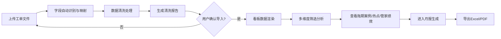

## 1. 产品概述

物业投诉响应看板是面向物业公司运营和管理团队的数据可视化分析工具，解决多渠道投诉数据混杂、重复投诉难识别、响应效率难追踪的核心痛点。通过自动数据清洗和多维度分析，为经理月度复盘会提供拖期案例、重复投诉热点、管家绩效等决策依据，输出结构化月报而非简单平均值。

## 2. 核心功能

### 2.1 用户角色

| 角色 | 描述 | 核心权限 |
|------|------|----------|
| 运营同事 | 负责导入投诉工单、日常数据维护 | 导入数据、查看看板、导出月报 |
| 物业经理 | 月度复盘、管理决策 | 全量看板查看、深度分析、月报导出 |

### 2.2 功能模块

1. **数据导入页**：文件上传、字段映射、数据预览、清洗规则说明
2. **核心看板页**：KPI概览卡、拖期案例榜、重复投诉热点、管家绩效分析、问题类型分布、响应时长趋势
3. **月报导出页**：结构化月报预览、PDF/Excel导出、数据质量说明

### 2.3 页面详情

| 页面名称 | 模块名称 | 功能描述 |
|----------|----------|----------|
| 数据导入页 | 文件上传区 | 支持CSV/Excel拖拽上传，显示文件大小和行数 |
| 数据导入页 | 字段映射配置 | 自动识别列名，支持手动映射工单号、业主信息、时间等核心字段 |
| 数据导入页 | 数据清洗说明 | 展示时间缺失、关闭早于受理、业主去重、问题类型标准化的处理规则及本次处理条数 |
| 核心看板页 | KPI概览卡 | 总工单量、平均响应时长、平均关闭时长、重复投诉率、超期率5个核心指标 |
| 核心看板页 | 拖得最久案例榜 | 按关闭时长倒序Top10，显示小区/楼栋/业主/问题/受理时长/状态，支持点击查看详情 |
| 核心看板页 | 重复投诉热点 | 按业主+问题类型聚合的重复投诉排行，显示投诉次数、涉及楼栋、首次与末次时间 |
| 核心看板页 | 管家处理情况 | 各管家负责工单数、平均响应/关闭时长、超期率对比柱状图和排名表 |
| 核心看板页 | 问题类型与来源分析 | 按标准化后的问题类型饼图、按来源（电话/业主群/工单）分布、交叉矩阵热力图 |
| 核心看板页 | 筛选器 | 按小区、楼栋、时间范围、管家、问题类型多维度筛选 |
| 月报导出页 | 月报结构化展示 | 核心指标趋势、典型案例、数据质量说明、改进建议四大板块 |
| 月报导出页 | 导出操作 | 支持Excel/PDF格式导出，可选择月份范围 |

## 3. 核心流程

用户上传工单数据文件 → 系统自动识别字段并执行数据清洗（时间异常修正、业主去重、问题类型标准化）→ 展示清洗报告和处理说明 → 用户确认导入 → 看板自动渲染多维度分析图表 → 用户按维度筛选查看具体数据 → 进入月报页选择时间范围 → 生成结构化月报并导出。

## 4. 用户界面设计

### 4.1 设计风格
- **主色调**：深靛蓝 #1e3a5f 作为主色，搭配珊瑚橙 #ff6b6b 强调色，用于标记超期和告警；中性色采用暖灰系，营造专业稳重的物业行业调性
- **按钮风格**：圆角 8px，主按钮深蓝填充，悬停时轻微上浮阴影；次按钮描边风格
- **字体**：标题使用思源宋体（Source Han Serif CN）体现专业感，正文使用思源黑体（Source Han Sans CN）保证可读性
- **布局风格**：卡片式布局，卡片有细微边框和柔和阴影，头部采用深蓝色导航栏，左侧筛选侧边栏
- **图标风格**：线性图标为主，关键告警节点使用填充图标配珊瑚橙强调

### 4.2 页面设计概览

| 页面名称 | 模块名称 | UI元素 |
|----------|----------|--------|
| 核心看板页 | KPI概览卡 | 5张横向排列卡片，左侧大数字+环比趋势小箭头，右侧迷你趋势折线图，超期和重复率卡用珊瑚橙色边框强调 |
| 核心看板页 | 拖得最久案例榜 | 表格样式，超期行背景浅珊瑚红渐变，时长列用彩色进度条可视化，鼠标悬停显示完整详情 |
| 核心看板页 | 重复投诉热点 | 卡片式排行，每个热点卡包含业主头像占位、投诉次数徽章、问题标签、时间跨度进度条 |
| 核心看板页 | 管家处理情况 | 上半部分分组柱状图对比响应/关闭时长，下半部分排名表，超期率列用色阶背景 |
| 月报导出页 | 月报预览 | 类A4纸张白底卡片，含页眉、章节划分、数据表格和图表缩略图 |

### 4.3 响应性
桌面端优先（1440px及以上），支持1280px自适应，关键数据表格在1024px以下支持横向滚动，移动端仅保留核心KPI查看功能。

### 4.4 动画与交互
- 页面加载时卡片依次从下方淡入（stagger 80ms）
- KPI数字使用滚动计数器动画
- 悬停表格行时轻微左移+左侧显示竖条色标
- 筛选器切换时图表使用平滑过渡动画（400ms ease）
