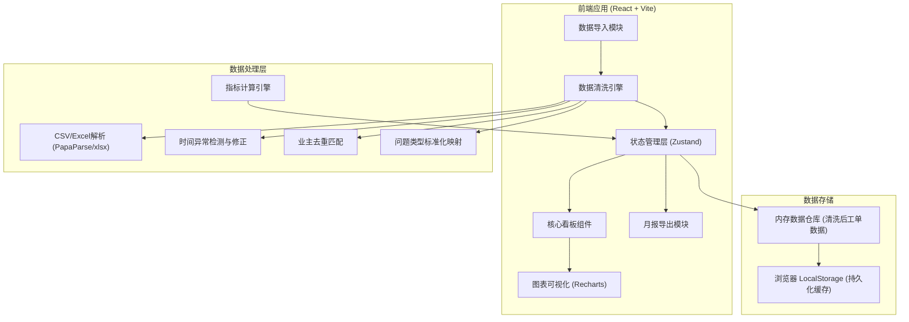
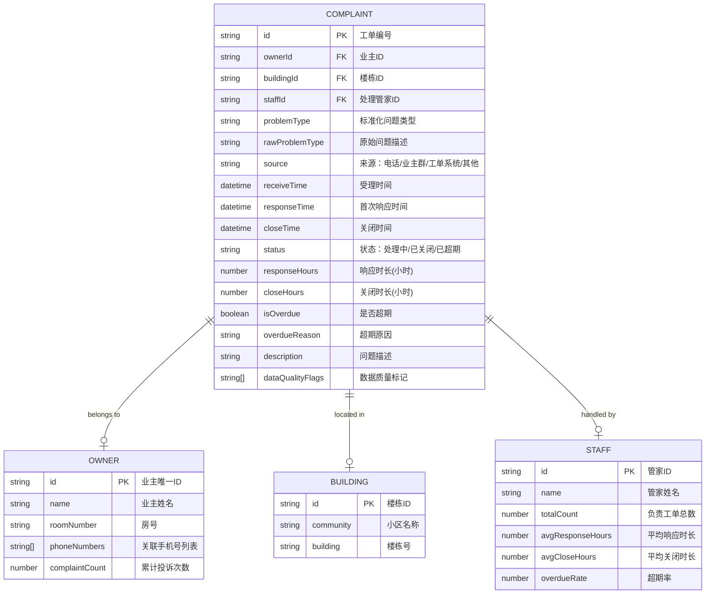

## 1. 架构设计

## 2. 技术描述
- **前端框架**：React@18 + TypeScript
- **构建工具**：Vite@5
- **样式方案**：TailwindCSS@3 + CSS变量主题系统
- **状态管理**：Zustand (轻量级状态管理，适合看板类应用)
- **图表库**：Recharts@2 (React原生图表库，覆盖柱状图、折线图、饼图、热力图需求)
- **文件解析**：PapaParse (CSV解析) + xlsx (Excel解析)
- **工具库**：date-fns (日期处理)、lodash-es (数据处理)
- **导出能力**：xlsx (Excel导出) + jspdf + html2canvas (PDF导出)
- **后端**：无后端，纯前端应用，数据存储在浏览器本地

## 3. 路由定义

| 路由 | 页面组件 | 用途 |
|------|----------|------|
| / | DashboardPage | 核心看板首页，默认展示KPI、拖期案例、重复投诉热点、管家绩效 |
| /import | ImportPage | 数据导入页，文件上传、字段映射、清洗报告 |
| /report | ReportPage | 月报导出页，结构化月报预览与导出 |

## 4. 数据模型

### 4.1 核心数据实体

### 4.2 问题类型标准化映射表

| 原始手写关键词 | 标准化类型 |
|----------------|------------|
| 电梯、梯控、困梯、电梯噪音 | 电梯问题 |
| 漏水、渗水、水管、下水道、堵塞 | 给排水问题 |
| 灯坏、停电、跳闸、电路 | 电力照明 |
| 噪音、扰民、装修、狗叫 | 噪音扰民 |
| 卫生、垃圾、保洁、异味 | 环境卫生 |
| 门禁、刷卡、门锁、保安 | 安防门禁 |
| 停车、车位、车辆、道闸 | 停车管理 |
| 绿化、草坪、树木、虫 | 绿化养护 |

### 4.3 数据清洗规则定义

1. **时间字段缺失处理**：
   - 受理时间缺失：标记为异常数据，从工单创建时间推断或排除该工单，计入清洗报告
   - 响应时间缺失：用"首次跟进记录时间"填充，若无则置空并计入异常
   - 关闭时间缺失且状态为已关闭：标记异常需人工补录

2. **关闭时间早于受理时间**：
   - 自动交换两个时间戳
   - 标记 `time_inverted` 数据质量标记
   - 在清洗报告中列出处理条数

3. **同一业主不同手机号**：
   - 优先使用"房号+姓名"作为业主唯一键
   - 无房号时使用"姓名+手机号前缀匹配"去重
   - 多个手机号合并到同一业主的 phoneNumbers 数组
   - 生成业主唯一ID并建立投诉关联

4. **问题类型手写不一致**：
   - 关键词模糊匹配标准化映射表
   - 置信度低于60%的保留原始描述并标记需人工确认
   - 建立用户自定义映射表，支持后续导入自动学习

## 5. 指标计算逻辑

| 指标名称 | 计算公式 | 阈值定义 |
|----------|----------|----------|
| 平均响应时长 | Σ(响应时间-受理时间) / 有效工单数 | 超过2小时标记为响应慢 |
| 平均关闭时长 | Σ(关闭时间-受理时间) / 已关闭工单数 | 超过72小时标记为拖期 |
| 重复投诉率 | (同一业主+同一问题类型≥2次的工单数) / 总工单数 | - |
| 超期率 | 关闭时长>72小时的工单数 / 已关闭工单数 | 关闭时长>72小时 |
| 管家绩效分 | 100 - (超期率*50 + 平均响应时长/2*30 + 平均关闭时长/72*20) | - |
