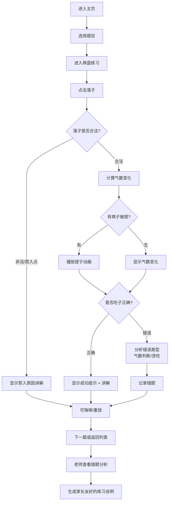

## 1. 产品概述

围棋吃子讲解练习小游戏，专为围棋启蒙课设计，帮助孩子理解"气"与"禁入点"的区别，通过交互式小棋盘练习掌握吃子技巧。

- 目标用户：围棋启蒙阶段的儿童（6-10岁）、围棋老师、学生家长
- 解决的核心问题：孩子容易混淆"没气"和"不能下"，白板摆棋难以复盘
- 产品价值：通过可视化气数变化、即时讲解反馈，让抽象的围棋规则变得直观易懂

## 2. 核心功能

### 2.1 用户角色

| 角色 | 核心需求 | 主要功能 |
|------|----------|----------|
| 学生 | 练习吃子题，理解规则，看讲解 | 答题、悔棋、重放、查看气数变化 |
| 老师 | 查看错题，分析错误类型，生成反馈 | 错题统计、错误类型分析、练习说明生成 |
| 家长 | 了解孩子学习情况 | 查看练习报告、友好的练习说明 |

### 2.2 功能模块

1. **练习主页**：题目选择、进度展示、切换老师/学生模式
2. **棋盘练习页**：交互式小棋盘、落子、气数可视化、提子动画、悔棋重放
3. **讲解面板**：错误原因分析、气数变化说明、为什么这步不合适
4. **老师视图**：错题列表、错误类型统计（气数判断/贪吃）、练习说明导出
5. **题目配置**：通过简单配置添加新的吃子题

### 2.3 页面详情

| 页面名称 | 模块名称 | 功能描述 |
|-----------|-------------|---------------------|
| 练习主页 | 题目列表 | 显示所有题目，标注完成状态和正确率 |
| 练习主页 | 模式切换 | 学生模式/老师模式一键切换 |
| 练习主页 | 进度概览 | 总题数、已完成、正确率、错题数 |
| 棋盘练习页 | 棋盘区域 | 7x7或9x9小棋盘，显示棋子和气数标记 |
| 棋盘练习页 | 操作栏 | 悔棋、重放、提示、下一题按钮 |
| 棋盘练习页 | 讲解面板 | 实时显示当前气数、落子后的变化、错误分析 |
| 老师视图 | 错题分析 | 按错误类型分类展示错题详情 |
| 老师视图 | 练习说明 | 生成友好的练习报告，可复制给家长 |
| 题目配置 | 题目编辑器 | 通过简单的坐标配置添加新题目 |

## 3. 核心流程

## 4. 用户界面设计

### 4.1 设计风格

- **整体风格**：温暖木质风格 + 童趣卡通元素，让孩子感到亲切有趣
- **主色调**：
  - 棋盘木色：#D4A574（浅棕木色）
  - 线条色：#4A3728（深棕木纹）
  - 强调色：#E74C3C（红色，用于提子/错误提示）
  - 成功色：#27AE60（绿色，用于正确提示）
  - 气数标记：#3498DB（蓝色，用于气数显示）
- **按钮风格**：圆润大按钮，带有轻微立体阴影，适合孩子点击
- **字体**：
  - 标题："ZCOOL KuaiLe"（站酷快乐体）- 活泼可爱
  - 正文："Noto Sans SC" - 清晰易读
- **图标风格**：emoji 风格，围棋子用真实黑白棋子样式

### 4.2 页面设计概述

| 页面名称 | 模块名称 | UI 元素 |
|-----------|-------------|----------|
| 练习主页 | 顶部导航 | Logo、模式切换按钮、进度指示 |
| 练习主页 | 题目卡片 | 木质卡片样式，显示题目编号、类型、完成状态、星级评价 |
| 练习主页 | 进度条 | 彩色进度条显示整体完成率 |
| 棋盘练习页 | 棋盘区域 | 木质纹理背景，黑色网格线，棋子带立体阴影 |
| 棋盘练习页 | 气数标记 | 蓝色小圆点 + 数字显示每组棋子的气数 |
| 棋盘练习页 | 提子动画 | 棋子缩小淡出 + 红色闪光效果 |
| 棋盘练习页 | 讲解气泡 | 卡通气泡框，用孩子能懂的语言讲解 |
| 老师视图 | 统计面板 | 卡片式统计，图表化展示错误类型分布 |
| 老师视图 | 错题列表 | 可展开的错题详情，包含错误分析 |
| 老师视图 | 练习说明 | 一键复制按钮，温和鼓励的措辞 |

### 4.3 响应式设计

- 桌面端：棋盘居中，左右两侧显示讲解面板和操作栏
- 平板端：棋盘上方显示操作栏，下方显示讲解面板
- 移动端：竖屏布局，棋盘自适应屏幕宽度，底部固定操作栏，讲解面板可展开收起

### 4.4 动效设计

- 落子：棋子从上方落下 + "嗒"的音效（可选）
- 提子：棋子缩小并淡出 + 轻微震动反馈
- 气数变化：数字渐隐渐现更新
- 正确提示：绿色勾号弹跳出现 + 彩带粒子效果
- 错误提示：红色叉号抖动出现 + 温和的提示音
- 页面切换：平滑淡入淡出过渡
- 悬停效果：按钮轻微放大，卡片微微上浮

---

## 附录：题目类型说明

1. **打吃题**：一步棋让对方棋子只剩一口气
2. **提子题**：一步棋直接提走对方棋子
3. **逃子题**：一步棋让自己被打吃的棋子逃出
4. **禁入点识别题**：找出不能下的位置，说明原因
5. **双吃题**：一步棋同时打吃对方两块棋
