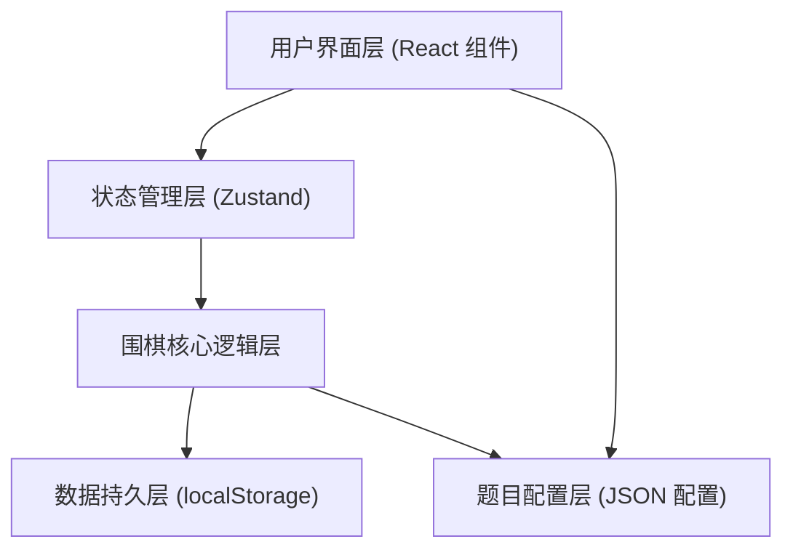

## 1. 架构设计



## 2. 技术描述

- **前端框架**：React@18 + TypeScript + Vite@5
- **样式方案**：TailwindCSS@3
- **状态管理**：Zustand
- **路由管理**：react-router-dom@6
- **图标库**：lucide-react
- **持久化**：localStorage（无需后端数据库）
- **构建工具**：Vite
- **包管理器**：npm（macOS 环境）

## 3. 目录结构

```
src/
├── components/          # UI 组件
│   ├── GoBoard/        # 棋盘组件
│   ├── Stone/          # 棋子组件
│   ├── LibertyMarker/  # 气数标记组件
│   ├── Explanation/    # 讲解面板组件
│   ├── ProblemCard/    # 题目卡片组件
│   └── common/         # 通用组件（按钮、模态框等）
├── hooks/              # 自定义 Hooks
│   ├── useGoGame.ts    # 围棋游戏逻辑 Hook
│   └── useProgress.ts  # 进度管理 Hook
├── store/              # Zustand 状态
│   ├── gameStore.ts    # 游戏状态
│   └── progressStore.ts # 进度状态
├── utils/              # 工具函数
│   ├── goLogic.ts      # 围棋核心逻辑（气、提子、禁入点）
│   └── storage.ts      # localStorage 封装
├── data/               # 数据配置
│   └── problems.ts     # 吃子题配置
├── types/              # TypeScript 类型定义
│   └── index.ts
├── pages/              # 页面组件
│   ├── Home.tsx        # 练习主页
│   ├── Practice.tsx    # 棋盘练习页
│   └── TeacherView.tsx # 老师视图页
└── App.tsx             # 应用入口
```

## 4. 核心数据模型

### 4.1 TypeScript 类型定义

```typescript
// 棋子颜色
type StoneColor = 'black' | 'white' | null;

// 棋盘位置
interface Position {
  row: number;
  col: number;
}

// 棋子组（连通块）
interface StoneGroup {
  stones: Position[];
  color: StoneColor;
  liberties: Position[];
  libertyCount: number;
}

// 落子记录
interface MoveRecord {
  position: Position;
  color: StoneColor;
  capturedStones: Position[];
  boardState: StoneColor[][];
  timestamp: number;
}

// 题目类型
type ProblemType = 'capture' | 'atari' | 'escape' | 'forbidden' | 'double-atari';

// 错误类型
type ErrorType = 'liberty-misjudge' | 'greedy-capture' | 'wrong-position' | 'forbidden-move';

// 题目配置
interface Problem {
  id: string;
  type: ProblemType;
  title: string;
  description: string;
  boardSize: number;
  initialBoard: StoneColor[][];
  playerColor: StoneColor;
  correctMoves: Position[];      // 正确落子位置（可多个）
  forbiddenMoves: Position[];    // 典型错误位置
  explanation: string;           // 正确答案讲解
}

// 答题记录
interface Attempt {
  problemId: string;
  position: Position;
  isCorrect: boolean;
  errorType?: ErrorType;
  timestamp: number;
}

// 题目进度
interface ProblemProgress {
  problemId: string;
  completed: boolean;
  attempts: Attempt[];
  lastAttempt: number | null;
  mastered: boolean;
}

// 练习说明
interface PracticeReport {
  studentName?: string;
  date: string;
  totalProblems: number;
  completedProblems: number;
  accuracy: number;
  errorBreakdown: Record<ErrorType, number>;
  weakPoints: string[];
  suggestions: string[];
}
```

## 5. 路由定义

| 路由 | 页面 | 说明 |
|------|------|------|
| `/` | Home 主页 | 题目列表、进度展示、模式切换 |
| `/practice/:id` | Practice 练习页 | 棋盘练习、落子、讲解 |
| `/teacher` | TeacherView 老师视图 | 错题分析、练习说明生成 |

## 6. 围棋核心逻辑算法

### 6.1 气的计算（Liberty Calculation）

1. 使用 BFS/DFS 找出连通的同色棋子组（棋块）
2. 对每个棋块，遍历所有棋子的上下左右四个方向
3. 统计空交叉点数量即为该棋块的气数

### 6.2 提子判断（Capture Detection）

1. 落子后，检查对方相邻的棋块
2. 如果某对方棋块气数为 0，则提走该棋块所有棋子
3. 提子后更新棋盘状态和气数

### 6.3 禁入点判断（Forbidden Point Detection）

禁入点判断需满足以下条件之一：
1. **自杀禁入**：落子后己方棋块气数为 0，且不能提走对方棋子
2. **打劫禁入**：落子后棋盘状态与上一步相同（简化版打劫判断）

### 6.4 错误类型分析

- **气数判断错误**：落子后未能正确减少对方气数，或忽略己方气数
- **贪吃**：为了吃小棋而忽略更大的危险（如己方被打吃）
- **位置错误**：落子位置完全不对，没有接近正确答案
- **禁入点错误**：试图在禁入点落子

## 7. 题目配置格式

题目通过简单的 JSON 配置添加，示例：

```typescript
// 7x7 棋盘，0=空, 1=黑子, 2=白子
// 正确落子位置：{ row: 3, col: 3 }
{
  id: 'capture-001',
  type: 'capture',
  title: '吃子练习 1',
  description: '黑棋下在哪里可以提掉白子？',
  boardSize: 7,
  initialBoard: [
    [0,0,0,0,0,0,0],
    [0,0,0,0,0,0,0],
    [0,0,1,2,0,0,0],
    [0,1,2,1,2,0,0],
    [0,0,1,2,0,0,0],
    [0,0,0,0,0,0,0],
    [0,0,0,0,0,0,0],
  ],
  playerColor: 'black',
  correctMoves: [{ row: 3, col: 3 }],
  explanation: '下在中间可以把白子团团围住，让它没有气！'
}
```

## 8. 性能优化

- **棋盘渲染**：只在状态变化时重渲染，使用 React.memo 优化棋子组件
- **气数计算**：缓存棋块信息，避免重复计算
- **动画性能**：使用 CSS transform 和 opacity 实现硬件加速动画
- **存储优化**：只持久化必要的进度数据，避免 localStorage 膨胀

## 9. 渐进式增强

- 第一阶段：核心围棋逻辑 + 基础交互
- 第二阶段：动画效果 + 讲解系统
- 第三阶段：错题分析 + 练习报告
- 第四阶段：音效 + 更多题目类型
