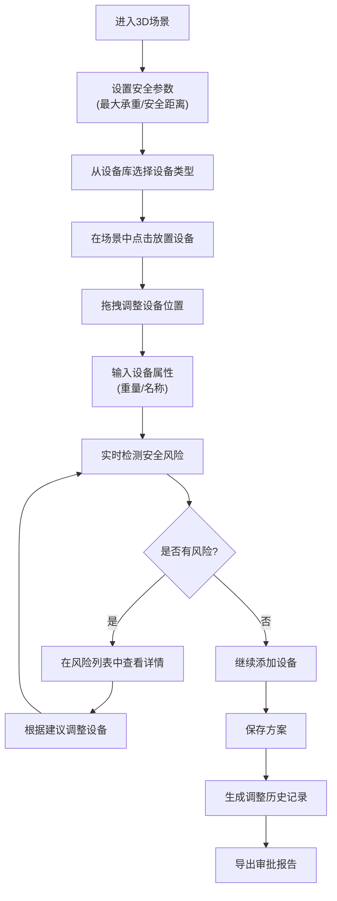
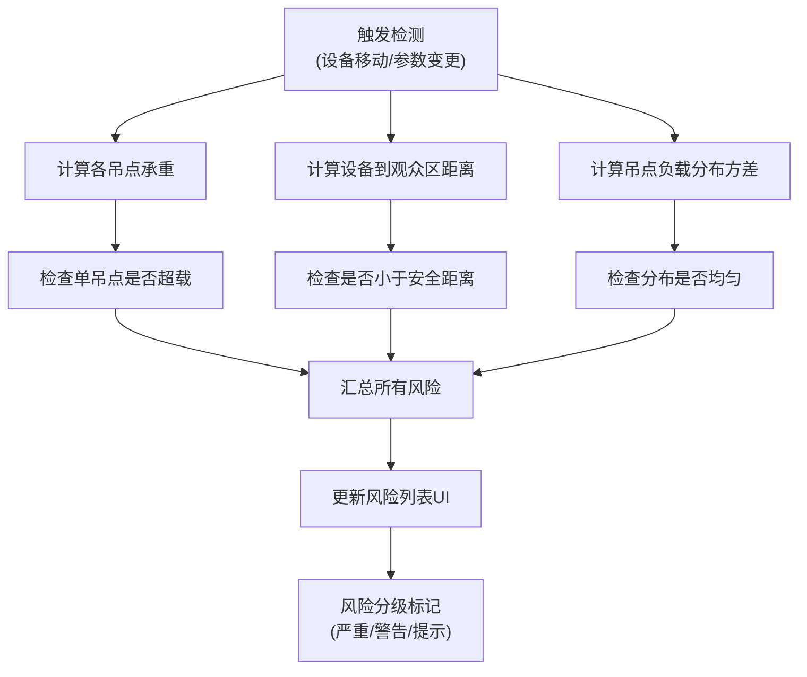

## 1. 产品概述

舞台吊点安全预演工具，为剧场技术团队提供3D可视化的舞台设备安全模拟环境。通过在虚拟场景中放置舞台、吊点、灯架、音箱和观众区，输入设备重量和安全距离参数，实时检测超载、距离过近、吊点分布不均等安全风险，辅助技术负责人在搭台前完成安全复核。

### 目标用户
- 技术负责人：进行安全预演、风险复核、方案审批
- 灯光/音响技术人员：放置设备、调整位置、输入参数
- 校务处/剧场管理员：查看方案、导出审批材料

### 核心价值
- 减少搭台后的安全隐患和返工成本
- 提供可视化的风险预警，便于沟通决策
- 保存调整历史，支持追溯和复盘
- 生成标准化的审批材料，提高审批效率

---

## 2. 核心功能

### 2.1 用户角色

| 角色 | 权限 |
|------|------|
| 技术人员 | 创建设备、调整位置、输入参数、保存方案 |
| 技术负责人 | 所有技术人员权限 + 风险过滤、复核方案 |
| 管理员 | 查看方案、导出审批材料 |

### 2.2 功能模块

1. **3D场景编辑器**：舞台建模、设备放置、拖拽调整、视角控制
2. **安全检测引擎**：超载检测、距离检测、分布均匀性检测
3. **风险面板**：实时风险列表、风险详情、过滤功能
4. **方案管理**：保存方案、历史版本回溯、方案对比
5. **导出模块**：风险报告、调整建议、设备清单导出
6. **设备库**：灯架、音箱、吊点等设备类型管理

### 2.3 页面详情

| 页面名称 | 模块名称 | 功能描述 |
|-----------|-------------|---------------------|
| 主编辑页 | 3D场景画布 | 可旋转、缩放、平移的3D视图，显示舞台、吊点、设备 |
| 主编辑页 | 设备工具栏 | 设备类型选择（灯架/音箱/吊点/观众区），点击放置到场景 |
| 主编辑页 | 属性面板 | 选中设备后显示属性：名称、重量（支持kg/公斤/空值）、位置坐标 |
| 主编辑页 | 安全参数区 | 全局安全设置：单吊点最大承重、观众区最小安全距离 |
| 主编辑页 | 风险列表面板 | 实时显示所有风险，支持按设备类型过滤 |
| 方案管理页 | 方案列表 | 显示所有保存的方案，支持查看、删除、导出 |
| 方案详情页 | 历史时间线 | 显示方案调整历史，支持回滚到任意版本 |
| 导出预览页 | 报告预览 | 显示导出报告内容，包含风险点、调整建议、设备清单 |

---

## 3. 核心流程

### 主操作流程

### 安全检测流程

---

## 4. 用户界面设计

### 4.1 设计风格

**风格定位**：工业技术风 + 专业安全工具

- **主色调**：深空灰 `#1a1d23` 作为背景，营造专业感
- **强调色**：
  - 安全绿 `#10b981` - 正常状态
  - 警告橙 `#f59e0b` - 警告级风险
  - 危险红 `#ef4444` - 严重风险
  - 信息蓝 `#3b82f6` - 选中/交互
- **字体**：
  - 标题：Space Grotesk - 现代工业感
  - 正文：JetBrains Mono - 技术文档风格，数字清晰易读
- **按钮风格**：直角矩形，2px边框，hover时边框发光效果
- **布局风格**：三栏布局（左设备库 + 中3D场景 + 右属性/风险面板）
- **视觉元素**：网格线背景、科技感边框、状态指示灯、风险徽章

### 4.2 页面设计概述

| 页面名称 | 模块名称 | UI 元素 |
|-----------|-------------|----------|
| 主编辑页 | 3D场景画布 | 半透明网格地面、舞台3D模型、设备几何体、吊点连接线、距离标注线、风险高亮轮廓 |
| 主编辑页 | 设备工具栏 | 图标+文字按钮、设备类型徽章、拖拽光标效果、放置预览 |
| 主编辑页 | 属性面板 | 分组卡片、数字输入框（带单位下拉）、坐标显示、删除按钮 |
| 主编辑页 | 风险列表面板 | 风险等级色块、风险描述、关联设备跳转、过滤下拉、统计数字 |
| 方案管理页 | 方案列表 | 卡片式布局、缩略图预览、创建时间、操作按钮组 |
| 方案详情页 | 历史时间线 | 垂直时间线、版本节点、变更摘要、回滚按钮 |
| 导出预览页 | 报告预览 | 分页预览、风险汇总表、设备清单表、打印/下载按钮 |

### 4.3 3D场景设计

- **环境**：暗调工作室环境，使用HDRI环境贴图提供柔和反射
- **光照**：三光源设置 - 主光（冷白）、补光（暖调）、轮廓光（蓝色边缘光）
- **相机**：透视相机，默认45度俯视角，支持轨道控制（旋转/缩放/平移）
- **设备模型**：
  - 舞台：深棕色木质台面 + 金属支架
  - 灯架：银色金属桁架结构，发光灯管
  - 音箱：黑色箱体，正面扬声器网罩
  - 吊点：发光蓝色球体，带承重连接线
  - 观众区：半透明蓝色区域，显示座位网格
- **交互效果**：
  - 选中设备：蓝色发光边框 + 坐标轴控制器
  - 风险设备：红色脉冲闪烁效果
  - 拖拽设备：半透明跟随预览 + 吸附网格
  - 吊点超载：红色连接线 + 重量数字变红
- **后处理**：轻微泛光效果、环境光遮蔽、色调映射

### 4.4 响应式设计

- **桌面端**（>1200px）：完整三栏布局，3D场景占据主要空间
- **平板端**（768-1200px）：左栏折叠为图标，右栏可收起
- **移动端**（<768px）：单栏布局，3D场景全屏，面板通过底部抽屉呼出

---

## 5. 非功能需求

### 5.1 性能要求
- 3D场景帧率 ≥ 30fps（支持最多50个设备）
- 风险检测响应时间 < 100ms
- 方案保存耗时 < 500ms

### 5.2 数据要求
- 所有数据存储在浏览器本地（localStorage）
- 支持导出JSON格式方案文件
- 历史版本最多保留20个

### 5.3 兼容性
- 支持Chrome 90+、Firefox 88+、Safari 14+
- 需要WebGL 2.0支持
