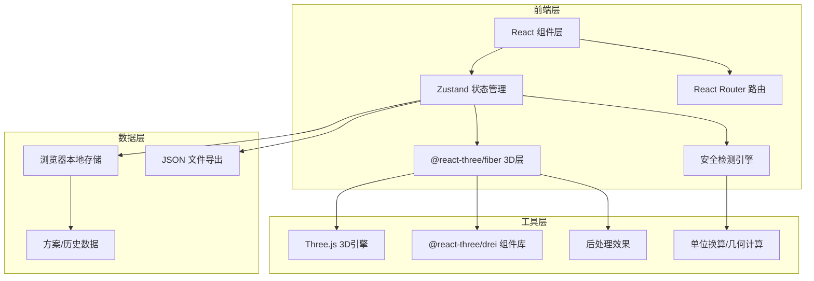
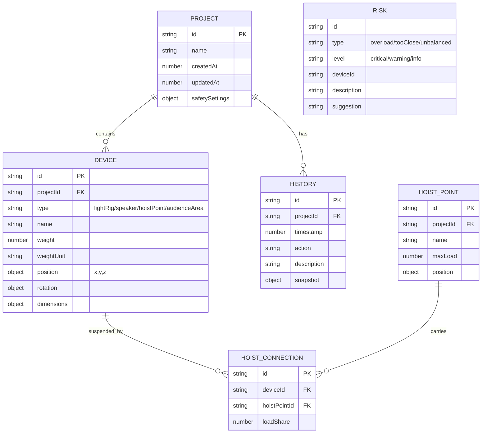

## 1. 架构设计



---

## 2. 技术描述

### 2.1 技术栈选择

| 层级 | 技术选型 | 版本 | 用途说明 |
|------|----------|------|----------|
| 前端框架 | React | 18.x | 组件化开发，Hooks管理生命周期 |
| 语言 | TypeScript | 5.x | 类型安全，提升代码可维护性 |
| 构建工具 | Vite | 5.x | 快速开发构建，热更新 |
| 样式 | Tailwind CSS | 3.x | 原子化CSS，快速构建UI |
| 状态管理 | Zustand | 4.x | 轻量级状态管理，支持中间件 |
| 路由 | React Router | 6.x | 单页应用路由管理 |
| 3D引擎 | Three.js | 0.160.x | WebGL 3D渲染核心 |
| React-Three | @react-three/fiber | 8.x | React声明式Three.js封装 |
| 3D组件库 | @react-three/drei | 9.x | 常用3D组件集合 |
| 后处理 | @react-three/postprocessing | 2.x | Bloom、AO等后处理效果 |
| 图标 | lucide-react | 0.294.x | 统一图标库 |

### 2.2 项目初始化

使用 `react-ts` 模板初始化项目，命令：
```
npm init vite-init@latest -y . -- --template react-ts --force
```

然后添加额外依赖：
- three, @react-three/fiber, @react-three/drei, @react-three/postprocessing
- zustand
- react-router-dom
- lucide-react

---

## 3. 目录结构

```
src/
├── components/              # React 组件
│   ├── layout/             # 布局组件
│   │   ├── Header.tsx
│   │   ├── Sidebar.tsx
│   │   └── Panel.tsx
│   ├── three3d/            # 3D 相关组件
│   │   ├── Scene3D.tsx     # 3D场景容器
│   │   ├── Stage.tsx       # 舞台模型
│   │   ├── LightRig.tsx    # 灯架模型
│   │   ├── Speaker.tsx     # 音箱模型
│   │   ├── HoistPoint.tsx  # 吊点模型
│   │   ├── AudienceArea.tsx # 观众区
│   │   ├── ConnectionLine.tsx # 吊点连接线
│   │   └── DragController.tsx # 拖拽控制器
│   ├── ui/                 # 通用UI组件
│   │   ├── Button.tsx
│   │   ├── Input.tsx
│   │   ├── Select.tsx
│   │   ├── Card.tsx
│   │   ├── Badge.tsx
│   │   └── Modal.tsx
│   ├── properties/         # 属性面板
│   │   ├── PropertyPanel.tsx
│   │   ├── WeightInput.tsx # 重量输入(支持单位)
│   │   └── PositionInput.tsx
│   ├── risk/               # 风险相关
│   │   ├── RiskList.tsx
│   │   ├── RiskItem.tsx
│   │   ├── RiskFilter.tsx
│   │   └── RiskStats.tsx
│   └── export/             # 导出相关
│       ├── ExportPreview.tsx
│       └── ReportGenerator.tsx
├── pages/                  # 页面组件
│   ├── EditorPage.tsx      # 主编辑页
│   ├── ProjectListPage.tsx # 方案列表页
│   ├── ProjectDetailPage.tsx # 方案详情页
│   └── ExportPage.tsx      # 导出预览页
├── store/                  # Zustand 状态管理
│   ├── useProjectStore.ts  # 项目/设备/方案状态
│   ├── useSafetyStore.ts   # 安全检测状态
│   └── useUIStore.ts       # UI状态
├── hooks/                  # 自定义 Hooks
│   ├── useDragDrop.ts      # 拖拽逻辑
│   ├── useSafetyCheck.ts   # 安全检测
│   ├── useWeightUnit.ts    # 重量单位处理
│   └── useHistory.ts       # 历史版本管理
├── utils/                  # 工具函数
│   ├── unitConversion.ts   # 单位换算(kg/公斤)
│   ├── geometry.ts         # 几何计算(距离/面积)
│   ├── safetyEngine.ts     # 安全检测引擎
│   ├── exportReport.ts     # 报告生成
│   └── storage.ts          # 本地存储封装
├── types/                  # TypeScript 类型定义
│   ├── devices.ts          # 设备类型
│   ├── safety.ts           # 安全相关类型
│   └── project.ts          # 项目类型
├── constants/              # 常量配置
│   ├── deviceDefaults.ts   # 设备默认参数
│   ├── safetyThresholds.ts # 安全阈值
│   └── colors.ts           # 颜色常量
├── App.tsx                 # 根组件
├── main.tsx                # 入口文件
└── index.css               # 全局样式
```

---

## 4. 路由定义

| 路由路径 | 页面组件 | 用途说明 |
|----------|----------|----------|
| `/` | `EditorPage` | 主编辑页，3D场景+设备操作 |
| `/projects` | `ProjectListPage` | 方案列表，查看所有保存的方案 |
| `/projects/:id` | `ProjectDetailPage` | 方案详情，查看历史版本 |
| `/export/:id` | `ExportPage` | 导出预览页，生成审批报告 |

---

## 5. 数据模型

### 5.1 数据模型定义



### 5.2 核心类型定义

```typescript
// 设备类型
type DeviceType = 'lightRig' | 'speaker' | 'hoistPoint' | 'audienceArea' | 'stage';

// 重量单位
type WeightUnit = 'kg' | '公斤' | '';

// 风险等级
type RiskLevel = 'critical' | 'warning' | 'info';

// 风险类型
type RiskType = 'overload' | 'tooClose' | 'unbalanced' | 'weightMissing';

// 位置坐标
interface Position {
  x: number;
  y: number;
  z: number;
}

// 设备基础接口
interface BaseDevice {
  id: string;
  type: DeviceType;
  name: string;
  position: Position;
  rotation?: Position;
  dimensions?: { width: number; height: number; depth: number };
}

// 承重设备接口
interface LoadBearingDevice extends BaseDevice {
  weight: number;
  weightUnit: WeightUnit;
}

// 灯架
interface LightRig extends LoadBearingDevice {
  type: 'lightRig';
  lightCount: number;
  connectedHoistPoints: string[];
}

// 音箱
interface Speaker extends LoadBearingDevice {
  type: 'speaker';
  power: number;
}

// 吊点
interface HoistPoint extends BaseDevice {
  type: 'hoistPoint';
  maxLoad: number;
  currentLoad: number;
}

// 观众区
interface AudienceArea extends BaseDevice {
  type: 'audienceArea';
  capacity: number;
}

// 舞台
interface Stage extends BaseDevice {
  type: 'stage';
}

// 安全设置
interface SafetySettings {
  maxHoistLoad: number;      // 单吊点最大承重(kg)
  minAudienceDistance: number; // 观众区最小安全距离(m)
  maxLoadVariance: number;   // 最大负载分布方差
}

// 风险
interface Risk {
  id: string;
  type: RiskType;
  level: RiskLevel;
  deviceId: string;
  deviceType: DeviceType;
  description: string;
  suggestion: string;
  value?: number;
  threshold?: number;
}

// 项目方案
interface Project {
  id: string;
  name: string;
  createdAt: number;
  updatedAt: number;
  safetySettings: SafetySettings;
  devices: BaseDevice[];
  risks: Risk[];
}

// 历史记录
interface HistoryEntry {
  id: string;
  projectId: string;
  timestamp: number;
  action: string;
  description: string;
  snapshot: Project;
}
```

---

## 6. 核心模块设计

### 6.1 安全检测引擎

**核心检测逻辑**：
1. **超载检测**：计算每个吊点承担的总重量，与 `maxHoistLoad` 比较
2. **距离检测**：计算设备（灯架/音箱）到观众区的最小距离，与 `minAudienceDistance` 比较
3. **分布均匀性检测**：计算各吊点负载的方差，判断分布是否均匀
4. **重量缺失检测**：检测承重设备是否未填写重量

**单位处理逻辑**：
- 输入时自动识别 `kg` 和 `公斤`
- 内部统一转换为 `kg` 进行计算
- 显示时按用户输入的单位回显
- 空值（未填写）标记为 `weightMissing` 风险

### 6.2 3D 拖拽系统

- 使用 `@react-three/drei` 的 `DragControls` 实现拖拽
- 拖拽时更新设备位置，实时触发安全检测
- 支持网格吸附（可选）
- 拖拽结束自动保存历史记录

### 6.3 历史版本管理

- 使用 Zustand middleware 实现状态快照
- 每次设备变更（添加/删除/移动/修改属性）自动生成历史记录
- 最多保留20个版本
- 支持回滚到任意历史版本

### 6.4 导出模块

- 生成 JSON 格式方案文件
- 生成 Markdown 格式审批报告，包含：
  - 项目基本信息
  - 风险汇总（按等级分类）
  - 详细风险点及调整建议
  - 设备清单（按类型分组，含重量统计）
  - 安全参数设置
- 支持打印和下载

---

## 7. 状态管理设计

### useProjectStore
```typescript
{
  project: Project | null;
  selectedDeviceId: string | null;
  addDevice: (device: Omit<BaseDevice, 'id'>) => void;
  updateDevice: (id: string, updates: Partial<BaseDevice>) => void;
  removeDevice: (id: string) => void;
  selectDevice: (id: string | null) => void;
  saveProject: (name: string) => void;
  loadProject: (id: string) => void;
  exportProject: (id: string) => string;
}
```

### useSafetyStore
```typescript
{
  risks: Risk[];
  filterType: DeviceType | 'all';
  safetySettings: SafetySettings;
  runSafetyCheck: () => void;
  updateSafetySettings: (settings: Partial<SafetySettings>) => void;
  setRiskFilter: (type: DeviceType | 'all') => void;
  getFilteredRisks: () => Risk[];
}
```

### useUIStore
```typescript
{
  activePanel: 'properties' | 'risks' | 'history';
  isPlacingDevice: boolean;
  placingDeviceType: DeviceType | null;
  setActivePanel: (panel: string) => void;
  startPlacingDevice: (type: DeviceType) => void;
  cancelPlacingDevice: () => void;
}
```

---

## 8. 关键算法

### 8.1 吊点承重分配算法

当一个设备连接多个吊点时，按距离反比例分配重量：

```
总重量 W，连接到 N 个吊点 P1, P2, ... PN
每个吊点 Pi 到设备的距离 Di
分配系数 Ki = 1 / Di
吊点承重 Li = W * Ki / (K1 + K2 + ... + KN)
```

### 8.2 设备到观众区距离计算

计算设备边界框到观众区边界框的最小3D距离：
- 计算两个AABB（轴对齐包围盒）的最小距离
- 考虑高度差

### 8.3 负载分布均匀性计算

```
所有吊点承重 L1, L2, ..., Ln
平均值 μ = (L1 + L2 + ... + Ln) / n
方差 σ² = Σ(Li - μ)² / n
若 σ² > 阈值 => 分布不均风险
```

### 8.4 单位换算

```
1 公斤 = 1 kg
空值 => 触发 weightMissing 风险
```
