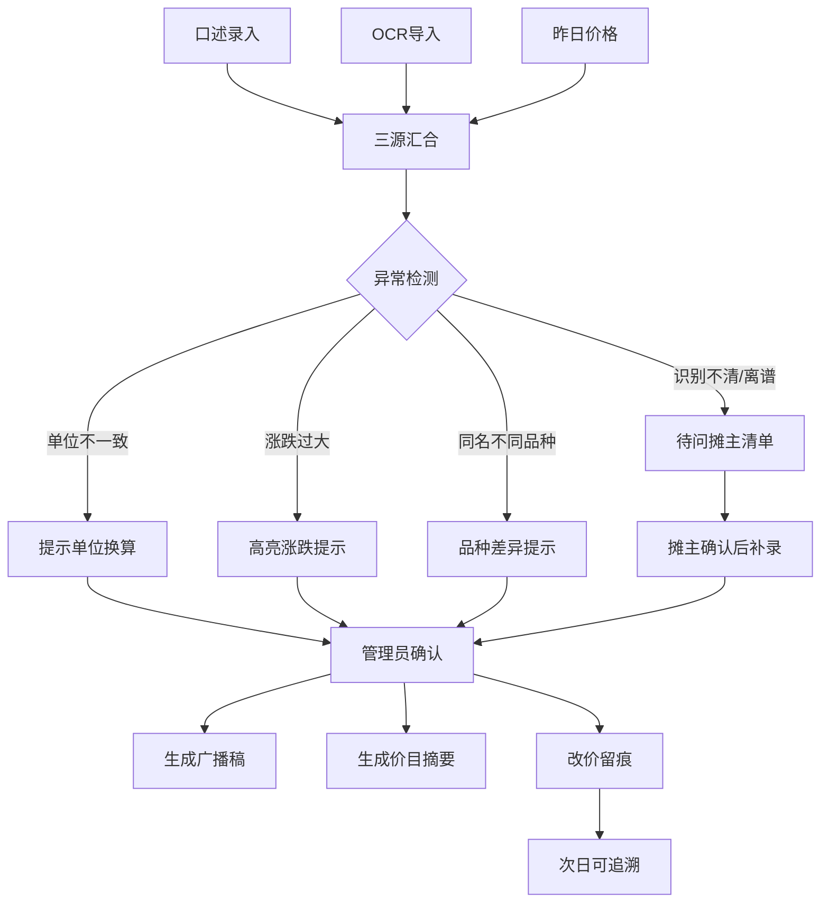

## 1. 产品概述

农贸价格播报纠错工具——面向农贸市场管理员的日常价格校验与广播稿生成工具。将口述文字、价签识别结果和昨日价格三源数据汇合，自动检测单位不一致、涨跌过大、同名不同品种、缺少确认等问题，管理员确认后一键生成广播稿与摊位价目摘要；所有改价留痕，次日可追溯。

- 目标用户：农贸市场管理员、运营人员
- 核心价值：减少人工比价出错率，提高播报准确性与效率，形成价格变更审计闭环

## 2. 核心功能

### 2.1 用户角色

| 角色 | 注册方式 | 核心权限 |
|------|----------|----------|
| 管理员 | 系统分配账号 | 录入数据、确认价格、生成广播稿、查看留痕 |
| 运营 | 系统分配账号 | 查看播报稿、查看留痕、导出价目摘要 |

### 2.2 功能模块

1. **数据录入页**：口述文字输入、价签OCR结果导入、昨日价格自动加载
2. **纠错校验页**：多源比对、异常提示、确认操作
3. **广播稿生成页**：确认后生成广播稿、摊位价目摘要导出
4. **留痕追溯页**：历史改价记录、每日处理快照

### 2.3 页面详情

| 页面名称 | 模块名称 | 功能描述 |
|----------|----------|----------|
| 数据录入页 | 口述文字输入 | 管理员手动输入摊主口报价，支持逐条添加品种名+价格+单位 |
| 数据录入页 | 价签识别导入 | 粘贴或上传价签OCR结果，解析为结构化价格数据 |
| 数据录入页 | 昨日价格加载 | 自动加载前一工作日最终确认价格，作为比价基准 |
| 纠错校验页 | 三源比对面板 | 同一品种的三列并排：口述价、OCR价、昨日价，高亮差异 |
| 纠错校验页 | 异常检测提示 | 单位不一致(斤/公斤)、涨跌幅超阈值、同名不同品种、缺少确认 |
| 纠错校验页 | 待问摊主清单 | 识别不清或价格离谱的条目自动归入待问清单，不硬生成结论 |
| 纠错校验页 | 逐条确认操作 | 管理员选择采纳价格来源、手动修正、标注待确认 |
| 广播稿生成页 | 广播稿预览 | 按摊位分组生成口语化播报文本，支持手动微调 |
| 广播稿生成页 | 价目摘要导出 | 生成结构化摊位价目表，可复制或打印 |
| 留痕追溯页 | 改价记录列表 | 按日期查看所有价格变更，标注来源和操作人 |
| 留痕追溯页 | 每日快照 | 展示某日最终确认的完整价格表 |

## 3. 核心流程

管理员每日工作流程：
1. 打开数据录入页，逐条输入摊主口述价格（品种+价格+单位）
2. 导入价签OCR识别结果，系统自动解析品种与价格
3. 系统自动加载昨日确认价格
4. 进入纠错校验页，三源数据并排显示
5. 系统自动检测异常：单位不一致（斤vs公斤）、涨跌超30%、同名不同品种（如"青菜"vs"小青菜"）、OCR识别模糊
6. 管理员逐条确认：选择采纳价、手动修正、或标注"待问摊主"
7. 识别不清或离谱价格归入待问摊主清单
8. 全部确认后，生成广播稿和摊位价目摘要
9. 改价记录自动留痕，次日可查

## 4. 用户界面设计

### 4.1 设计风格

- **主色调**：暖橙 #E8722A（市场活力）+ 深棕 #3D2B1F（稳重感）
- **辅助色**：浅米 #FDF6EC 背景、深绿 #2D7D46（价格正常）、警示红 #D94452（异常提示）
- **字体**：思源宋体/Noto Serif SC（标题，市井人文感）+ Noto Sans SC（正文，清晰可读）
- **布局**：桌面端双栏布局，左侧数据录入/列表，右侧比对/预览面板
- **按钮风格**：圆角6px，微阴影，暖橙色主操作按钮
- **图标**：Lucide图标，线条风格

### 4.2 页面设计概览

| 页面名称 | 模块名称 | UI元素 |
|----------|----------|--------|
| 数据录入页 | 口述输入区 | 白色卡片，表格形式输入，品种/价格/单位三列，底部添加按钮 |
| 数据录入页 | OCR导入区 | 拖拽上传区+文本粘贴框，解析后表格展示 |
| 数据录入页 | 昨日价格区 | 折叠面板，灰色底表格，只读展示 |
| 纠错校验页 | 三源比对表 | 三列并排表格，异常行高亮色底，差异单元格标红/标绿 |
| 纠错校验页 | 异常提示卡片 | 右侧浮动面板，按类型分组，点击跳转对应行 |
| 纠错校验页 | 确认操作栏 | 每行末尾操作：采纳口述/采纳OCR/手动修正/待问摊主 |
| 广播稿生成页 | 广播稿编辑器 | 左侧文本预览区，可编辑；右侧摊位价目表格 |
| 广播稿生成页 | 操作按钮栏 | 复制广播稿、导出价目表、打印 |
| 留痕追溯页 | 日期选择器 | 顶部日期切换，日历选择 |
| 留痕追溯页 | 改价记录表 | 时间线+表格混合，改价行标黄底，标注原因 |

### 4.3 响应式设计

- 桌面优先设计，1280px+最佳体验
- 平板端（768-1279px）：单栏布局，左右面板切换为标签页
- 移动端（<768px）：简化操作，仅支持录入和查看，校验功能建议在桌面端使用

### 4.4 3D场景指引

不适用
