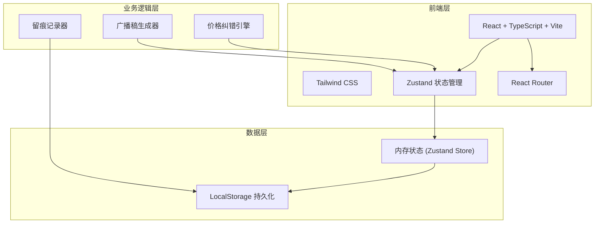
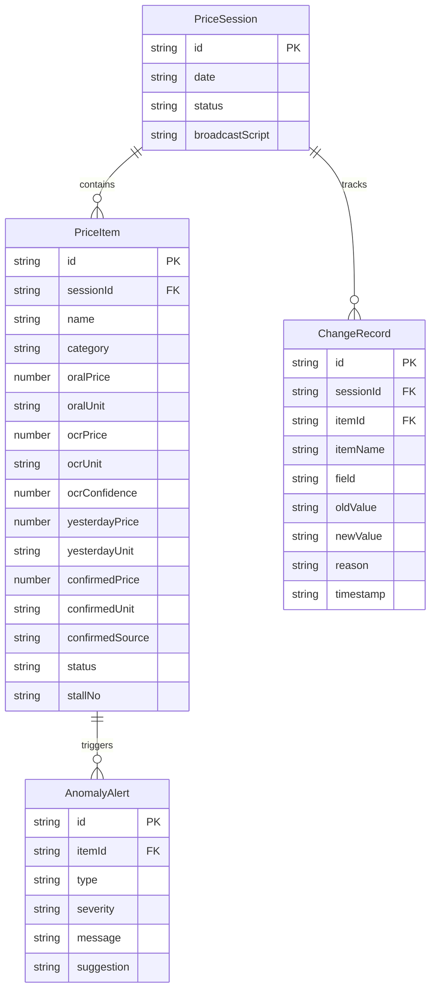

## 1. 架构设计



## 2. 技术说明

- **前端**：React@18 + TypeScript + Tailwind CSS@3 + Vite
- **初始化工具**：vite-init (react-ts 模板)
- **后端**：无（纯前端应用，使用 LocalStorage 持久化数据）
- **数据库**：LocalStorage，配合 Zustand persist 中间件
- **状态管理**：Zustand，含 persist 中间件实现数据持久化
- **路由**：react-router-dom v6

## 3. 路由定义

| 路由 | 用途 |
|------|------|
| `/` | 重定向到数据录入页 |
| `/input` | 数据录入页：口述输入、OCR导入、昨日价格 |
| `/verify` | 纠错校验页：三源比对、异常检测、逐条确认 |
| `/broadcast` | 广播稿生成页：广播稿预览编辑、价目摘要导出 |
| `/history` | 留痕追溯页：历史改价记录、每日快照 |

## 4. API定义

无后端API。所有数据通过 Zustand Store + LocalStorage 管理。

### 4.1 核心数据类型

```typescript
interface PriceItem {
  id: string;
  name: string;
  category: string;
  oralPrice?: number;
  oralUnit?: "斤" | "公斤";
  ocrPrice?: number;
  ocrUnit?: "斤" | "公斤";
  ocrConfidence?: number;
  yesterdayPrice?: number;
  yesterdayUnit?: "斤" | "公斤";
  confirmedPrice?: number;
  confirmedUnit?: "斤" | "公斤";
  confirmedSource?: "oral" | "ocr" | "manual" | "pending";
  status: "confirmed" | "pending" | "ask_vendor";
  stallNo?: string;
}

interface PriceSession {
  id: string;
  date: string;
  items: PriceItem[];
  broadcastScript?: string;
  changeLog: ChangeRecord[];
  status: "draft" | "verified" | "published";
}

interface ChangeRecord {
  id: string;
  itemId: string;
  itemName: string;
  field: string;
  oldValue: number | string;
  newValue: number | string;
  reason: string;
  timestamp: string;
}

interface AnomalyAlert {
  id: string;
  itemId: string;
  type: "unit_mismatch" | "price_surge" | "name_variant" | "ocr_unclear" | "unconfirmed";
  severity: "warning" | "error";
  message: string;
  suggestion: string;
}
```

## 5. 服务端架构图

不适用（纯前端应用）

## 6. 数据模型

### 6.1 数据模型定义



### 6.2 数据定义语言

使用 LocalStorage + Zustand persist，无需 SQL DDL。初始化时自动创建 mock 数据：

- 默认包含前3个交易日的价格历史记录
- 每个交易日包含10-15个常见蔬菜品种
- 预设涨跌阈值：30%
- 预设单位换算：1公斤 = 2斤
