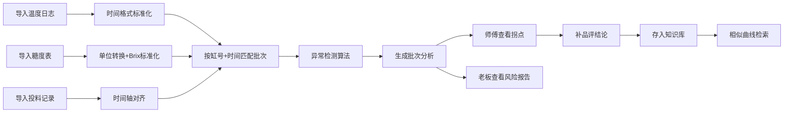

## 1. 产品概述

小酒厂发酵温控分析平台，解决多源数据对齐与异常检测问题。导入温度日志、糖度表和投料记录，按缸号对齐时间轴，自动标出升温太快、低温拖太久、补料无响应等异常片段。为酿酒师提供拐点分析图表，为管理者提供风险批次报告，并建立品评知识库实现相似曲线溯源。

### 核心价值
- **数据整合**：解决手抄糖度与设备日志的时间轴对齐难题
- **异常预警**：自动识别温控异常，辅助判断酸味偏重原因
- **知识沉淀**：品评结论回写，相似曲线快速检索
- **双视角决策**：师傅看工艺拐点，老板看批次风险

---

## 2. 核心功能

### 2.1 用户角色

| 角色 | 身份 | 核心权限 |
|------|------|----------|
| 酿酒师 | 一线操作师傅 | 数据导入、异常复核、拐点分析、补品评结论 |
| 厂长/老板 | 管理者 | 查看风险报告、批次列表、品评历史 |

### 2.2 功能模块

1. **数据导入页**：温度日志、糖度表、投料记录批量导入，坏行标记与保留
2. **批次列表页**：按缸号和时间展示所有发酵批次，异常标记一目了然
3. **批次详情页**：温度/糖度/投料三合一图表，异常片段高亮标注
4. **风险报告页**：老板视角，筛选高风险批次，建议提前品评
5. **知识库检索**：按曲线特征检索历史品评结论

### 2.3 页面详情

| 页面名称 | 模块名称 | 功能描述 |
|-----------|-----------|----------|
| 数据导入页 | 文件上传区 | 支持CSV拖放上传，支持温度日志/糖度表/投料记录三种类型 |
| 数据导入页 | 数据预览区 | 展示解析后数据，坏行用黄色标记，支持手动确认 |
| 数据导入页 | 时间格式处理 | 自动识别跨夜时间（如"23:00-次日05:00"），统一转ISO时间戳 |
| 数据导入页 | 单位转换 | 自动识别Brix/百分比糖度单位，统一转换为标准Brix |
| 批次列表页 | 批次卡片 | 展示缸号、批次号、起止时间、异常数量、品评状态 |
| 批次列表页 | 筛选过滤 | 按缸号、时间范围、异常类型、品评状态筛选 |
| 批次详情页 | 三合一图表 | 温度曲线（主Y轴）、糖度点（次Y轴）、投料标记（垂直线） |
| 批次详情页 | 异常标记 | 升温太快（红色区间）、低温拖太久（蓝色区间）、补料无响应（橙色标记） |
| 批次详情页 | 拐点标注 | 自动标注温度/糖度关键拐点，鼠标悬浮显示详情 |
| 批次详情页 | 品评回写 | 师傅填写品评结论、处理措施、最终评分 |
| 风险报告页 | 风险批次列表 | 按异常严重程度排序，标注"建议提前品评"标签 |
| 风险报告页 | 趋势统计 | 各缸号异常率、月度趋势、常见异常类型分布 |
| 知识库检索 | 相似曲线匹配 | 选择当前批次曲线，检索历史相似曲线及对应品评结论 |
| 知识库检索 | 处理建议 | 展示相似批次的处理措施和最终结果 |

---

## 3. 核心流程

### 3.1 数据导入与分析流程

### 3.2 详细流程说明
1. 师傅导入三类数据文件（温度日志/糖度表/投料记录）
2. 系统自动处理时间格式、单位转换，标记坏行保留待复核
3. 按缸号和时间范围自动匹配归属于同一发酵批次
4. 异常检测引擎扫描三类异常：升温太快、低温拖太久、补料无响应
5. 生成批次分析结果，师傅查看图表拐点，补品评结论
6. 老板查看风险报告，决定哪些批次需要提前品评
7. 所有品评结论存入知识库，支持相似曲线检索

---

## 4. 用户界面设计

### 4.1 设计风格
- **主色调**：深琥珀色 `#8B4513`（酿酒桶色）
- **辅助色**：暖橙色 `#D2691E`（温度感）、深棕色 `#3E2723`（专业稳重）
- **异常色**：升温异常 `#E53935（红）、低温异常 `#1E88E5（蓝）、补料异常 `#FB8C00（橙）
- **字体**：标题用「思源宋体 Heavy」（传统工艺感），正文用「Inter」（现代清晰）
- **布局**：卡片式布局，数据密集区采用固定表头滚动
- **图标**：Lucide 图标，统一线性风格

### 4.2 页面设计概览

| 页面名称 | 模块名称 | UI元素 |
|-----------|-----------|---------|
| 数据导入页 | 文件上传区 | 拖拽上传框，文件类型标签，上传进度条，拖放时边框动画 |
| 数据导入页 | 数据预览表格 | 斑马纹表格，坏行黄色背景，悬浮高亮，可折叠展开 |
| 批次列表页 | 批次卡片网格 | 卡片悬停上浮，异常标签圆角胶囊，状态指示灯 |
| 批次详情页 | 三合一图表 | ECharts 折线图，异常区间半透明填充，拐点标记带 tooltip |
| 批次详情页 | 时间轴导航 | 底部时间滑块，支持缩放拖拽 |
| 风险报告页 | 风险批次列表 | 风险等级红黄绿三色标识，紧急标签突出显示 |
| 知识库检索 | 曲线对比区 | 左右双栏曲线叠加对比，相似度百分比显示 |

### 4.3 响应式设计
- **桌面端优先（1280px+：三栏布局
- **平板端（768-1279px：两栏布局
- **移动端（<768px）：单栏流式布局，图表自适应缩放

### 4.4 交互体验
- 页面加载：骨架屏占位，数据渐入动画
- 卡片悬停：微妙上浮+阴影加深
- 图表交互：拐点悬停显示详情，点击异常区间跳转品评
- 数据导入：拖拽文件时边框呼吸灯效果
- 按钮：圆角8px，点击反馈

---

## 5. 异常检测规则

### 5.1 升温太快
- **判定规则**：1小时内温度上升超过2°C
- **视觉标记**：红色半透明区间覆盖
- **风险等级**：高

### 5.2 低温拖太久
- **判定规则**：温度低于设定阈值超过4小时
- **视觉标记**：蓝色半透明区间覆盖
- **风险等级**：中

### 5.3 补料无响应
- **判定规则**：补料后2小时内温度/糖度无明显变化
- **视觉标记**：橙色垂直线+感叹号
- **风险等级**：中高

---

## 6. 数据格式规范

### 6.1 温度日志格式
- 支持列：缸号, 时间, 温度(°C)
- 时间格式兼容：`YYYY-MM-DD HH:mm, MM/DD HH:mm（自动识别跨夜）

### 6.2 糖度表格式
- 支持列：缸号, 时间, 糖度, 单位(Brix/%)
- 单位自动转换：% → Brix（×1.0系数，假设1% = 1°Bx）

### 6.3 投料记录格式
- 支持列：缸号, 时间, 投料类型, 投料量
- 投料类型：糖、酵母、营养盐等

