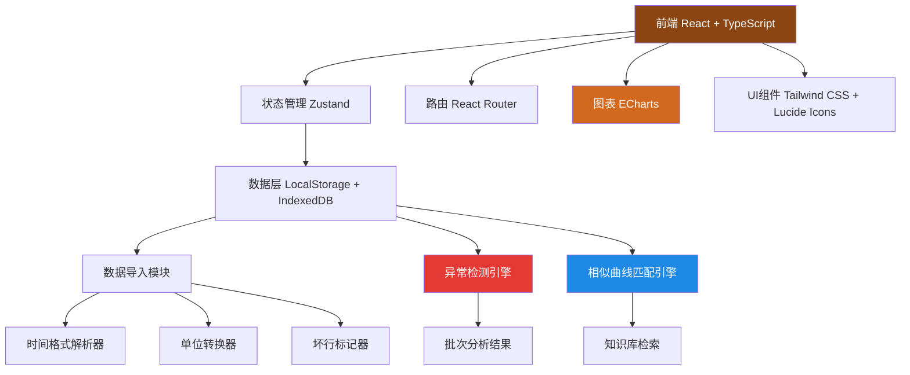
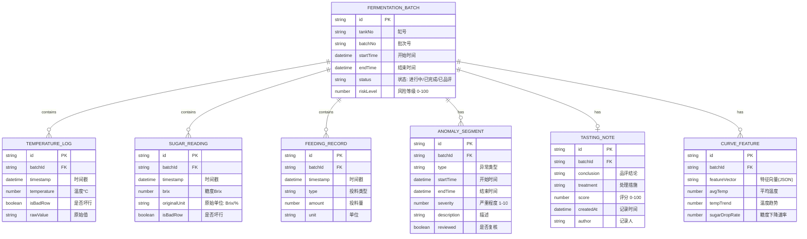

## 1. 架构设计



---

## 2. 技术栈说明

| 层级 | 技术选型 | 版本 | 说明 |
|------|----------|------|------|
| **前端框架** | React | 18.x | 组件化开发 |
| **语言** | TypeScript | 5.x | 类型安全 |
| **构建工具** | Vite | 5.x | 快速构建 |
| **路由** | react-router-dom | 6.x | 单页路由 |
| **状态管理** | zustand | 4.x | 轻量状态管理 |
| **图表** | echarts | 5.x | 专业数据可视化 |
| **样式** | tailwindcss | 3.x | 原子化CSS |
| **图标** | lucide-react | 0.344.x | 线性图标库 |
| **CSV解析** | papaparse | 5.4.x | CSV文件解析 |
| **数据持久化** | LocalStorage + IndexedDB | - | 本地存储，无需后端 |
| **项目模板** | react-ts | - | 纯前端项目 |

---

## 3. 路由定义

| 路由路径 | 页面名称 | 主要功能 |
|----------|----------|----------|
| `/` | 首页导航 | 快捷入口、数据统计概览 |
| `/import` | 数据导入页 | 多文件上传、数据预览、格式处理 |
| `/batches` | 批次列表页 | 所有批次展示、筛选过滤、状态指示 |
| `/batches/:id` | 批次详情页 | 三合一图表、异常标记、拐点分析、品评回写 |
| `/report` | 风险报告页 | 老板视角、风险批次、趋势统计 |
| `/knowledge` | 知识库检索 | 相似曲线匹配、历史品评查询 |

---

## 4. 数据模型

### 4.1 实体关系图



### 4.2 TypeScript 类型定义

```typescript
// 核心类型定义
type AnomalyType = 'heating_too_fast' | 'low_temp_too_long' | 'feeding_no_response';
type BatchStatus = 'ongoing' | 'completed' | 'tasted';
type SugarUnit = 'Brix' | '%';

interface FermentationBatch {
  id: string;
  tankNo: string;
  batchNo: string;
  startTime: Date;
  endTime?: Date;
  status: BatchStatus;
  riskLevel: number;
  temperatureLogs: TemperatureLog[];
  sugarReadings: SugarReading[];
  feedingRecords: FeedingRecord[];
  anomalies: AnomalySegment[];
  tastingNote?: TastingNote;
  curveFeatures?: CurveFeature;
}

interface TemperatureLog {
  id: string;
  timestamp: Date;
  temperature: number;
  isBadRow: boolean;
  rawValue: string;
}

interface SugarReading {
  id: string;
  timestamp: Date;
  brix: number;
  originalUnit: SugarUnit;
  isBadRow: boolean;
  rawValue: string;
}

interface FeedingRecord {
  id: string;
  timestamp: Date;
  type: string;
  amount: number;
  unit: string;
}

interface AnomalySegment {
  id: string;
  type: AnomalyType;
  startTime: Date;
  endTime: Date;
  severity: number;
  description: string;
  reviewed: boolean;
}

interface TastingNote {
  id: string;
  conclusion: string;
  treatment: string;
  score: number;
  createdAt: Date;
  author: string;
}

interface CurveFeature {
  avgTemp: number;
  tempTrend: number;
  sugarDropRate: number;
  featureVector: number[];
}

interface SimilarBatchResult {
  batch: FermentationBatch;
  similarity: number;
  tastingNote?: TastingNote;
}
```

---

## 5. 核心算法模块

### 5.1 异常检测算法

```typescript
// 升温太快检测
function detectHeatingTooFast(logs: TemperatureLog[], threshold: number = 2, windowHours: number = 1): AnomalySegment[] {
  // 滑动窗口检测1小时内温升超过2°C
}

// 低温拖太久检测  
function detectLowTempTooLong(logs: TemperatureLog[], tempThreshold: number, durationHours: number = 4): AnomalySegment[] {
  // 检测温度低于阈值持续超过4小时
}

// 补料无响应检测
function detectFeedingNoResponse(
  logs: TemperatureLog[],
  readings: SugarReading[],
  feedings: FeedingRecord[],
  responseHours: number = 2
): AnomalySegment[] {
  // 补料后2小时内温度/糖度无明显变化
}
```

### 5.2 相似曲线匹配算法

```typescript
// 提取曲线特征向量
function extractCurveFeatures(batch: FermentationBatch): number[] {
  // 归一化温度序列、糖度序列、时间维度
  // 提取统计特征：均值、方差、趋势、斜率
}

// 计算相似度（余弦相似度 + DTW动态时间规整）
function calculateSimilarity(features1: number[], features2: number[]): number {
  // 结合余弦相似度和DTW距离
}

// 检索相似批次
function findSimilarBatches(targetBatch: FermentationBatch, allBatches: FermentationBatch[], topK: number = 5): SimilarBatchResult[] {
  // 计算与所有历史批次的相似度，返回Top K
}
```

### 5.3 时间格式解析

```typescript
function parseFlexibleDateTime(dateStr: string, baseDate?: Date): Date {
  // 支持格式:
  // 1. YYYY-MM-DD HH:mm
  // 2. MM/DD HH:mm
  // 3. HH:mm (相对时间，跨夜自动推断)
  // 4. "23:00-次日05:00" 跨夜格式
}
```

### 5.4 糖度单位转换

```typescript
function convertToBrix(value: number, unit: SugarUnit): number {
  // 百分比转Brix，1% ≈ 1°Bx
  return unit === '%' ? value : value;
}
```

---

## 6. 项目结构

```
src/
├── components/           # 可复用组件
│   ├── BatchCard.tsx         # 批次卡片
│   ├── Chart/                # 图表组件
│   │   ├── FermentationChart.tsx   # 三合一主图表
│   │   ├── AnomalyOverlay.tsx      # 异常区间覆盖层
│   │   └── TimeSlider.tsx          # 时间轴滑块
│   ├── DataImport/           # 数据导入组件
│   │   ├── FileUpload.tsx          # 文件上传
│   │   └── DataPreview.tsx         # 数据预览表格
│   ├── TastingForm.tsx        # 品评回写表单
│   └── ui/                    # 基础UI组件
│       ├── Button.tsx
│       ├── Badge.tsx
│       └── Card.tsx
├── pages/                # 页面组件
│   ├── Home.tsx               # 首页
│   ├── DataImport.tsx         # 数据导入页
│   ├── BatchList.tsx          # 批次列表页
│   ├── BatchDetail.tsx        # 批次详情页
│   ├── RiskReport.tsx         # 风险报告页
│   └── KnowledgeBase.tsx      # 知识库检索页
├── store/                # Zustand状态管理
│   └── useBatchStore.ts       # 批次数据存储
├── hooks/                # 自定义Hooks
│   ├── useAnomalyDetection.ts # 异常检测Hook
│   ├── useCurveMatching.ts    # 曲线匹配Hook
│   └── useDataImport.ts       # 数据导入Hook
├── utils/                # 工具函数
│   ├── timeParser.ts          # 时间解析
│   ├── unitConverter.ts       # 单位转换
│   ├── anomalyDetector.ts     # 异常检测算法
│   ├── curveMatcher.ts        # 曲线匹配算法
│   └── csvParser.ts           # CSV解析
├── types/                # TypeScript类型定义
│   └── index.ts
├── data/                 # Mock示例数据
│   └── sampleBatches.ts
├── App.tsx
├── main.tsx
└── index.css
```

---

## 7. 状态管理设计

```typescript
// Zustand Store 设计
interface BatchState {
  batches: FermentationBatch[];
  currentBatch: FermentationBatch | null;
  importPreview: {
    temperatureLogs: TemperatureLog[];
    sugarReadings: SugarReading[];
    feedingRecords: FeedingRecord[];
    badRows: { type: string; row: number; reason: string }[];
  };
  
  // Actions
  importData: (files: File[]) => Promise<void>;
  confirmImport: () => void;
  getBatch: (id: string) => FermentationBatch | undefined;
  updateBatch: (id: string, updates: Partial<FermentationBatch>) => void;
  addTastingNote: (batchId: string, note: Omit<TastingNote, 'id' | 'createdAt'>) => void;
  findSimilarBatches: (batchId: string) => SimilarBatchResult[];
  detectAnomalies: (batchId: string) => AnomalySegment[];
}
```

---

## 8. 数据持久化方案

### 8.1 LocalStorage
- 存储：批次元数据列表、用户偏好设置
- 特点：读写快，适合小数据量

### 8.2 IndexedDB
- 存储：温度日志明细、糖度记录、投料记录
- 特点：支持大量结构化数据存储，异步操作不阻塞UI

### 8.3 数据初始化
- 首次加载时自动注入示例数据（3-5个完整批次，包含异常情况）
- 示例数据涵盖：正常批次、升温太快批次、低温拖太久批次、补料无响应批次

