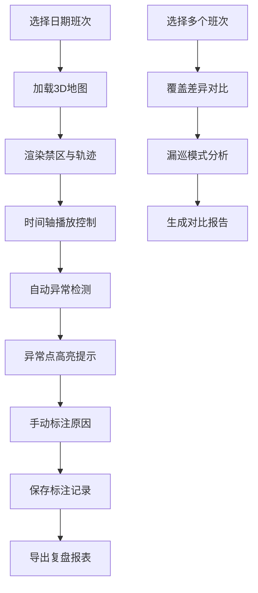

## 1. 产品概述

巡逻机器人路线复盘系统，专为园区安保团队设计，将机器人巡逻数据从枯燥的坐标列表转化为直观的3D可视化场景。解决夜间巡逻数据难以解读、异常情况靠想象、多班次对比不便等问题，提升安保管理效率和巡逻质量。

- 目标用户：夜班保安、安保主管、保安队长
- 核心价值：可视化巡逻轨迹、智能异常检测、多维度报表导出、班次对比分析

## 2. 核心功能

### 2.1 用户角色

| 角色 | 说明 | 核心权限 |
|------|------|----------|
| 夜班保安 | 夜间值班人员，查看自己班次的巡逻数据 | 查看轨迹、播放动画、查看告警 |
| 安保主管 | 负责早会复盘，导出报表 | 导出报表、标注原因、查看所有班次 |
| 保安队长 | 负责整体巡逻质量，跨班次对比 | 班次对比、覆盖分析、异常汇总 |

### 2.2 功能模块

1. **3D场景主页**：地图加载、禁区显示、轨迹渲染、告警点标注
2. **时间轴播放控制**：播放/暂停/快进/慢放、机器人实时位置、停留检测
3. **异常检测面板**：坐标缺失、重复记录、贴近危险区域提示
4. **手动标注系统**：标注异常原因、保存标注、历史标注查询
5. **报表导出中心**：巡逻覆盖报告、异常停留报告、未到达点位报告
6. **班次对比分析**：多班次覆盖对比、差异可视化、漏巡检测

### 2.3 页面详情

| 页面名称 | 模块名称 | 功能描述 |
|----------|----------|----------|
| 3D场景主页 | 地图渲染 | 加载园区3D地图，支持缩放旋转平移 |
| 3D场景主页 | 禁区显示 | 高亮显示水池、仓库门等危险/重点区域 |
| 3D场景主页 | 轨迹渲染 | 多晚轨迹同时显示，不同颜色区分 |
| 3D场景主页 | 告警点标注 | 告警编号悬浮显示，点击查看详情 |
| 时间轴控制面板 | 播放控制 | 播放、暂停、倍速、拖动进度条 |
| 时间轴控制面板 | 实时信息 | 当前时间、机器人位置、移动速度 |
| 时间轴控制面板 | 停留检测 | 停留超过阈值时高亮提示 |
| 异常检测面板 | 坐标缺失检测 | 检测时间间隔过大的坐标缺失 |
| 异常检测面板 | 重复记录检测 | 同一时间点多条记录检测 |
| 异常检测面板 | 危险贴近检测 | 轨迹与禁区距离过近检测 |
| 手动标注系统 | 标注编辑 | 选择异常点，输入原因，保存 |
| 手动标注系统 | 标注列表 | 显示所有历史标注，支持筛选搜索 |
| 报表导出中心 | 覆盖报告 | 导出巡逻覆盖热力图和覆盖率数据 |
| 报表导出中心 | 停留报告 | 导出异常停留点位和时长统计 |
| 报表导出中心 | 未到达报告 | 导出应巡未到达点位列表 |
| 班次对比分析 | 覆盖对比 | 多个班次巡逻覆盖度对比图表 |
| 班次对比分析 | 差异可视化 | 高亮显示班次间的巡逻差异 |
| 班次对比分析 | 漏巡检测 | 识别偶然漏巡 vs 系统性漏巡 |

## 3. 核心流程

安保主管选择日期班次，加载3D地图和轨迹数据，使用时间轴播放巡逻过程，系统自动检测异常并提示，主管手动标注异常原因，最后导出复盘报表。保安队长可选择多个班次进行对比分析，确认巡逻质量。

## 4. 用户界面设计

### 4.1 设计风格

**科技感暗色主题**，适配夜间安保工作环境，减少视觉疲劳。

- 主色调：深蓝 `#0a1628` 作为背景，科技蓝 `#3b82f6` 作为主色
- 辅助色：警示红 `#ef4444`（告警）、警戒黄 `#f59e0b`（警告）、正常绿 `#10b981`（正常）
- 字体：显示字体采用 `Orbitron` 科技感字体，正文字体采用 `Inter` 清晰易读
- 按钮风格：圆角矩形，微光边框，hover时有呼吸灯效果
- 布局风格：左侧3D场景主区域，右侧信息面板，底部时间轴控制条
- 图标：lucide-react 线性图标，配合状态色

### 4.2 页面设计概述

| 页面名称 | 模块名称 | UI元素 |
|----------|----------|--------|
| 3D场景主页 | 主视区 | 深色3D场景，发光轨迹线，脉冲告警点，半透明禁区 |
| 3D场景主页 | 顶部导航 | 班次选择器、日期范围、视图切换按钮 |
| 3D场景主页 | 右侧面板 | 异常列表、告警详情、标注表单 |
| 3D场景主页 | 底部控制 | 时间轴进度条、播放控制按钮、时间显示、倍速选择 |
| 报表导出中心 | 报表列表 | 卡片式报表预览，导出格式选择 |
| 班次对比分析 | 对比视图 | 并排3D场景或差异热力图，统计数据表格 |

### 4.3 响应式

桌面端优先设计，适配1920x1080及以上分辨率。平板端可折叠右侧面板，移动端提供简化的数据浏览模式。3D场景区域始终保持最大可视空间。

### 4.4 3D场景指导

- **环境/HDRI**：夜间园区场景，深蓝色星空背景，柔和的环境光，模拟月光效果
- **光照设置**：主光模拟月光（冷白色，低强度），轨迹线自带发光材质，告警点有脉冲点光源
- **相机设置**：透视相机，初始为45度俯视角度，支持OrbitControls自由操控，自动适配场景边界
- **交互与动画**：机器人模型沿轨迹平滑移动，停留时有悬浮动画，异常点有脉冲闪烁，轨迹线渐入动画
- **后期处理**：Bloom效果增强发光物体，轻微景深突出重点区域，色彩校正确保夜景通透
- **性能优化**：轨迹线使用LineGeometry，机器人使用简化GLTF模型，实例化渲染重复元素，目标60fps

