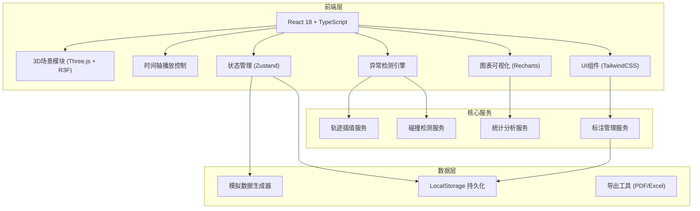
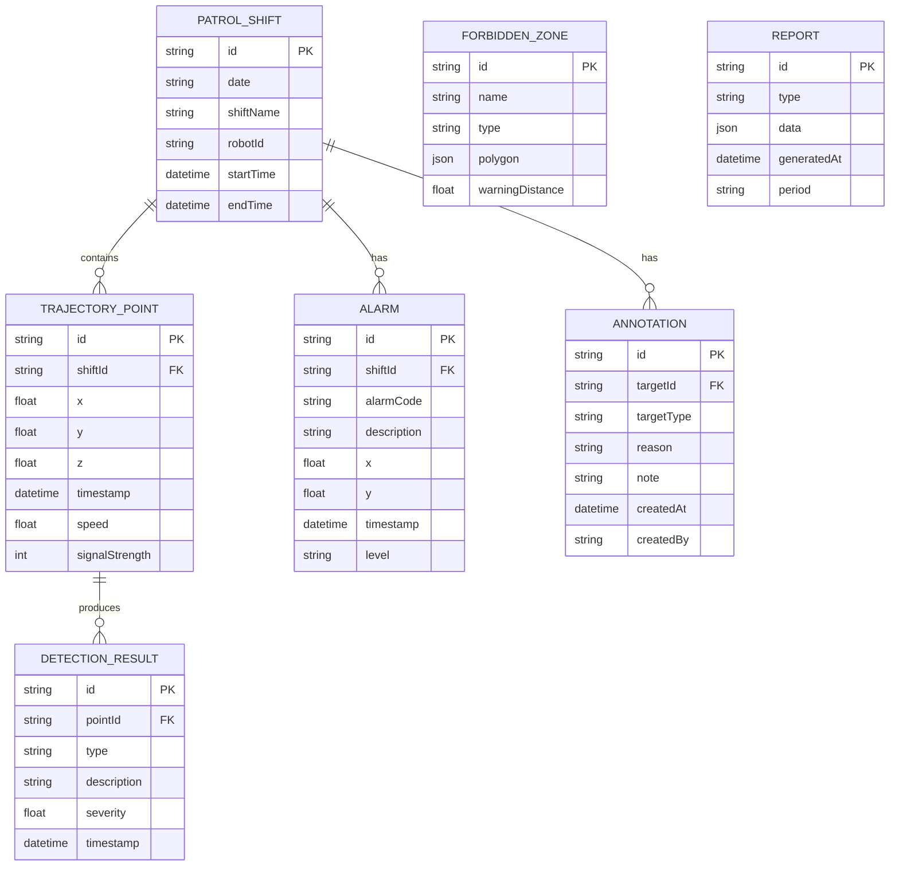

## 1. 架构设计



## 2. 技术描述

- **前端框架**: React@18 + TypeScript@5 + Vite@5
- **3D渲染**: Three.js@0.160 + @react-three/fiber@8 + @react-three/drei@9 + @react-three/postprocessing@2
- **状态管理**: Zustand@4
- **样式方案**: TailwindCSS@3
- **路由管理**: react-router-dom@6
- **图表库**: Recharts@2
- **图标库**: lucide-react@0.294
- **导出工具**: xlsx@0.18 + html2canvas@1
- **初始化工具**: vite-init
- **后端**: 无后端，纯前端应用，使用LocalStorage持久化
- **数据**: 内置模拟数据生成器，支持导入真实JSON数据

## 3. 项目结构

```
src/
├── components/          # 可复用UI组件
│   ├── ui/             # 基础UI组件 (按钮、卡片、输入框等)
│   ├── Scene3D/        # 3D场景相关组件
│   ├── Timeline/       # 时间轴控制组件
│   ├── Panels/         # 右侧面板组件
│   ├── Reports/        # 报表相关组件
│   └── Comparison/     # 班次对比组件
├── hooks/              # 自定义Hooks
│   ├── useAnimation.ts
│   ├── useDetection.ts
│   ├── usePlayback.ts
│   └── useExport.ts
├── pages/              # 页面组件
│   ├── Index.tsx       # 3D场景主页
│   ├── Reports.tsx     # 报表导出中心
│   └── Comparison.tsx  # 班次对比分析
├── store/              # Zustand状态管理
│   ├── useSceneStore.ts
│   ├── usePlaybackStore.ts
│   ├── useAnnotationStore.ts
│   └── useReportStore.ts
├── services/           # 核心服务
│   ├── trajectoryService.ts
│   ├── detectionService.ts
│   ├── analysisService.ts
│   └── exportService.ts
├── utils/              # 工具函数
│   ├── math.ts
│   ├── time.ts
│   ├── colors.ts
│   └── mockData.ts
├── types/              # TypeScript类型定义
│   ├── index.ts
│   ├── scene.ts
│   ├── trajectory.ts
│   ├── annotation.ts
│   └── report.ts
├── App.tsx
├── main.tsx
└── index.css
```

## 4. 路由定义

| 路由 | 页面 | 功能 |
|------|------|------|
| `/` | 3D场景主页 | 地图浏览、轨迹播放、异常检测、手动标注 |
| `/reports` | 报表导出中心 | 巡逻覆盖报告、异常停留报告、未到达点位报告导出 |
| `/comparison` | 班次对比分析 | 多班次覆盖对比、差异可视化、漏巡模式分析 |

## 5. 数据模型

### 5.1 数据模型定义



### 5.2 核心数据结构

```typescript
// 巡逻班次
interface PatrolShift {
  id: string;
  date: string;
  shiftName: string; // '夜班A', '夜班B'
  robotId: string;
  startTime: string;
  endTime: string;
  trajectoryPoints: TrajectoryPoint[];
  alarms: Alarm[];
}

// 轨迹点
interface TrajectoryPoint {
  id: string;
  shiftId: string;
  x: number;
  y: number;
  z: number;
  timestamp: string;
  speed: number;
  signalStrength: number;
}

// 告警
interface Alarm {
  id: string;
  shiftId: string;
  alarmCode: string;
  description: string;
  x: number;
  y: number;
  timestamp: string;
  level: 'info' | 'warning' | 'critical';
}

// 禁区
interface ForbiddenZone {
  id: string;
  name: string;
  type: 'pool' | 'warehouse' | 'restricted' | 'building';
  polygon: { x: number; y: number }[];
  warningDistance: number;
  height: number;
}

// 标注
interface Annotation {
  id: string;
  targetId: string;
  targetType: 'alarm' | 'detection' | 'point';
  reason: string;
  note: string;
  createdAt: string;
  createdBy: string;
}

// 检测结果
interface DetectionResult {
  id: string;
  type: 'missing' | 'duplicate' | 'proximity';
  description: string;
  severity: 'low' | 'medium' | 'high';
  timestamp: string;
  pointId?: string;
  zoneId?: string;
  distance?: number;
}

// 报表数据
interface CoverageReport {
  shiftId: string;
  coverageRate: number;
  coveredAreas: string[];
  missedPoints: PatrolPoint[];
  heatmapData: HeatmapCell[];
}

interface StayReport {
  shiftId: string;
  abnormalStays: AbnormalStay[];
  totalStayTime: number;
  avgStayDuration: number;
}

interface ComparisonReport {
  shiftIds: string[];
  coverageComparison: { shiftId: string; rate: number }[];
  differences: ShiftDifference[];
  patternAnalysis: PatternAnalysis;
}
```

## 6. 核心服务接口

### 6.1 轨迹插值服务

```typescript
interface TrajectoryService {
  interpolatePoints(points: TrajectoryPoint[], interval: number): TrajectoryPoint[];
  calculateDistance(p1: TrajectoryPoint, p2: TrajectoryPoint): number;
  calculateSpeed(p1: TrajectoryPoint, p2: TrajectoryPoint): number;
  detectStops(points: TrajectoryPoint[], threshold: number): StopEvent[];
  smoothTrajectory(points: TrajectoryPoint[], windowSize: number): TrajectoryPoint[];
}
```

### 6.2 异常检测服务

```typescript
interface DetectionService {
  detectMissingCoordinates(points: TrajectoryPoint[], maxInterval: number): DetectionResult[];
  detectDuplicateRecords(points: TrajectoryPoint[], tolerance: number): DetectionResult[];
  detectZoneProximity(points: TrajectoryPoint[], zones: ForbiddenZone[]): DetectionResult[];
  detectAbnormalStops(points: TrajectoryPoint[], minDuration: number): DetectionResult[];
  getPointToZoneDistance(point: TrajectoryPoint, zone: ForbiddenZone): number;
}
```

### 6.3 统计分析服务

```typescript
interface AnalysisService {
  calculateCoverageRate(shift: PatrolShift, checkpoints: Checkpoint[]): number;
  generateHeatmap(points: TrajectoryPoint[], gridSize: number): HeatmapCell[];
  compareShifts(shifts: PatrolShift[]): ComparisonReport;
  analyzePattern(shifts: PatrolShift[]): PatternAnalysis;
  identifyMissedPoints(shift: PatrolShift, checkpoints: Checkpoint[]): Checkpoint[];
}
```

### 6.4 导出服务

```typescript
interface ExportService {
  exportToPDF(report: ReportData): Promise<void>;
  exportToExcel(report: ReportData): Promise<void>;
  exportToJSON(data: any): Promise<void>;
  generateCoverageReport(shift: PatrolShift): CoverageReport;
  generateStayReport(shift: PatrolShift): StayReport;
  generateMissedPointsReport(shift: PatrolShift, checkpoints: Checkpoint[]): MissedPointsReport;
}
```

## 7. 状态管理设计

### 7.1 Scene Store (场景状态)

```typescript
interface SceneState {
  selectedShiftId: string | null;
  visibleShiftIds: string[];
  showForbiddenZones: boolean;
  showTrajectories: boolean;
  showAlarms: boolean;
  showHeatmap: boolean;
  cameraPosition: [number, number, number];
  cameraTarget: [number, number, number];
  selectedPointId: string | null;
  selectedAlarmId: string | null;
  
  actions: {
    selectShift: (id: string | null) => void;
    toggleShiftVisibility: (id: string) => void;
    toggleForbiddenZones: () => void;
    toggleTrajectories: () => void;
    toggleAlarms: () => void;
    toggleHeatmap: () => void;
    setCameraPosition: (pos: [number, number, number], target: [number, number, number]) => void;
    selectPoint: (id: string | null) => void;
    selectAlarm: (id: string | null) => void;
  };
}
```

### 7.2 Playback Store (播放控制状态)

```typescript
interface PlaybackState {
  isPlaying: boolean;
  currentTime: number;
  duration: number;
  speed: number; // 0.25, 0.5, 1, 2, 4
  loop: boolean;
  robotPosition: [number, number, number] | null;
  currentPointIndex: number;
  
  actions: {
    play: () => void;
    pause: () => void;
    togglePlay: () => void;
    seek: (time: number) => void;
    setSpeed: (speed: number) => void;
    toggleLoop: () => void;
    reset: () => void;
  };
}
```

### 7.3 Annotation Store (标注状态)

```typescript
interface AnnotationState {
  annotations: Annotation[];
  isAnnotationMode: boolean;
  selectedAnnotationId: string | null;
  filter: { type?: string; targetType?: string };
  
  actions: {
    addAnnotation: (annotation: Omit<Annotation, 'id' | 'createdAt'>) => void;
    updateAnnotation: (id: string, updates: Partial<Annotation>) => void;
    deleteAnnotation: (id: string) => void;
    toggleAnnotationMode: () => void;
    selectAnnotation: (id: string | null) => void;
    setFilter: (filter: Partial<AnnotationState['filter']>) => void;
    loadAnnotations: () => void;
    saveAnnotations: () => void;
  };
}
```

## 8. 性能优化策略

1. **3D渲染优化**:
   - 使用BufferGeometry替代Geometry
   - 轨迹线使用LineSegments减少绘制调用
   - 实例化渲染重复元素（告警点、标注点）
   - 视锥体剔除，只渲染可见区域
   - 级别细节(LOD)控制，远距离使用简化模型

2. **数据处理优化**:
   - Web Worker处理轨迹插值和异常检测
   - 数据分页加载，避免一次性加载大量数据
   - 时间窗口采样，高密度数据降采样显示

3. **内存管理**:
   - 组件卸载时清理Three.js资源
   - 事件监听器及时移除
   - 大对象引用及时释放

4. **动画优化**:
   - 使用requestAnimationFrame统一动画循环
   - 避免布局抖动，批量DOM更新
   - 使用CSS transform和opacity属性动画

