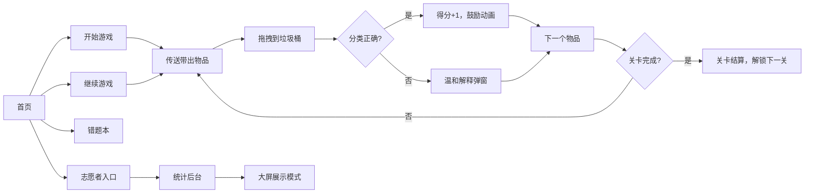

## 1. 产品概述

垃圾分类接力训练是一款面向社区居民的互动教育小游戏，通过拖拽投放的趣味形式，帮助老人和孩子掌握常见易混淆垃圾的正确分类方法。游戏以温和引导替代生硬扣分，配合志愿者后台统计功能，让社区宣传活动更高效、更有温度。

- **目标用户**：社区老人、儿童、活动志愿者
- **核心价值**：用游戏化方式解决垃圾分类"记不住、分不清"的痛点
- **使用场景**：社区周末宣传活动、家庭亲子教育、大屏现场讲解

## 2. 核心功能

### 2.1 用户角色

| 角色 | 使用方式 | 核心功能 |
|------|----------|----------|
| 普通玩家 | 直接进入游戏 | 关卡游戏、错题复习、进度保存 |
| 志愿者 | 密码进入后台 | 查看错题库统计、大屏展示模式、导出易错题目 |

### 2.2 功能模块

1. **首页**：游戏标题、开始游戏、继续上次、错题本、志愿者入口
2. **游戏页面**：物品传送带、四色垃圾桶、得分/关卡显示、温和错误提示
3. **错题本页面**：错题列表、分类筛选、重新练习
4. **志愿者后台**：易错分类统计、错题排行榜、大屏展示模式切换

### 2.3 页面详情

| 页面名称 | 模块名称 | 功能描述 |
|-----------|-------------|---------------------|
| 首页 | 英雄区 | 大标题、游戏介绍、卡通插图 |
| 首页 | 操作区 | 开始游戏、继续游戏、错题本三个大按钮 |
| 首页 | 底部 | 志愿者入口（小图标） |
| 游戏页 | 顶部信息栏 | 当前关卡、得分、连续正确数、暂停按钮 |
| 游戏页 | 传送带区域 | 从左向右移动的待分类物品 |
| 游戏页 | 垃圾桶区 | 四个分类垃圾桶（可回收、厨余、有害、其他），支持拖拽投放 |
| 游戏页 | 反馈弹窗 | 答对鼓励、答错温和解释（污染/时段/常识三种角度） |
| 错题本 | 筛选栏 | 按分类筛选错题 |
| 错题本 | 错题列表 | 物品名称、正确分类、错误原因、再练一次按钮 |
| 志愿者后台 | 统计概览 | 总题数、正确率、各分类错误数 |
| 志愿者后台 | 易错排行 | Top 10 最易错题，支持投到大屏 |
| 志愿者后台 | 大屏模式 | 全屏大字展示题目和讲解，适合现场宣讲 |

## 3. 核心流程

### 3.1 游戏主流程

玩家进入首页 → 点击开始游戏 → 传送带出现物品 → 拖拽物品到对应垃圾桶 → 正确加分继续/错误给出解释 → 完成当前关卡解锁下一关 → 可随时退出，进度自动保存

### 3.2 志愿者流程

志愿者点击首页角落图标 → 输入密码（默认 0000）→ 查看统计数据 → 选择大屏模式 → 现场选取易错题讲解 → 退出返回首页

## 4. 用户界面设计

### 4.1 设计风格

- **整体风格**：温暖卡通、圆润友好，适合全年龄段
- **主色调**：清新绿色（#4CAF50）代表环保主题
- **辅助色**：
  - 蓝色（#2196F3）— 可回收物
  - 绿色（#4CAF50）— 厨余垃圾
  - 红色（#F44336）— 有害垃圾
  - 灰色（#9E9E9E）— 其他垃圾
- **按钮风格**：大圆角、微立体阴影、点击下沉效果
- **字体**：圆润无衬线字体，标题字号大且清晰
- **图标风格**：emoji + 扁平插画风格，直观易懂
- **动效**：物品弹跳入场、正确投放绿色闪光、错误时轻微抖动不刺眼

### 4.2 页面设计概览

| 页面名称 | 模块名称 | UI 元素 |
|-----------|-------------|-------------|
| 首页 | 英雄区 | 大标题"垃圾分类接力赛"、副标题"比比谁是分类小能手"、卡通垃圾桶插图 |
| 首页 | 按钮组 | 三个彩色大按钮竖排，图标+文字 |
| 游戏页 | 顶部栏 | 圆角胶囊形信息条，左关卡右得分 |
| 游戏页 | 传送带 | 木质传送带纹理，物品缓慢从左滑入 |
| 游戏页 | 垃圾桶 | 四个大垃圾桶并排，有表情和标签，拖入时有高亮反馈 |
| 游戏页 | 反馈弹窗 | 半透明模糊背景，圆角卡片，温和的文字解释 |
| 错题本 | 列表 | 卡片式列表，每张卡片显示物品图、正确分类、错误原因标签 |
| 志愿者后台 | 统计区 | 彩色数据卡片，柱状图展示各分类错误率 |
| 志愿者后台 | 大屏模式 | 黑色背景大字号，适合投影展示 |

### 4.3 响应式

- 桌面端优先，适配平板和手机横屏
- 触控优化：垃圾桶和按钮尺寸 ≥ 48px，方便老人和小孩点击拖拽
- 字体自适应：最小字号不低于 16px，老人也能看清

### 4.4 交互细节

- 拖拽物品时，物品跟随手指/鼠标，有轻微放大和阴影
- 拖到垃圾桶上方时，垃圾桶高亮并张开"嘴巴"
- 投放正确：绿色闪光 + "答对啦！" 气泡 + 物品落入动画
- 投放错误：轻微左右抖动 + "再想想～" + 温和解释卡片
- 连续答对 3 题：出现小彩虹/星星鼓励特效
