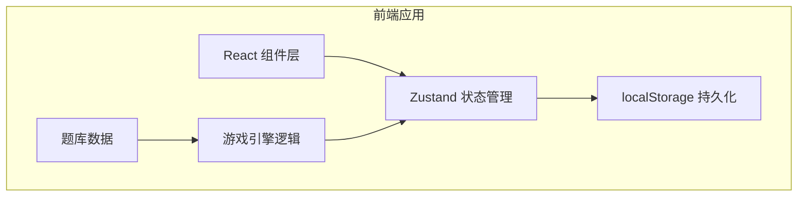

## 1. 架构设计

本项目为纯前端应用，所有数据存储在浏览器 localStorage 中，无需后端服务。采用 React + TypeScript + Vite 技术栈，使用 TailwindCSS 进行样式管理，Zustand 进行状态管理。



## 2. 技术描述

- **前端框架**：React 18 + TypeScript
- **构建工具**：Vite 5
- **样式方案**：TailwindCSS 3
- **状态管理**：Zustand
- **路由方案**：React Router DOM 6
- **图标库**：Lucide React
- **数据存储**：浏览器 localStorage（无后端）
- **拖拽实现**：原生 HTML5 Drag and Drop API + 触摸事件兼容

## 3. 路由定义

| 路由路径 | 页面组件 | 功能说明 |
|---------|----------|----------|
| `/` | HomePage | 首页，游戏入口 |
| `/game` | GamePage | 游戏主界面 |
| `/mistakes` | MistakesPage | 错题本 |
| `/volunteer` | VolunteerPage | 志愿者后台 |
| `/volunteer/screen` | BigScreenPage | 大屏展示模式 |

## 4. 数据模型

### 4.1 核心类型定义

```typescript
// 垃圾分类类型
type TrashCategory = 'recyclable' | 'kitchen' | 'harmful' | 'other'

// 物品定义
interface TrashItem {
  id: string
  name: string
  emoji: string
  category: TrashCategory
  isEasyToMistake: boolean      // 是否易错题
  mistakeExplanation?: string   // 错误解释（污染/常识/时段等角度）
  lifeExample?: string          // 生活例子
}

// 错题记录
interface MistakeRecord {
  itemId: string
  wrongCategory: TrashCategory   // 玩家投错的分类
  wrongCount: number             // 错过几次
  lastWrongTime: number          // 最后一次错的时间戳
}

// 游戏进度
interface GameProgress {
  currentLevel: number           // 当前关卡
  totalScore: number             // 总得分
  streak: number                 // 连续正确数
  maxStreak: number              // 最高连击
  itemsAnswered: number          // 已答题数
  itemsCorrect: number           // 答对数
  unlockedLevels: number         // 已解锁关卡数
}

// 关卡配置
interface LevelConfig {
  level: number
  itemCount: number              // 本关物品数
  items: string[]                // 物品ID列表
  passScore: number              // 通关分数（正确率）
}
```

### 4.2 题库数据设计

- 总物品数：约 40-50 个常见垃圾
- 易错题占比：约 40%（湿纸巾、外卖盒、过期药、花土、大骨头、贝壳、烟头、旧衣服、电池、灯泡等）
- 分 5 个关卡，难度递增
- 每关物品数：10 → 12 → 15 → 18 → 20

### 4.3 localStorage 存储键

| 键名 | 说明 |
|------|------|
| `trash_game_progress` | 游戏进度 |
| `trash_game_mistakes` | 错题记录数组 |
| `trash_game_volunteer` | 志愿者模式开关（免密） |

## 5. 模块结构

```
src/
├── components/
│   ├── TrashBin.tsx          # 垃圾桶组件
│   ├── TrashItem.tsx         # 可拖拽物品组件
│   ├── ConveyorBelt.tsx      # 传送带组件
│   ├── FeedbackModal.tsx     # 反馈弹窗
│   ├── GameHeader.tsx        # 游戏顶部信息栏
│   ├── StatCard.tsx          # 统计卡片
│   └── BigScreenCard.tsx     # 大屏题目卡片
├── pages/
│   ├── HomePage.tsx
│   ├── GamePage.tsx
│   ├── MistakesPage.tsx
│   ├── VolunteerPage.tsx
│   └── BigScreenPage.tsx
├── store/
│   └── useGameStore.ts       # Zustand 全局状态
├── data/
│   ├── trashItems.ts         # 题库数据
│   └── levels.ts             # 关卡配置
├── hooks/
│   ├── useDragAndDrop.ts     # 拖拽逻辑 hook
│   └── useGameProgress.ts    # 游戏进度 hook
├── utils/
│   ├── storage.ts            # localStorage 工具
│   └── gameLogic.ts          # 游戏逻辑工具
├── types/
│   └── index.ts              # 类型定义
├── App.tsx
├── main.tsx
└── index.css
```

## 6. 核心功能实现方案

### 6.1 拖拽系统

使用 HTML5 Drag and Drop API 实现桌面端拖拽，同时监听 touch 事件兼容移动端：
- `dragstart` / `touchstart`：记录拖拽物品
- `dragover` / `touchmove`：检测悬停的垃圾桶，高亮反馈
- `drop` / `touchend`：判断投放是否正确

### 6.2 温和错误解释

根据物品类型和错误分类，生成三种角度的解释：
- **污染角度**：沾油的纸盒因为被污染，不能算可回收
- **常识角度**：大骨头难腐烂，属于其他垃圾不是厨余
- **材质角度**：湿纸巾虽然叫"湿"，但属于其他垃圾

### 6.3 进度保存

游戏状态变化时自动保存到 localStorage，页面加载时恢复。
退出页面/切换路由时也会保存进度。

### 6.4 志愿者统计

从错题记录中统计：
- 各分类的错误数量和错误率
- Top 10 最易错题
- 按分类筛选错题

### 6.5 大屏展示模式

全屏黑色背景，大字号展示：
- 题目（物品 + 名称）
- 四个分类选项
- 正确答案高亮 + 生活例子讲解
- 左右切换按钮

## 7. 性能与体验优化

- 物品动画使用 CSS transform，避免重排
- 反馈弹窗使用 CSS 过渡动画
- 题库数据静态导入，不做网络请求
- localStorage 操作节流，避免频繁写入
