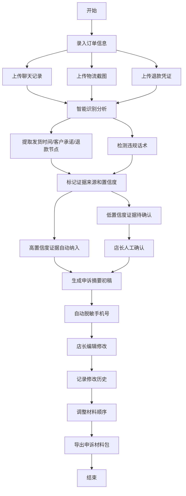

## 1. 产品概述

商家差评申诉助手是一款专为电商店长设计的申诉材料整理工具，解决恶意差评申诉时材料分散、时间紧迫的痛点。通过智能识别关键信息、自动整理证据链、生成标准化申诉摘要，帮助店长在平台申诉窗口期快速高效地完成申诉材料准备。

- **核心问题**：客服聊天、物流轨迹、售后退款截图分散，申诉窗口短暂，人工整理耗时易错
- **目标用户**：电商店长、客服主管、运营人员
- **市场价值**：将申诉材料准备时间从数小时缩短至数分钟，提高申诉成功率

## 2. 核心功能

### 2.1 用户角色

| 角色 | 注册方式 | 核心权限 |
|------|----------|----------|
| 店长 | 本地登录 | 材料上传、证据识别、摘要生成、导出、材料排序、修改历史查看 |

### 2.2 功能模块

1. **订单材料导入页**：聊天记录上传、物流截图上传、退款凭证上传、订单信息录入
2. **智能识别分析页**：关键信息自动提取、证据溯源展示、置信度标记、人工确认区域
3. **申诉摘要编辑页**：摘要生成、手机号脱敏、人工修改、历史版本追踪
4. **材料整理导出页**：材料顺序拖拽调整、平台格式适配、一键导出打包

### 2.3 页面详情

| 页面名称 | 模块名称 | 功能描述 |
|---------|---------|----------|
| 订单材料导入页 | 文件上传区 | 支持拖拽上传聊天记录、物流截图、退款凭证，支持批量导入 |
| 订单材料导入页 | 订单信息表单 | 录入订单号、下单时间、申诉截止时间、客户昵称 |
| 订单材料导入页 | 材料预览区 | 已上传材料列表，支持删除、重新上传、分类标记 |
| 智能识别分析页 | 时间线视图 | 发货时间、客户承诺、退款节点按时间轴展示 |
| 智能识别分析页 | 证据卡片 | 每条证据显示原文引用、来源标注、置信度标记 |
| 智能识别分析页 | 违规话术检测 | 识别可能违规的客户话术，标记风险等级 |
| 智能识别分析页 | 待确认区域 | 低置信度证据集中展示，供店长人工确认 |
| 申诉摘要编辑页 | 摘要生成器 | 基于识别结果自动生成申诉文案 |
| 申诉摘要编辑页 | 脱敏处理 | 自动隐藏手机号中间四位，保留首尾 |
| 申诉摘要编辑页 | 版本历史 | 记录每次修改内容、时间，支持版本对比和回滚 |
| 材料整理导出页 | 材料排序 | 拖拽调整材料顺序，适配平台要求 |
| 材料整理导出页 | 导出配置 | 选择导出格式（PDF/Word/图片包），生成申诉材料包 |

## 3. 核心流程

店长导入订单相关材料后，系统自动分析提取关键信息，标记证据来源和置信度，生成申诉摘要初稿。店长确认低置信度证据、修改摘要内容后，按平台要求调整材料顺序，最后一键导出完整申诉材料包。

## 4. 用户界面设计

### 4.1 设计风格

- **主色调**：深蓝色 `#1e3a5f`（专业、可信），辅助色橙色 `#f59e0b`（警告、重点标记）
- **中性色**：以 slate 色系为基础，确保内容可读性
- **按钮风格**：圆角 6px，悬停时轻微上浮阴影，点击时内缩反馈
- **字体**：标题使用 Lato（清晰现代），正文使用 Noto Sans SC（中文可读性）
- **布局风格**：卡片式布局，清晰的模块分隔，左侧导航栏 + 主内容区
- **图标风格**：使用 lucide-react 线性图标，保持简洁统一

### 4.2 页面设计概述

| 页面名称 | 模块名称 | UI 元素 |
|---------|---------|----------|
| 订单材料导入页 | 文件上传区 | 大尺寸拖拽区域，虚线边框，上传后显示文件缩略图，渐入动画 |
| 订单材料导入页 | 材料预览区 | 网格布局卡片，悬停显示操作按钮，删除时淡出动画 |
| 智能识别分析页 | 时间线视图 | 垂直时间线，节点用不同颜色标识类型，展开/收起动画 |
| 智能识别分析页 | 证据卡片 | 白底卡片，置信度用色条显示，原文引用用浅灰背景块 |
| 智能识别分析页 | 待确认区域 | 橙色边框高亮，复选框批量确认，滑动动画 |
| 申诉摘要编辑页 | 编辑器 | 富文本编辑区，修改痕迹用不同颜色标注，侧边版本列表 |
| 材料整理导出页 | 排序列表 | 拖拽手柄，拖动时阴影反馈，放下时位置过渡动画 |

### 4.3 响应式

- 桌面端优先设计（1280px+），主内容区最大宽度 1440px
- 平板端（768px-1279px）：导航栏折叠为抽屉式
- 移动端（<768px）：单列布局，卡片堆叠，底部浮动操作栏

### 4.4 交互细节

- 页面加载时元素按序渐入（staggered animation）
- 识别分析过程显示骨架屏和进度条
- 证据卡片悬停时轻微上浮并显示来源信息
- 拖拽排序时有半透明跟随效果
- 低置信度证据有脉冲动画提醒店长注意
