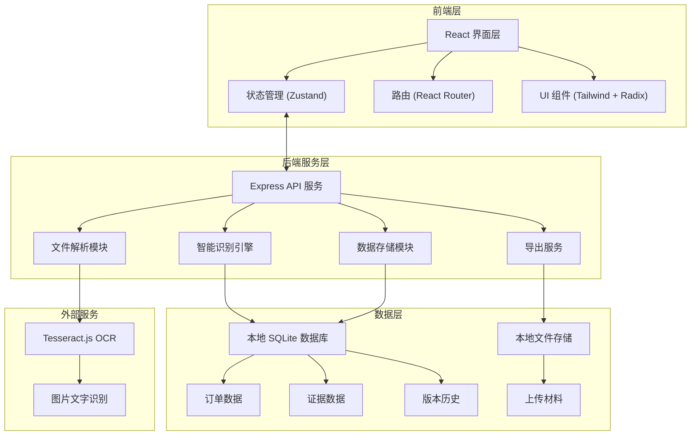
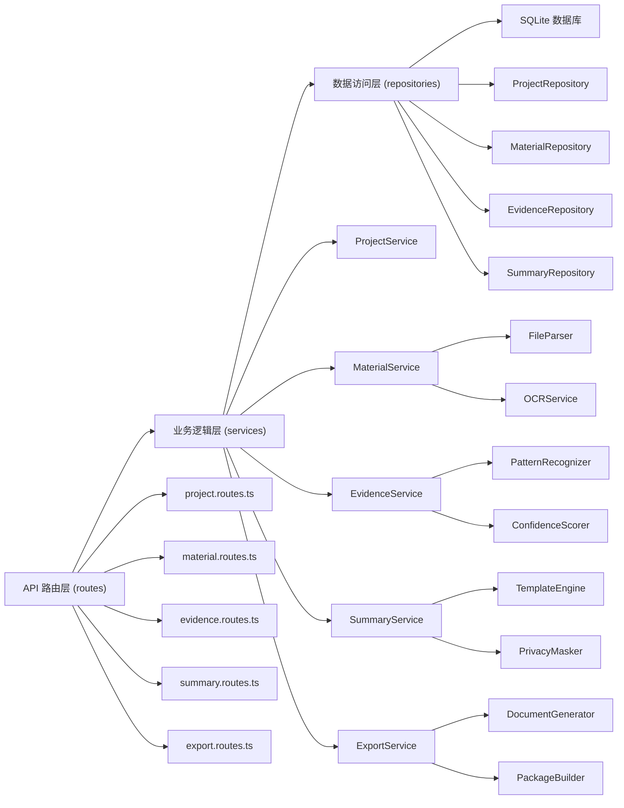
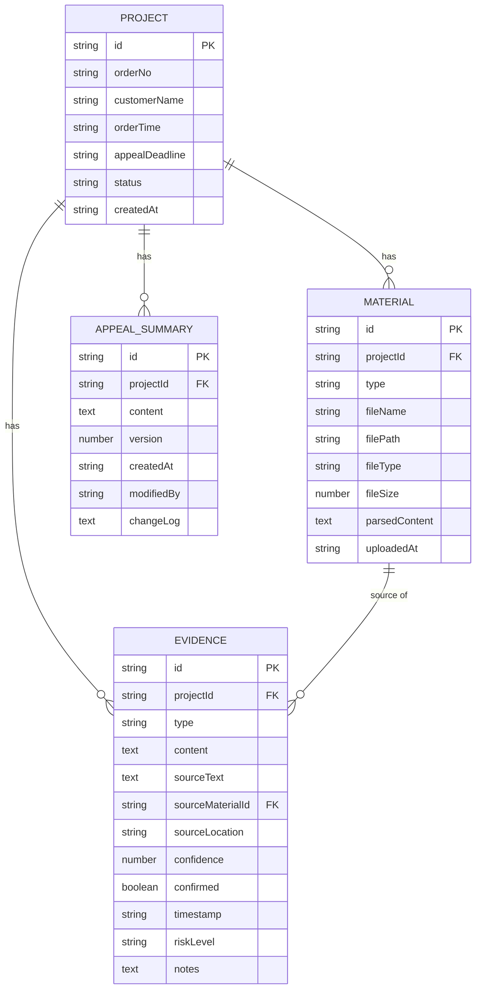

## 1. 架构设计

本应用采用前后端分离架构，前端负责用户交互和界面展示，后端负责文件解析、智能识别和数据持久化。所有数据默认存储在本地，支持导出备份。



## 2. 技术描述

- **前端**：React@18 + TypeScript + Vite + TailwindCSS@3 + Zustand + React Router@6
- **后端**：Express@4 + TypeScript
- **数据库**：SQLite + better-sqlite3（本地存储）
- **OCR**：Tesseract.js（浏览器端图片文字识别）
- **UI 组件**：Radix UI + lucide-react 图标
- **拖拽**：@dnd-kit/core + @dnd-kit/sortable
- **文件处理**：mammoth（Word 解析）、pdfjs-dist（PDF 解析）

## 3. 路由定义

| 路由路径 | 页面名称 | 功能说明 |
|---------|---------|----------|
| `/` | 首页/项目列表 | 展示历史申诉项目，创建新项目入口 |
| `/project/:id/import` | 材料导入页 | 上传聊天记录、物流截图、退款凭证 |
| `/project/:id/analyze` | 智能识别页 | 查看识别结果，确认低置信度证据 |
| `/project/:id/summary` | 申诉摘要页 | 编辑申诉文案，查看修改历史 |
| `/project/:id/export` | 材料导出页 | 调整材料顺序，导出申诉材料包 |

## 4. API 定义

### 4.1 类型定义

```typescript
// 订单信息
interface Order {
  id: string;
  orderNo: string;
  customerName: string;
  orderTime: string;
  appealDeadline: string;
  createdAt: string;
  status: 'draft' | 'analyzing' | 'confirmed' | 'exported';
}

// 上传材料
interface Material {
  id: string;
  projectId: string;
  type: 'chat' | 'logistics' | 'refund' | 'other';
  fileName: string;
  filePath: string;
  fileType: string;
  fileSize: number;
  parsedContent?: string;
  uploadedAt: string;
}

// 证据项
interface Evidence {
  id: string;
  projectId: string;
  type: 'shipping_time' | 'customer_promise' | 'refund_node' | 'violation_speech';
  content: string;
  sourceText: string;
  sourceMaterialId: string;
  sourceLocation: string;
  confidence: number; // 0-1
  confirmed: boolean;
  timestamp?: string;
  riskLevel?: 'low' | 'medium' | 'high';
  notes?: string;
}

// 申诉摘要
interface AppealSummary {
  id: string;
  projectId: string;
  content: string;
  version: number;
  createdAt: string;
  modifiedBy: string;
  changeLog: string;
}

// 材料排序
interface MaterialOrder {
  projectId: string;
  order: string[]; // material ids in order
}
```

### 4.2 接口列表

| 方法 | 路径 | 说明 | 请求参数 | 返回 |
|------|------|------|----------|------|
| GET | `/api/projects` | 获取项目列表 | - | `Order[]` |
| POST | `/api/projects` | 创建新项目 | `{ orderNo, customerName, orderTime, appealDeadline }` | `Order` |
| GET | `/api/projects/:id` | 获取项目详情 | - | `Order` |
| POST | `/api/projects/:id/upload` | 上传材料 | `FormData: file, type` | `Material` |
| DELETE | `/api/materials/:id` | 删除材料 | - | `{ success: boolean }` |
| POST | `/api/projects/:id/analyze` | 触发智能识别 | - | `{ evidence: Evidence[] }` |
| GET | `/api/projects/:id/evidence` | 获取识别结果 | - | `Evidence[]` |
| PUT | `/api/evidence/:id` | 更新证据（确认/备注） | `{ confirmed, notes }` | `Evidence` |
| POST | `/api/evidence/batch-confirm` | 批量确认证据 | `{ ids: string[] }` | `{ success: boolean }` |
| GET | `/api/projects/:id/summary` | 获取申诉摘要 | - | `AppealSummary[]` |
| POST | `/api/projects/:id/summary` | 生成/保存摘要 | `{ content, changeLog }` | `AppealSummary` |
| GET | `/api/projects/:id/material-order` | 获取材料顺序 | - | `MaterialOrder` |
| PUT | `/api/projects/:id/material-order` | 更新材料顺序 | `{ order: string[] }` | `MaterialOrder` |
| POST | `/api/projects/:id/export` | 导出申诉材料包 | `{ format: 'pdf' | 'word' | 'zip' }` | `{ downloadUrl: string }` |

## 5. 服务架构图



## 6. 数据模型

### 6.1 ER 图



### 6.2 DDL 语句

```sql
CREATE TABLE projects (
  id TEXT PRIMARY KEY,
  order_no TEXT NOT NULL,
  customer_name TEXT NOT NULL,
  order_time TEXT NOT NULL,
  appeal_deadline TEXT NOT NULL,
  status TEXT NOT NULL DEFAULT 'draft',
  created_at TEXT NOT NULL DEFAULT CURRENT_TIMESTAMP
);

CREATE TABLE materials (
  id TEXT PRIMARY KEY,
  project_id TEXT NOT NULL REFERENCES projects(id),
  type TEXT NOT NULL CHECK (type IN ('chat', 'logistics', 'refund', 'other')),
  file_name TEXT NOT NULL,
  file_path TEXT NOT NULL,
  file_type TEXT NOT NULL,
  file_size INTEGER NOT NULL,
  parsed_content TEXT,
  uploaded_at TEXT NOT NULL DEFAULT CURRENT_TIMESTAMP
);

CREATE TABLE evidence (
  id TEXT PRIMARY KEY,
  project_id TEXT NOT NULL REFERENCES projects(id),
  type TEXT NOT NULL CHECK (type IN ('shipping_time', 'customer_promise', 'refund_node', 'violation_speech')),
  content TEXT NOT NULL,
  source_text TEXT NOT NULL,
  source_material_id TEXT NOT NULL REFERENCES materials(id),
  source_location TEXT NOT NULL,
  confidence REAL NOT NULL DEFAULT 0,
  confirmed INTEGER NOT NULL DEFAULT 0,
  timestamp TEXT,
  risk_level TEXT CHECK (risk_level IN ('low', 'medium', 'high')),
  notes TEXT
);

CREATE TABLE appeal_summaries (
  id TEXT PRIMARY KEY,
  project_id TEXT NOT NULL REFERENCES projects(id),
  content TEXT NOT NULL,
  version INTEGER NOT NULL DEFAULT 1,
  created_at TEXT NOT NULL DEFAULT CURRENT_TIMESTAMP,
  modified_by TEXT NOT NULL DEFAULT 'system',
  change_log TEXT
);

CREATE TABLE material_orders (
  project_id TEXT PRIMARY KEY REFERENCES projects(id),
  order_json TEXT NOT NULL,
  updated_at TEXT NOT NULL DEFAULT CURRENT_TIMESTAMP
);

CREATE INDEX idx_materials_project_id ON materials(project_id);
CREATE INDEX idx_evidence_project_id ON evidence(project_id);
CREATE INDEX idx_evidence_confidence ON evidence(confidence);
CREATE INDEX idx_appeal_summaries_project_id ON appeal_summaries(project_id);
```
