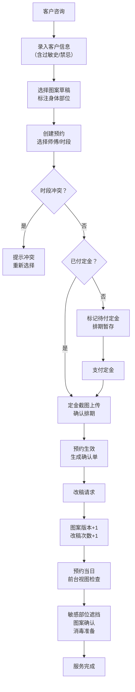

## 1. 产品概述

纹身工作室桌面预约管理系统，集中管理客户信息、预约排期、图案草稿、定金凭证和改稿记录，解决聊天记录分散、信息遗漏、时段冲突等问题。

- 目标用户：纹身工作室前台、纹身师傅、管理人员
- 核心价值：信息集中化、智能提醒、流程标准化、数据持久化

## 2. 核心功能

### 2.1 用户角色

| 角色 | 登录方式 | 核心权限 |
|------|---------|---------|
| 前台 | 本地应用启动 | 预约管理、客户管理、当日视图、导出确认单 |
| 纹身师傅 | 本地应用启动 | 查看个人预约、管理图案、添加备注 |
| 管理员 | 本地应用启动 | 全部功能、数据备份与恢复 |

### 2.2 功能模块

1. **客户管理**：客户信息录入、修改、查询，包含联系方式、过敏史、禁忌备注
2. **预约管理**：预约创建、编辑、取消，时段冲突检测，定金状态管理
3. **图案管理**：图案草稿上传、版本历史、改稿次数统计、身体部位标注
4. **提醒系统**：图片路径失效检测、时段冲突预警、未付定金提醒、敏感部位遮挡提示
5. **导出中心**：客户版确认单（隐藏内部备注）、内部版确认单（完整信息）
6. **当日视图**：按师傅筛选预约、确认图案、耗时预估、消毒准备清单

### 2.3 页面详情

| 页面名称 | 模块名称 | 功能描述 |
|---------|---------|---------|
| 总览仪表盘 | 数据概览 | 今日预约数、待确认定金、最近改稿、提醒列表 |
| 客户管理 | 客户列表 | 客户CRUD、搜索筛选、过敏史标记 |
| 预约管理 | 预约日历 | 日历视图、时段拖拽、冲突检测、定金状态 |
| 图案柜 | 图案管理 | 图案上传、版本对比、身体部位选择、改稿记录 |
| 当日前台 | 当日预约 | 按师傅筛选、图案确认、耗时标注、消毒准备勾选 |
| 导出中心 | 确认单导出 | 客户版/内部版切换、PDF生成、打印预览 |

## 3. 核心流程

## 4. 用户界面设计

### 4.1 设计风格
- **主色调**：深墨黑 (#121212) 作为主背景，朱砂红 (#C53030) 作为强调色，象牙白 (#FAF7F2) 作为文字色
- **辅助色**：暗金 (#B8860B) 用于重要状态，军绿 (#2D4A3E) 用于确认按钮
- **设计风格**：暗黑工业风，融合纹身文化的粗粝质感与现代桌面应用的实用性
- **字体**：标题使用 "Noto Serif SC" 衬线体彰显艺术感，正文使用 "Noto Sans SC" 保证可读性
- **视觉元素**：细颗粒噪点纹理背景、装饰性边框、微妙的金属质感按钮

### 4.2 页面设计概览

| 页面名称 | 模块名称 | UI元素 |
|---------|---------|--------|
| 总览仪表盘 | 数据卡片 | 四个象限布局：今日预约、待收定金、改稿提醒、预警列表，卡片带悬浮阴影和过渡动画 |
| 预约管理 | 日历视图 | 周视图为主，时间轴纵向排列，预约卡片按颜色区分状态（已确认/待定金/已完成），冲突时段红色闪烁边框 |
| 图案柜 | 图案网格 | 响应式网格布局，悬停放大预览，点击打开详情抽屉显示版本历史和身体部位图 |
| 当日前台 | 时间线视图 | 按师傅分组的垂直时间线，每个预约节点包含图案缩略图、客户姓名、耗时、消毒准备勾选框 |
| 导出中心 | 表单布局 | 左右分栏：左侧导出选项（客户版/内部版、日期范围），右侧实时预览 |

### 4.3 响应式设计
- **桌面优先**：主窗口最小尺寸 1280×800，推荐 1600×900
- **自适应布局**：使用 CSS Grid 和 Flexbox，窗口缩放时内容区域智能重排
- **侧边栏可折叠**：左侧导航栏支持收起为图标模式，释放更多内容空间

### 4.4 交互动效
- **页面切换**：内容区域淡入淡出过渡（300ms ease-out）
- **卡片悬浮**：y轴微移(-2px) + 阴影加深 + 边框高亮
- **提醒动画**：重要提醒采用呼吸灯效果（红色边框透明度脉动）
- **展开/收起**：抽屉面板滑入滑出，配合内容渐显
