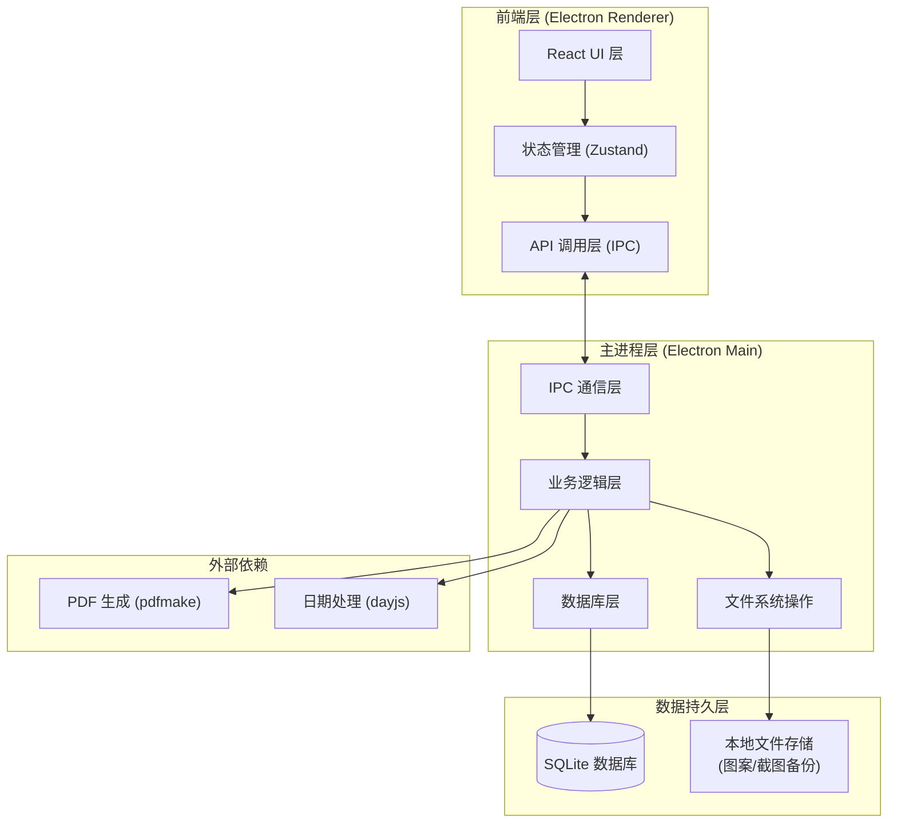
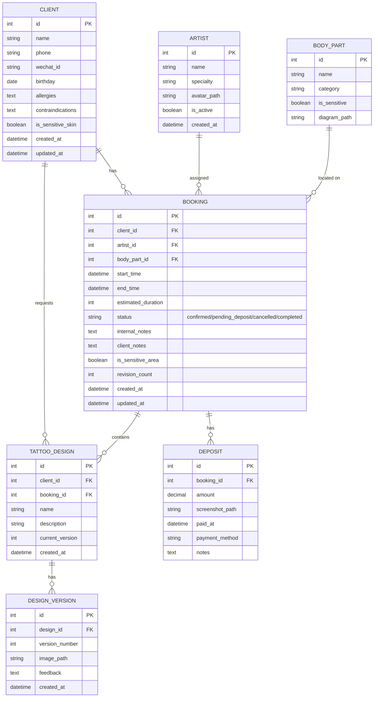

## 1. 架构设计



## 2. 技术描述

### 2.1 技术栈选型
- **桌面框架**：Electron@28 - 跨平台桌面应用，支持 Windows/macOS
- **前端框架**：React@18 + TypeScript - 类型安全的组件化开发
- **构建工具**：Vite@5 - 快速的开发构建体验
- **状态管理**：Zustand@4 - 轻量级状态管理，简单易用
- **UI 组件库**：自定义组件 + Headless UI - 灵活定制暗黑工业风界面
- **样式方案**：TailwindCSS@3 + CSS 变量 - 快速开发且支持主题定制
- **数据库**：better-sqlite3 + electron-store - 结构化数据存储 + 配置存储
- **日期处理**：dayjs - 轻量级日期时间处理
- **PDF 生成**：pdfmake - 客户端 PDF 生成，支持中文字体
- **图表**：recharts - 数据可视化仪表盘

### 2.2 关键技术决策
1. **数据持久化**：使用 SQLite 存储业务数据，图案文件复制到应用数据目录，保证关闭重开数据不丢失
2. **图片路径检测**：文件选择时校验文件存在性，启动时批量扫描所有图片路径，失效则标记
3. **时段冲突检测**：创建/修改预约时查询同一师傅同一时段是否已有预约，时间重叠度 > 15分钟即判冲突
4. **敏感部位处理**：身体部位字段包含敏感词时自动标记，导出客户版时自动打码处理
5. **双版本导出**：同一数据模型根据导出类型动态过滤字段，客户版隐藏内部备注和禁忌信息

## 3. 路由定义

| 路由路径 | 页面名称 | 用途 |
|---------|---------|------|
| /dashboard | 总览仪表盘 | 数据概览、提醒列表、快捷操作 |
| /clients | 客户管理 | 客户信息CRUD、过敏史管理 |
| /bookings | 预约管理 | 日历视图、预约创建编辑、冲突检测 |
| /gallery | 图案柜 | 图案管理、版本历史、身体部位标注 |
| /today | 当日前台 | 当日预约时间线、按师傅筛选、消毒准备 |
| /export | 导出中心 | 确认单导出、客户版/内部版切换 |
| /settings | 系统设置 | 师傅管理、敏感词配置、数据备份 |

## 4. 数据模型

### 4.1 ER 图



### 4.2 数据库初始化 SQL

```sql
-- 师傅表
CREATE TABLE IF NOT EXISTS artists (
    id INTEGER PRIMARY KEY AUTOINCREMENT,
    name TEXT NOT NULL,
    specialty TEXT,
    avatar_path TEXT,
    is_active INTEGER DEFAULT 1,
    created_at DATETIME DEFAULT CURRENT_TIMESTAMP
);

-- 客户表
CREATE TABLE IF NOT EXISTS clients (
    id INTEGER PRIMARY KEY AUTOINCREMENT,
    name TEXT NOT NULL,
    phone TEXT,
    wechat_id TEXT,
    birthday DATE,
    allergies TEXT,
    contraindications TEXT,
    is_sensitive_skin INTEGER DEFAULT 0,
    created_at DATETIME DEFAULT CURRENT_TIMESTAMP,
    updated_at DATETIME DEFAULT CURRENT_TIMESTAMP
);

-- 身体部位表
CREATE TABLE IF NOT EXISTS body_parts (
    id INTEGER PRIMARY KEY AUTOINCREMENT,
    name TEXT NOT NULL,
    category TEXT,
    is_sensitive INTEGER DEFAULT 0,
    diagram_path TEXT
);

-- 预约表
CREATE TABLE IF NOT EXISTS bookings (
    id INTEGER PRIMARY KEY AUTOINCREMENT,
    client_id INTEGER NOT NULL,
    artist_id INTEGER NOT NULL,
    body_part_id INTEGER,
    start_time DATETIME NOT NULL,
    end_time DATETIME NOT NULL,
    estimated_duration INTEGER,
    status TEXT DEFAULT 'pending_deposit',
    internal_notes TEXT,
    client_notes TEXT,
    is_sensitive_area INTEGER DEFAULT 0,
    revision_count INTEGER DEFAULT 0,
    created_at DATETIME DEFAULT CURRENT_TIMESTAMP,
    updated_at DATETIME DEFAULT CURRENT_TIMESTAMP,
    FOREIGN KEY (client_id) REFERENCES clients(id),
    FOREIGN KEY (artist_id) REFERENCES artists(id),
    FOREIGN KEY (body_part_id) REFERENCES body_parts(id)
);

-- 图案表
CREATE TABLE IF NOT EXISTS tattoo_designs (
    id INTEGER PRIMARY KEY AUTOINCREMENT,
    client_id INTEGER NOT NULL,
    booking_id INTEGER,
    name TEXT NOT NULL,
    description TEXT,
    current_version INTEGER DEFAULT 1,
    created_at DATETIME DEFAULT CURRENT_TIMESTAMP,
    FOREIGN KEY (client_id) REFERENCES clients(id),
    FOREIGN KEY (booking_id) REFERENCES bookings(id)
);

-- 图案版本表
CREATE TABLE IF NOT EXISTS design_versions (
    id INTEGER PRIMARY KEY AUTOINCREMENT,
    design_id INTEGER NOT NULL,
    version_number INTEGER NOT NULL,
    image_path TEXT NOT NULL,
    feedback TEXT,
    created_at DATETIME DEFAULT CURRENT_TIMESTAMP,
    FOREIGN KEY (design_id) REFERENCES tattoo_designs(id)
);

-- 定金表
CREATE TABLE IF NOT EXISTS deposits (
    id INTEGER PRIMARY KEY AUTOINCREMENT,
    booking_id INTEGER NOT NULL,
    amount DECIMAL(10,2) NOT NULL,
    screenshot_path TEXT,
    paid_at DATETIME,
    payment_method TEXT,
    notes TEXT,
    FOREIGN KEY (booking_id) REFERENCES bookings(id)
);

-- 索引
CREATE INDEX IF NOT EXISTS idx_bookings_artist_time ON bookings(artist_id, start_time);
CREATE INDEX IF NOT EXISTS idx_bookings_client ON bookings(client_id);
CREATE INDEX IF NOT EXISTS idx_bookings_status ON bookings(status);

-- 初始化身体部位数据
INSERT OR IGNORE INTO body_parts (id, name, category, is_sensitive) VALUES
(1, '上臂', '上肢', 0), (2, '小臂', '上肢', 0), (3, '大臂内侧', '上肢', 1),
(4, '大腿', '下肢', 0), (5, '小腿', '下肢', 0), (6, '脚踝', '下肢', 0),
(7, '后背', '躯干', 0), (8, '前胸', '躯干', 1), (9, '侧腰', '躯干', 0),
(10, '颈部', '头颈', 1), (11, '手腕', '上肢', 0), (12, '肋骨', '躯干', 1);

-- 初始化师傅数据
INSERT OR IGNORE INTO artists (id, name, specialty) VALUES
(1, '阿龙', '传统日式、黑灰写实'),
(2, '小雨', '小清新、彩色水彩'),
(3, '老王', 'Old School、黑臂');
```

## 5. IPC 通信接口定义

### 5.1 客户管理
```typescript
// 获取客户列表
ipcMain.handle('clients:list', (filters?: {
  keyword?: string;
  hasAllergies?: boolean;
}) => Promise<Client[]>);

// 创建/更新客户
ipcMain.handle('clients:save', (client: ClientInput) => Promise<Client>);

// 删除客户
ipcMain.handle('clients:delete', (id: number) => Promise<boolean>);
```

### 5.2 预约管理
```typescript
// 获取预约列表
ipcMain.handle('bookings:list', (filters?: {
  dateRange?: [Date, Date];
  artistId?: number;
  status?: string;
}) => Promise<BookingDetail[]>);

// 检测时段冲突
ipcMain.handle('bookings:checkConflict', (
  artistId: number,
  startTime: Date,
  endTime: number,
  excludeBookingId?: number
) => Promise<{ hasConflict: boolean; conflictBookings: Booking[] }>);

// 创建/更新预约
ipcMain.handle('bookings:save', (booking: BookingInput) => Promise<BookingDetail>);

// 取消预约
ipcMain.handle('bookings:cancel', (id: number) => Promise<boolean>);
```

### 5.3 图案管理
```typescript
// 上传图案（复制文件到应用目录）
ipcMain.handle('designs:upload', (
  sourcePath: string,
  designId: number
) => Promise<{ savedPath: string }>);

// 检查图片路径有效性
ipcMain.handle('designs:checkImages', () => Promise<{
  valid: string[];
  invalid: { path: string; designId: number; versionId: number }[];
}>);
```

### 5.4 导出功能
```typescript
// 生成确认单 PDF
ipcMain.handle('export:confirmation', (
  bookingId: number,
  version: 'client' | 'internal',
  outputPath: string
) => Promise<{ success: boolean; filePath: string }>);
```

## 6. 提醒系统逻辑

### 6.1 提醒类型定义
```typescript
type AlertType = 
  | 'image_invalid'       // 图片路径失效
  | 'time_conflict'       // 时段冲突
  | 'deposit_pending'     // 未付定金
  | 'sensitive_area'      // 敏感部位需遮挡
  | 'revision_high'       // 改稿次数过多(>3次)
  | 'allergy_warning';    // 客户有过敏史

interface Alert {
  id: string;
  type: AlertType;
  level: 'warning' | 'error' | 'info';
  message: string;
  relatedId?: number;
  relatedType?: 'booking' | 'client' | 'design';
}
```

### 6.2 提醒触发时机
1. **应用启动时**：批量扫描图片路径、检查当日及次日预约的定金状态
2. **预约创建/更新时**：实时检测时段冲突、敏感部位、定金状态
3. **图案上传时**：检查图片文件有效性
4. **当日视图加载时**：聚合显示所有相关提醒

### 6.3 核心检测算法
```typescript
// 时段冲突检测：时间重叠超过15分钟判定为冲突
function checkTimeConflict(
  existing: Booking[],
  newStart: Date,
  newEnd: Date
): Booking[] {
  const overlapThreshold = 15 * 60 * 1000; // 15分钟
  return existing.filter(b => {
    const bStart = new Date(b.start_time).getTime();
    const bEnd = new Date(b.end_time).getTime();
    const nStart = newStart.getTime();
    const nEnd = newEnd.getTime();
    
    const overlapStart = Math.max(bStart, nStart);
    const overlapEnd = Math.min(bEnd, nEnd);
    const overlapDuration = overlapEnd - overlapStart;
    
    return overlapDuration > overlapThreshold;
  });
}
```
