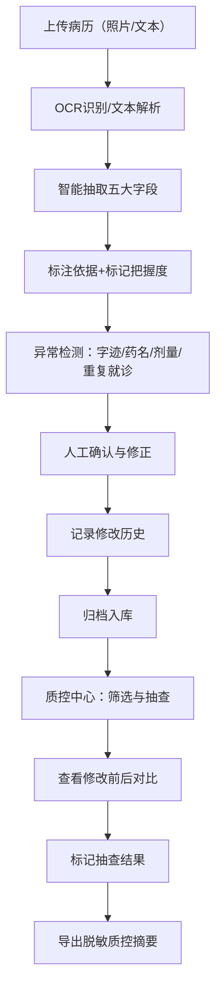

## 1. 产品概述

社区门诊病历信息智能提取与质控系统，解决手写病历识别不清、信息录入易错、月底质控困难的核心痛点。系统面向护士和质控人员，支持病历照片OCR识别或文本录入，智能抽取主诉、诊断、用药、过敏提示和复诊时间，并提供隐私脱敏、修改追踪和质控抽查全流程。

- **目标用户**：门诊护士（录入与确认）、质控护士（审核与抽查）
- **核心价值**：降低识别误差、保留修改溯源、规范质控流程

## 2. 核心功能

### 2.1 用户角色

| 角色 | 注册方式 | 核心权限 |
|------|----------|----------|
| 录入护士 | 系统账号 | 上传病历、查看抽取结果、确认/修改低把握项、提交归档 |
| 质控护士 | 系统账号 | 查看全部病历、导出脱敏质控摘要、抽查修改记录、标记抽查结果 |

### 2.2 功能模块

1. **病历上传页**：照片/文本两种方式录入，支持拖拽上传与实时预览
2. **抽取结果页**：五大字段（主诉、诊断、用药、过敏、复诊）结构化展示，标注依据句/图片区域，把握度标识
3. **人工确认页**：逐条确认高把握项，修正低把握项，支持同一患者多次就诊独立管理
4. **质控中心页**：病历列表、条件筛选、脱敏导出、修改历史抽查
5. **修改历史页**：展示字段修改前后对比，记录操作人与时间

### 2.3 页面详情

| 页面名称 | 模块名称 | 功能描述 |
|----------|----------|----------|
| 病历上传页 | 上传区域 | 拖拽/点击上传病历照片，或粘贴护士录入文本 |
| 病历上传页 | 实时预览 | 照片缩略图/文本预览，患者基本信息填写 |
| 抽取结果页 | 字段卡片 | 五大抽取字段卡片，显示内容、把握度标签、依据来源高亮 |
| 抽取结果页 | 依据标注 | 文本模式下高亮依据句，图片模式下框选图片区域 |
| 抽取结果页 | 警告提示 | 字迹不清、药名近似、剂量缺单位、重复就诊等异常提示 |
| 人工确认页 | 确认列表 | 逐条确认，高把握项默认勾选，低把握项留空待填 |
| 人工确认页 | 编辑面板 | 字段内容编辑，保留原始识别值 |
| 质控中心页 | 病历列表 | 时间/患者/状态筛选，支持搜索 |
| 质控中心页 | 摘要导出 | 一键导出脱敏PDF/Excel，身份证与手机号自动遮罩 |
| 质控中心页 | 抽查面板 | 随机抽查或筛选修改过的字段，展示修改前后对比 |
| 修改历史页 | 时间线 | 按时间线展示所有修改操作，操作人、修改前后内容 |

## 3. 核心流程

### 3.1 主流程（录入护士）

录入护士上传病历照片或粘贴文本 → 系统OCR/解析并智能抽取五大字段 → 系统标注依据并标记把握度 → 护士逐条确认或修正低把握项 → 系统记录修改前后内容 → 提交归档

### 3.2 质控流程（质控护士）

质控护士进入质控中心 → 筛选待查病历 → 查看病历详情与修改历史 → 抽查修改过的字段，对比修改前后 → 标记抽查结果（通过/需复核）→ 导出脱敏质控摘要

### 3.3 流程图

## 4. 用户界面设计

### 4.1 设计风格

- **主色调**：医用深蓝 `#1E3A8A`，辅助色：生命绿 `#059669`，警示橙 `#D97706`，危险红 `#DC2626`
- **中性色**：石板灰系列（slate-50 至 slate-900），确保医疗场景的专业感与可读性
- **按钮风格**：圆角 `6px`，高度 `40px`，主按钮填充深蓝，次按钮描边
- **字体**：标题使用「思源宋体」展现医疗专业感，正文使用「Inter」保障可读性
- **布局风格**：卡片式布局，左侧原图/原文区，右侧抽取结果区
- **图标风格**：Lucide 线性图标，统一 `20px` 尺寸

### 4.2 页面设计概览

| 页面名称 | 模块名称 | UI元素 |
|----------|----------|--------|
| 病历上传页 | 上传区域 | 虚线边框卡片，蓝色医疗图标，拖拽高亮效果，双模式切换Tab |
| 抽取结果页 | 字段卡片 | 卡片分组，把握度标签（高/中/低）不同配色，依据高亮背景色，异常警告徽章 |
| 人工确认页 | 确认列表 | 复选框+输入框组合，右侧原始值灰显提示，提交按钮固定底部 |
| 质控中心页 | 病历列表 | 表格布局，状态徽章，筛选栏固定顶部，行悬停高亮 |
| 修改历史页 | 时间线 | 左侧时间线竖线，右侧对比卡片（删除线红色/新增绿色），操作人头像 |

### 4.3 响应式

桌面端优先设计（1440px+），适配 1024px 平板；不提供移动端，使用场景为门诊工位电脑。

### 4.4 动效设计

- 页面加载：卡片渐入（fade-in-up，stagger 60ms）
- 字段抽取完成：进度条填满后绿色脉冲动画
- 把握度低：卡片边框橙色呼吸灯效果，吸引护士注意
- 悬停交互：卡片阴影加深 + 微位移（translateY -2px）
