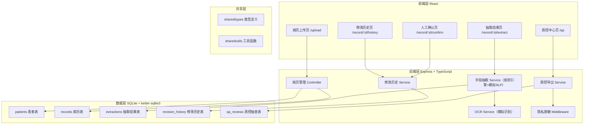
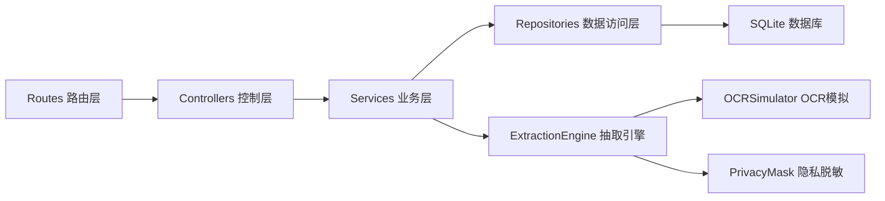
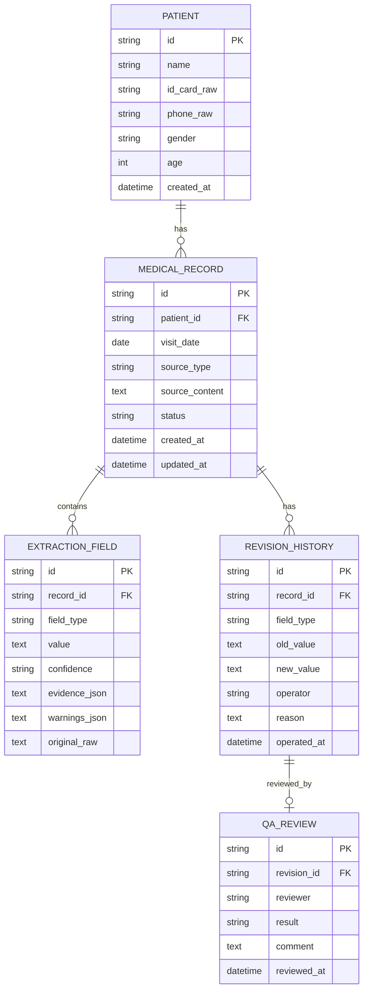

## 1. 架构设计



## 2. 技术说明

- **前端**：React@18 + TypeScript + tailwindcss@3 + vite + react-router-dom + zustand + lucide-react
- **初始化工具**：vite-init，使用 `react-express-ts` 模板（前后端一体化）
- **后端**：Express@4 + TypeScript（ESM 格式）
- **数据库**：SQLite（better-sqlite3 驱动），内置演示数据
- **OCR/NLP**：后端内置规则引擎模拟，不依赖外部服务，保证离线可用

## 3. 路由定义

| 前端路由 | 用途 |
|----------|------|
| `/` | 首页/仪表盘，快捷入口与今日概览 |
| `/upload` | 病历上传页（照片/文本） |
| `/record/:id/extract` | 抽取结果页 |
| `/record/:id/confirm` | 人工确认页 |
| `/qa` | 质控中心页 |
| `/record/:id/history` | 修改历史页 |

| 后端 API 路由 | 方法 | 用途 |
|---------------|------|------|
| `/api/records` | POST | 创建病历（上传照片/文本） |
| `/api/records` | GET | 获取病历列表（支持筛选） |
| `/api/records/:id` | GET | 获取单条病历详情 |
| `/api/records/:id/extract` | POST | 触发字段抽取，返回结构化结果 |
| `/api/records/:id/confirm` | POST | 提交人工确认与修正内容 |
| `/api/records/:id/history` | GET | 获取修改历史 |
| `/api/extractions/:extractionId/evidence` | GET | 获取字段依据（高亮句/图片区域坐标） |
| `/api/qa/export` | GET | 导出脱敏质控摘要（JSON/PDF） |
| `/api/qa/reviews` | POST | 提交质控抽查结果 |
| `/api/patients/:id/records` | GET | 获取同一患者多次就诊记录（防乱合并） |

## 4. API 类型定义

```typescript
// shared/types/index.ts

export type ConfidenceLevel = 'high' | 'medium' | 'low';

export type FieldType = 'chief_complaint' | 'diagnosis' | 'medication' | 'allergy' | 'followup';

export interface Patient {
  id: string;
  name: string;
  idCardMasked: string;      // 身份证脱敏后
  phoneMasked: string;       // 手机号脱敏后
  idCardRaw?: string;        // 仅内部使用，不返回前端
  phoneRaw?: string;         // 仅内部使用，不返回前端
  gender: '男' | '女';
  age: number;
}

export interface EvidenceSpan {
  type: 'text' | 'image';
  text?: string;             // 依据原文
  startIndex?: number;       // 文本起始位置
  endIndex?: number;         // 文本结束位置
  bbox?: { x: number; y: number; w: number; h: number }; // 图片区域
}

export interface ExtractedField {
  id: string;
  fieldType: FieldType;
  value: string;
  confidence: ConfidenceLevel;
  evidence: EvidenceSpan;
  warnings: string[];        // 字迹不清/药名近似/剂量缺单位等
  originalRaw?: string;      // OCR 原始片段
}

export interface MedicalRecord {
  id: string;
  patientId: string;
  visitDate: string;         // ISO date
  sourceType: 'image' | 'text';
  sourceContent: string;     // 图片base64或原文
  status: 'uploaded' | 'extracted' | 'confirmed' | 'archived';
  extractions: ExtractedField[];
  createdAt: string;
  updatedAt: string;
}

export interface RevisionHistory {
  id: string;
  recordId: string;
  fieldType: FieldType;
  oldValue: string;
  newValue: string;
  operator: string;          // 操作人
  operatedAt: string;
  reason?: string;
}

export interface QAReview {
  id: string;
  recordId: string;
  revisionId: string;
  reviewer: string;
  result: 'pass' | 'needs_recheck';
  comment?: string;
  reviewedAt: string;
}
```

## 5. 服务端分层架构



## 6. 数据模型

### 6.1 ER 图



### 6.2 DDL 语句

```sql
-- migrations/001_init.sql

CREATE TABLE IF NOT EXISTS patients (
  id TEXT PRIMARY KEY,
  name TEXT NOT NULL,
  id_card_raw TEXT NOT NULL,
  phone_raw TEXT NOT NULL,
  gender TEXT NOT NULL CHECK(gender IN ('男','女')),
  age INTEGER NOT NULL,
  created_at TEXT NOT NULL DEFAULT (datetime('now'))
);

CREATE TABLE IF NOT EXISTS medical_records (
  id TEXT PRIMARY KEY,
  patient_id TEXT NOT NULL REFERENCES patients(id),
  visit_date TEXT NOT NULL,
  source_type TEXT NOT NULL CHECK(source_type IN ('image','text')),
  source_content TEXT NOT NULL,
  status TEXT NOT NULL DEFAULT 'uploaded' CHECK(status IN ('uploaded','extracted','confirmed','archived')),
  created_at TEXT NOT NULL DEFAULT (datetime('now')),
  updated_at TEXT NOT NULL DEFAULT (datetime('now'))
);
CREATE INDEX idx_records_patient ON medical_records(patient_id);
CREATE INDEX idx_records_visit_date ON medical_records(visit_date);
CREATE INDEX idx_records_status ON medical_records(status);

CREATE TABLE IF NOT EXISTS extraction_fields (
  id TEXT PRIMARY KEY,
  record_id TEXT NOT NULL REFERENCES medical_records(id) ON DELETE CASCADE,
  field_type TEXT NOT NULL,
  value TEXT NOT NULL,
  confidence TEXT NOT NULL CHECK(confidence IN ('high','medium','low')),
  evidence_json TEXT NOT NULL,
  warnings_json TEXT NOT NULL DEFAULT '[]',
  original_raw TEXT
);
CREATE INDEX idx_extractions_record ON extraction_fields(record_id);

CREATE TABLE IF NOT EXISTS revision_history (
  id TEXT PRIMARY KEY,
  record_id TEXT NOT NULL REFERENCES medical_records(id) ON DELETE CASCADE,
  field_type TEXT NOT NULL,
  old_value TEXT NOT NULL,
  new_value TEXT NOT NULL,
  operator TEXT NOT NULL,
  reason TEXT,
  operated_at TEXT NOT NULL DEFAULT (datetime('now'))
);
CREATE INDEX idx_revisions_record ON revision_history(record_id);

CREATE TABLE IF NOT EXISTS qa_reviews (
  id TEXT PRIMARY KEY,
  revision_id TEXT NOT NULL REFERENCES revision_history(id) ON DELETE CASCADE,
  reviewer TEXT NOT NULL,
  result TEXT NOT NULL CHECK(result IN ('pass','needs_recheck')),
  comment TEXT,
  reviewed_at TEXT NOT NULL DEFAULT (datetime('now'))
);
```
