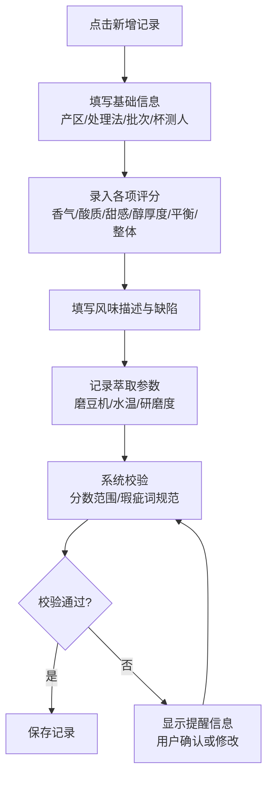
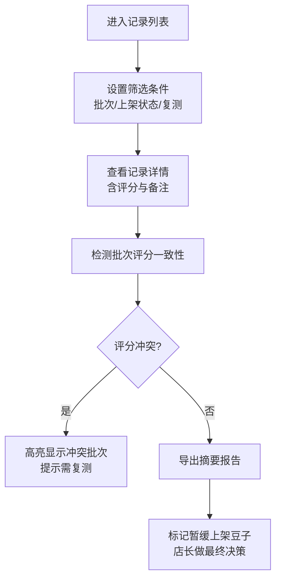

## 1. 产品概述

咖啡豆杯测记录页是一款面向咖啡馆烘豆师和店长的专业杯测记录工具，帮助团队系统化记录咖啡豆的杯测评分、风味描述和缺陷信息，替代传统纸质记录和零散聊天记录，提升咖啡豆质量管理和上架决策效率。

- 目标用户：咖啡馆烘豆师、店长、吧台培训人员
- 核心价值：标准化杯测流程、智能数据校验、便捷的筛选与导出

## 2. 核心功能

### 2.1 用户角色

| 角色 | 使用场景 | 核心需求 |
|------|----------|----------|
| 烘豆师 | 日常杯测记录 | 快速录入评分、记录磨豆机/水温参数、标记缺陷 |
| 店长 | 豆单管理与上架决策 | 按批次筛选、查看评分一致性、导出摘要 |
| 吧台培训 | 学习与参考 | 打印视图、风味参考、标准对比 |

### 2.2 功能模块

1. **杯测记录录入**：完整的杯测表单，包含基础信息、各项评分、风味备注、缺陷标记、萃取参数
2. **记录列表与筛选**：展示所有杯测记录，支持按批次、上架状态、复测状态筛选
3. **智能提醒系统**：分数范围校验、批次评分冲突检测、瑕疵词写法规范化提示
4. **数据持久化**：本地存储，浏览器刷新不丢失数据
5. **打印视图**：专为吧台培训设计的打印格式
6. **摘要导出**：生成店长决策用的摘要报告，标记暂缓上架的豆子

### 2.3 页面详情

| 页面名称 | 模块名称 | 功能描述 |
|----------|----------|----------|
| 杯测记录主页 | 顶部导航 | 应用标题、新增记录按钮、打印/导出入口 |
| 杯测记录主页 | 筛选区域 | 批次筛选、上架状态筛选、复测状态筛选、搜索 |
| 杯测记录主页 | 记录列表 | 卡片式展示记录摘要，可展开查看详情 |
| 新增/编辑弹窗 | 基础信息 | 产区、处理法、烘焙批次、杯测人、杯测日期 |
| 新增/编辑弹窗 | 评分区域 | 香气、酸质、甜感、醇厚度、平衡感、整体评分（0-10分） |
| 新增/编辑弹窗 | 风味与缺陷 | 香气描述、风味描述、缺陷标记、备注 |
| 新增/编辑弹窗 | 萃取参数 | 磨豆机型号、研磨度、水温、粉水比 |
| 新增/编辑弹窗 | 状态管理 | 是否上架、是否复测标记 |
| 提醒提示 | 分数校验 | 分数超出 0-10 范围时红色警告 |
| 提醒提示 | 批次冲突 | 同一批次多人评分差异过大时提示 |
| 提醒提示 | 瑕疵词规范 | 检测不规范的缺陷描述，建议使用标准术语 |
| 打印视图 | 培训专用 | 精简排版，适合打印出来用于吧台培训 |
| 导出功能 | 摘要导出 | 生成 CSV 格式的杯测摘要，包含上架建议 |

## 3. 核心流程

### 3.1 烘豆师录入杯测记录

### 3.2 店长筛选与决策

## 4. 用户界面设计

### 4.1 设计风格

- **整体调性**：专业、温暖、有咖啡质感，采用深棕色与暖米色配色，营造精品咖啡馆氛围
- **主色调**：深咖啡色 `#3E2723` 作为主色，焦糖色 `#8D6E63` 为辅助色
- **背景色**：暖米色 `#F5F0E1`，带有轻微的纸张纹理感
- **强调色**：温暖的橙色 `#FF8A65` 用于重要操作按钮和警告提示
- **按钮风格**：微圆角按钮，带有细腻的阴影和悬停动效
- **字体**：标题使用具有衬线质感的字体，正文使用清晰易读的无衬线字体
- **布局风格**：卡片式布局，层次分明，带有纸张质感的微妙阴影
- **图标风格**：线性图标，与咖啡主题呼应（咖啡豆、杯子、勺子等元素）

### 4.2 页面设计概述

| 页面名称 | 模块名称 | UI 元素 |
|----------|----------|---------|
| 主页 | 顶部导航栏 | 深色背景、白色文字、应用 Logo、操作按钮 |
| 主页 | 筛选区域 | 浅卡片背景、下拉选择器、搜索框、标签式筛选 |
| 主页 | 记录卡片 | 白色卡片、微阴影、悬停上浮效果、咖啡豆装饰元素 |
| 弹窗 | 表单布局 | 两列布局、分组标题、输入框带底部边框 |
| 弹窗 | 评分区域 | 数字输入 + 滑块组合、颜色渐变指示分数高低 |
| 弹窗 | 缺陷标签 | 可点击的标签云、选中高亮、自定义输入 |
| 打印视图 | 专用样式 | 黑白优化、简化布局、去除交互元素、适合 A4 打印 |

### 4.3 响应式设计

- **桌面优先**：以 1440px 宽度为基准设计
- **平板适配**：筛选区域可折叠，卡片从三列变为两列
- **手机适配**：单列布局，底部悬浮新增按钮，弹窗改为全屏抽屉
- **触摸优化**：按钮最小高度 44px，输入区域留有足够间距

### 4.4 动效与交互

- 页面加载时卡片依次淡入（staggered animation）
- 评分滑块拖动时有颜色渐变反馈
- 弹窗出现时有平滑的缩放+淡入效果
- 提醒信息以轻微抖动+颜色变化的方式引起注意
- 标签选中/取消时有弹性缩放动效
