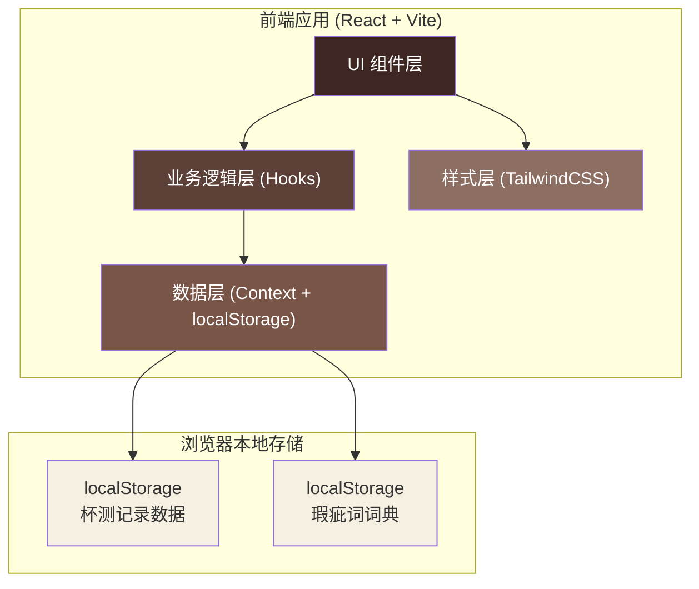
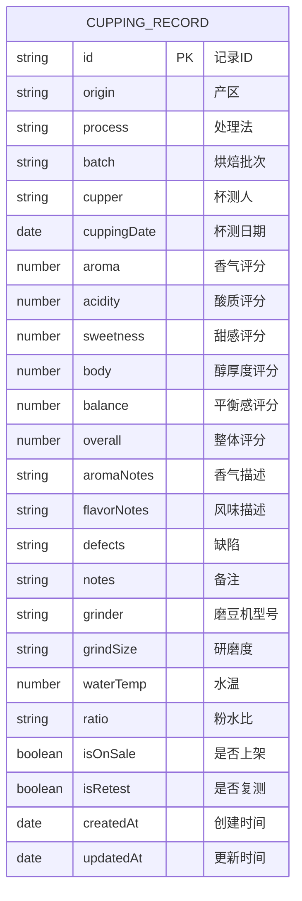

## 1. 架构设计



## 2. 技术描述

- **前端框架**：React 18 + TypeScript
- **构建工具**：Vite 5
- **样式方案**：TailwindCSS 3
- **状态管理**：React Context + useReducer
- **数据持久化**：localStorage（封装自定义 Hook）
- **图标库**：Lucide React
- **导出功能**：原生 Blob + CSV 生成
- **打印功能**：CSS @media print + 专用打印样式

## 3. 项目结构

```
src/
├── components/
│   ├── layout/
│   │   ├── Header.tsx          # 顶部导航
│   │   └── Container.tsx       # 页面容器
│   ├── records/
│   │   ├── RecordCard.tsx      # 记录卡片
│   │   ├── RecordList.tsx      # 记录列表
│   │   └── RecordForm.tsx      # 记录表单（弹窗）
│   ├── filters/
│   │   └── FilterBar.tsx       # 筛选栏
│   ├── scoring/
│   │   ├── ScoreSlider.tsx     # 评分滑块
│   │   └── ScoreInput.tsx      # 评分输入
│   ├── defects/
│   │   └── DefectTags.tsx      # 缺陷标签选择
│   ├── alerts/
│   │   └── ValidationAlert.tsx # 校验提醒
│   └── common/
│       ├── Button.tsx          # 通用按钮
│       ├── Modal.tsx           # 通用弹窗
│       └── Tag.tsx             # 通用标签
├── hooks/
│   ├── useLocalStorage.ts      # localStorage Hook
│   ├── useRecords.ts           # 记录管理 Hook
│   ├── useValidation.ts        # 数据校验 Hook
│   └── useExport.ts            # 导出 Hook
├── context/
│   └── RecordsContext.tsx      # 记录数据 Context
├── types/
│   └── index.ts                # TypeScript 类型定义
├── utils/
│   ├── defectDictionary.ts     # 瑕疵词词典
│   ├── validation.ts           # 校验工具函数
│   └── export.ts               # 导出工具函数
├── data/
│   └── mockData.ts             # 示例数据
├── styles/
│   └── print.css               # 打印样式
├── App.tsx
├── main.tsx
└── index.css
```

## 4. 路由定义

| 路由 | 用途 |
|------|------|
| / | 主页 - 杯测记录列表与筛选 |

本应用为单页应用，不使用多路由，所有功能在同一页面通过弹窗和状态切换实现。

## 5. 数据模型

### 5.1 数据模型定义



### 5.2 TypeScript 类型定义

```typescript
interface CuppingRecord {
  id: string;
  origin: string;
  process: string;
  batch: string;
  cupper: string;
  cuppingDate: string;
  scores: {
    aroma: number;
    acidity: number;
    sweetness: number;
    body: number;
    balance: number;
    overall: number;
  };
  aromaNotes: string;
  flavorNotes: string;
  defects: string[];
  notes: string;
  brewParams: {
    grinder: string;
    grindSize: string;
    waterTemp: number;
    ratio: string;
  };
  status: {
    isOnSale: boolean;
    isRetest: boolean;
  };
  createdAt: string;
  updatedAt: string;
}

interface ValidationResult {
  valid: boolean;
  warnings: ValidationWarning[];
}

interface ValidationWarning {
  type: 'score_range' | 'batch_conflict' | 'defect_spelling';
  message: string;
  severity: 'error' | 'warning';
  suggestions?: string[];
}
```

### 5.3 瑕疵词词典

```typescript
const standardDefects = [
  '霉味', '酸味', '发酵味', '涩感', '焦苦', '木味',
  '药味', '泥土味', '纸板味', '橡胶味', '洋葱味', '咸味',
  '平淡', '薄', '杂味', '不干净', '过度烘焙', '烘焙不足'
];
```

## 6. 核心功能实现方案

### 6.1 数据持久化

- 使用 `localStorage` 存储所有杯测记录
- 封装 `useLocalStorage` Hook 提供类型安全的读写
- 数据变更时自动同步到 localStorage
- 支持初始化时加载示例数据

### 6.2 智能校验

**分数范围校验**：
- 监听所有评分输入
- 超出 0-10 范围立即标记为错误状态
- 显示红色边框和提示文字

**批次评分冲突检测**：
- 保存时查询同一批次的其他记录
- 计算整体评分差异，超过 1 分视为冲突
- 展示冲突详情（其他杯测人的评分）

**瑕疵词规范检测**：
- 维护标准瑕疵词词典
- 对用户输入的缺陷描述进行模糊匹配
- 检测到拼写相近但不标准的词汇时给出建议

### 6.3 筛选功能

- 支持按批次号筛选（下拉选择 + 搜索）
- 支持按上架状态筛选（全部/已上架/未上架）
- 支持按复测状态筛选（全部/需复测/无需复测）
- 支持按产区、处理法、杯测人搜索

### 6.4 打印视图

- 使用 `@media print` 媒体查询
- 隐藏所有交互元素（按钮、筛选栏等）
- 优化排版为 A4 纸张尺寸
- 支持打印单条记录详情或多条记录列表

### 6.5 导出功能

- 生成 CSV 格式摘要
- 包含字段：批次、产区、处理法、平均评分、缺陷数量、上架状态、建议
- 自动标记平均分低于 7 分或有严重缺陷的豆子为"暂缓上架"
- 支持导出当前筛选结果或全部记录
