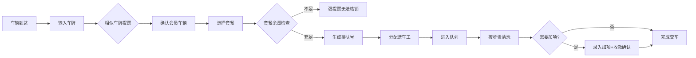

## 1. 产品概述

洗车套餐核销台是一套面向洗车门店的业务管理系统，解决雨后排长队时套餐扣错、加项漏收、进度追踪混乱等核心痛点。系统服务于前台、洗车工和老板三类角色，实现从车辆入场到交车结算的全流程数字化管理。

- **目标用户**：洗车门店前台、洗车师傅、门店老板
- **核心价值**：杜绝套餐扣错、加项漏收，提升排队效率，支持老板日结对账

## 2. 核心功能

### 2.1 用户角色

| 角色 | 使用场景 | 核心权限 |
|------|----------|----------|
| 前台 | 车辆登记、核销套餐、加项录入 | 登记车辆、创建核销单、录入加项、标记进度、撤销核销 |
| 洗车工 | 查看自己处理的车辆和进度 | 查看分配车辆、更新清洗进度 |
| 老板 | 日结对账、导出报表、查看异常 | 查看日结数据、导出Excel、查看撤销记录、管理会员套餐 |

### 2.2 功能模块

1. **前台核销台**：车辆排队队列、快速登记、套餐核销、加项录入、进度标记
2. **会员管理**：会员信息、套餐余额、消费记录
3. **洗车工进度**：按工人查看正在处理的车辆、进度步骤展示
4. **老板日结**：当日收支统计、分类汇总、撤销记录、数据导出

### 2.3 页面详情

| 页面名称 | 模块名称 | 功能描述 |
|----------|----------|----------|
| 前台核销台 | 排队队列 | 展示待洗/清洗中/已完成车辆，显示排队号、车牌、套餐、洗车工 |
| 前台核销台 | 车辆登记 | 输入车牌（模糊匹配提醒相似车牌）、选择会员/套餐、自动计算剩余次数 |
| 前台核销台 | 套餐核销 | 显示套餐余量，套餐不足时强提醒，防止重复核销 |
| 前台核销台 | 加项录入 | 选择加项服务（内饰清洁等），录入价格和改价原因，未付款交车提醒 |
| 前台核销台 | 进度追踪 | 标记车辆当前步骤（待洗→冲水→打泡→擦洗→冲洗→吹干→加项→交车） |
| 洗车工进度 | 工人看板 | 按洗车工分组展示车辆，显示当前步骤和预计完成时间 |
| 会员管理 | 会员列表 | 搜索会员、查看套餐余额、查看历史消费 |
| 老板日结 | 数据统计 | 现金收入、会员扣次金额、加项收入、撤销记录分类汇总 |
| 老板日结 | 数据导出 | 导出当日流水为CSV/Excel格式 |

## 3. 核心流程

### 3.1 车辆入场核销流程

车辆到达 → 前台输入车牌 → 系统提示相似车牌 → 确认车辆/会员 → 选择套餐 → 系统检查套餐余量 → 套餐充足则生成排队号和核销单 → 分配洗车工 → 进入排队队列 → 洗车工按步骤处理 → 加项服务录入（如需）→ 加项确认收款 → 完成交车

### 3.2 老板日结流程

老板选择日期 → 系统统计当日流水 → 分类展示（现金/会员扣次/加项/撤销）→ 查看明细 → 导出报表

## 4. 用户界面设计

### 4.1 设计风格

- **主色调**：深邃蓝色 `#1e40af`，传达专业、可靠
- **辅助色**：警示橙 `#f97316`（提醒）、成功绿 `#10b981`（完成）、危险红 `#ef4444`（错误）
- **字体**：标题使用 "Noto Sans SC" 粗体，正文使用 "Noto Sans SC" 常规体
- **按钮风格**：圆角 8px，悬停微浮起阴影，点击有按压反馈
- **布局风格**：卡片式布局 + 左侧导航栏，桌面端三栏布局（队列-操作-详情）
- **图标**：Lucide 图标库，线性风格

### 4.2 页面设计概览

| 页面名称 | 模块名称 | UI 元素 |
|----------|----------|---------|
| 前台核销台 | 顶部状态栏 | 日期时间、在洗车辆数、待洗数、已完成数 |
| 前台核销台 | 左侧排队队列 | 按状态分组的车辆卡片，拖拽改变顺序 |
| 前台核销台 | 中间操作区 | 快速登记表单、核销按钮、加项面板 |
| 前台核销台 | 右侧详情面板 | 当前选中车辆的会员信息、套餐余量、历史记录 |
| 洗车工进度 | 工人分组卡片 | 每位工人一张卡片，内列其处理车辆及进度条 |
| 老板日结 | 数据看板 | 大号数字展示核心指标，下方明细表，顶部导出按钮 |
| 老板日结 | 撤销记录 | 独立 Tab，展示撤销人、撤销时间、撤销原因 |

### 4.3 响应式设计

- 桌面端（≥1280px）：三栏布局，充分利用水平空间
- 平板端（768-1279px）：两栏布局，详情面板折叠为抽屉
- 移动端（<768px）：单栏布局，Tab 切换队列/登记/详情

### 4.4 关键提醒机制

- **相似车牌提醒**：输入车牌时弹出下拉提示，高亮相似车牌（如京A12345 vs 京A1234S）
- **套餐已用完提醒**：红色 Toast + 模态框双重提醒，阻止核销操作
- **重复完成提醒**：点击已完成订单时弹出确认框，防止误操作
- **加项未付款提醒**：交车时检查加项状态，未付款则黄色警示并要求确认收款
- **刷新数据保障**：所有状态实时持久化到后端，刷新页面数据不丢失
