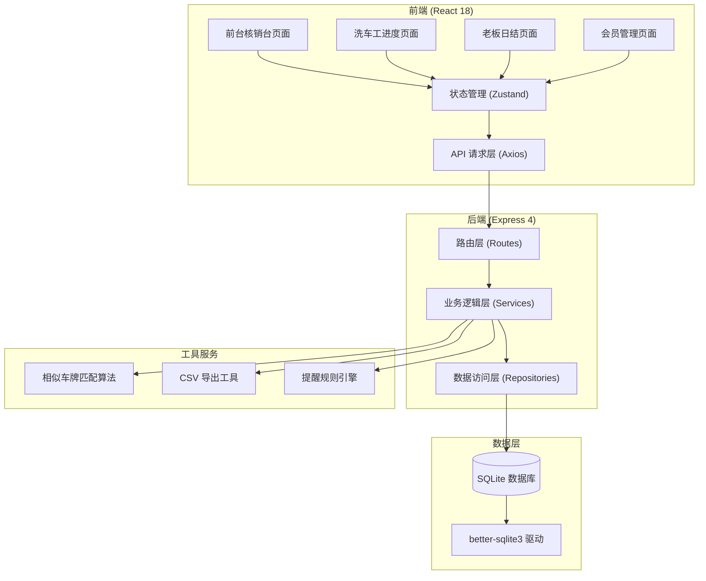
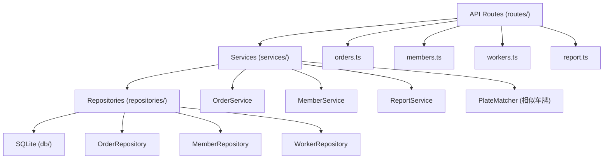
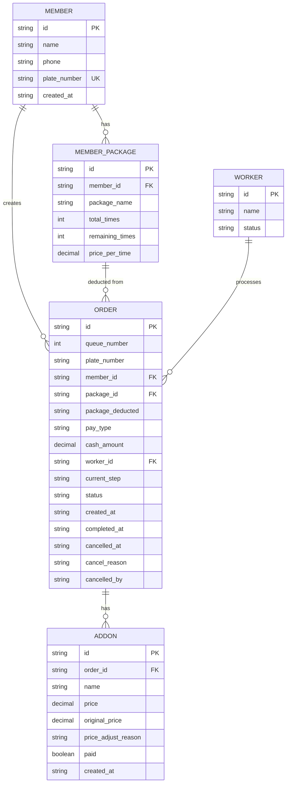

## 1. 架构设计



## 2. 技术说明

- **前端**：React@18 + TypeScript + Vite + TailwindCSS@3 + Zustand + React Router@6 + Lucide React
- **初始化工具**：vite-init
- **后端**：Express@4 + TypeScript
- **数据库**：SQLite（better-sqlite3 驱动），无需额外服务，文件式存储
- **数据导出**：原生 CSV 生成，无需额外依赖

## 3. 路由定义

### 前端路由

| 路由路径 | 页面用途 |
|----------|----------|
| / | 前台核销台（首页） |
| /workers | 洗车工进度看板 |
| /report | 老板日结报表 |
| /members | 会员管理 |

### 后端 API 路由

| 方法 | 路径 | 用途 |
|------|------|------|
| GET | /api/orders | 获取核销单列表（支持按日期/状态筛选） |
| POST | /api/orders | 创建核销单（车辆登记+套餐核销） |
| GET | /api/orders/:id | 获取核销单详情 |
| PATCH | /api/orders/:id | 更新核销单状态/进度 |
| POST | /api/orders/:id/cancel | 撤销核销单 |
| POST | /api/orders/:id/addons | 追加加项服务 |
| PATCH | /api/orders/:id/addons/:addonId | 更新加项付款状态 |
| GET | /api/members | 搜索会员（支持车牌/手机号/姓名） |
| GET | /api/members/:id | 获取会员详情及套餐余额 |
| POST | /api/members | 新增会员 |
| GET | /api/workers | 获取洗车工列表 |
| GET | /api/report/daily | 获取日结统计数据 |
| GET | /api/report/daily/export | 导出日结 CSV |

## 4. API 数据类型定义

```typescript
// 会员
interface Member {
  id: string;
  name: string;
  phone: string;
  plateNumber: string;
  createdAt: string;
}

// 会员套餐
interface MemberPackage {
  id: string;
  memberId: string;
  packageName: string;
  totalTimes: number;
  remainingTimes: number;
  pricePerTime: number;
}

// 洗车工
interface Worker {
  id: string;
  name: string;
  status: 'active' | 'off';
}

// 清洗步骤
type WashStep = 'queued' | 'rinsing' | 'soaping' | 'scrubbing' | 'washing' | 'drying' | 'addon' | 'done';

// 核销单状态
type OrderStatus = 'queued' | 'washing' | 'done' | 'cancelled';

// 加项
interface Addon {
  id: string;
  orderId: string;
  name: string;
  price: number;
  originalPrice: number;
  priceAdjustReason?: string;
  paid: boolean;
  createdAt: string;
}

// 核销单
interface Order {
  id: string;
  queueNumber: number;
  plateNumber: string;
  memberId?: string;
  memberName?: string;
  packageId?: string;
  packageName?: string;
  packageDeducted: number;
  payType: 'member' | 'cash';
  cashAmount?: number;
  workerId?: string;
  workerName?: string;
  currentStep: WashStep;
  status: OrderStatus;
  addons: Addon[];
  createdAt: string;
  completedAt?: string;
  cancelledAt?: string;
  cancelReason?: string;
  cancelledBy?: string;
}

// 日结统计
interface DailyReport {
  date: string;
  totalOrders: number;
  totalRevenue: number;
  memberDeductionCount: number;
  memberDeductionAmount: number;
  cashRevenue: number;
  addonRevenue: number;
  cancelledOrders: number;
  cancelledAmount: number;
  orders: Order[];
}
```

## 5. 服务端架构图



## 6. 数据模型

### 6.1 ER 图



### 6.2 初始化数据 (SQL)

```sql
-- 洗车工
INSERT INTO worker (id, name, status) VALUES
('w1', '张师傅', 'active'),
('w2', '李师傅', 'active'),
('w3', '王师傅', 'active');

-- 加项服务配置
INSERT INTO addon_config (id, name, default_price) VALUES
('ac1', '内饰清洁', 80),
('ac2', '发动机舱清洗', 50),
('ac3', '轮胎上光', 30),
('ac4', '玻璃镀膜', 100);

-- 示例会员
INSERT INTO member (id, name, phone, plate_number, created_at) VALUES
('m1', '陈先生', '13800138001', '京A12345', datetime('now')),
('m2', '刘女士', '13800138002', '京A1234S', datetime('now')),
('m3', '赵总', '13800138003', '京B88888', datetime('now'));

-- 示例会员套餐
INSERT INTO member_package (id, member_id, package_name, total_times, remaining_times, price_per_time) VALUES
('mp1', 'm1', '精洗10次卡', 10, 7, 35),
('mp2', 'm2', '普洗20次卡', 20, 1, 25),
('mp3', 'm3', '精洗年卡', 52, 45, 30);
```
