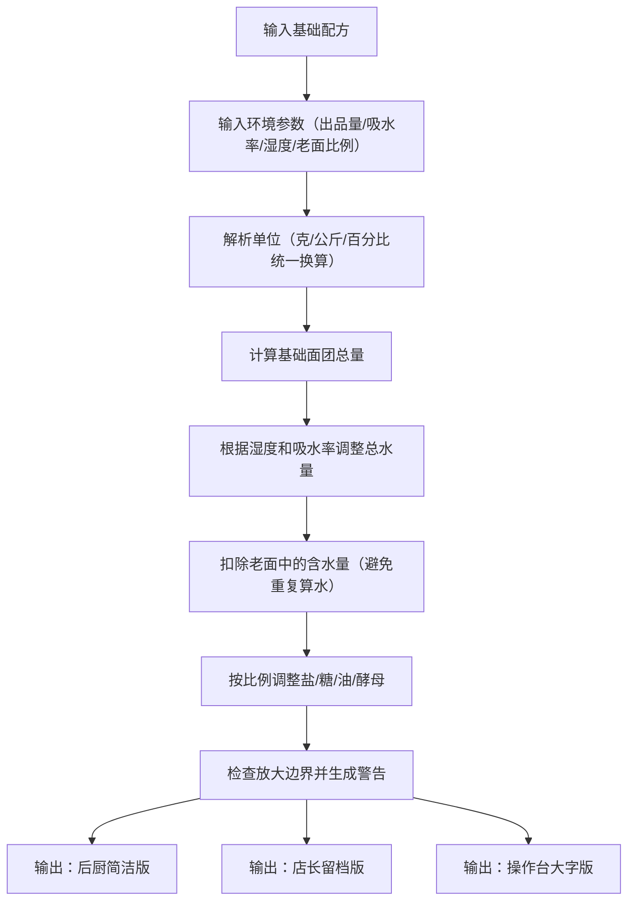

## 1. 产品概述

面包店换季后，同款吐司配方早上正常、下午发黏。师傅怀疑面粉批次吸水率差异和空气湿度影响，但新人只会照表称量。本工具通过输入基础配方、目标出品量、面粉吸水率、室内湿度和老面比例，自动计算调整水量、盐糖油和酵母用量，并输出多种场景化配方版本。

- 解决问题：季节/湿度变化导致面团不稳定、新人照表称量不会灵活调整、老面含水量重复计算
- 目标用户：面包店师傅、店长、学徒
- 产品价值：稳定出品质量、降低学徒操作门槛、避免配方放大出错

## 2. 核心功能

### 2.1 用户角色
| 角色 | 核心使用场景 |
|------|-------------|
| 面包师傅 | 输入配方参数，快速换算不同条件下的配方 |
| 店长 | 查看完整计算过程，留档管理，确认放大边界 |
| 学徒 | 查看操作台大字版配方，照单称量不易出错 |

### 2.2 功能模块
1. **配方输入页**：基础配方录入、环境参数设置、单位混合输入
2. **换算结果页**：实时计算、三种视图切换（后厨版/店长版/操作台版）
3. **打印/导出**：支持打印各版本配方

### 2.3 页面详情
| 页面名称 | 模块名称 | 功能描述 |
|-----------|-------------|---------------------|
| 配方输入页 | 基础配方录入 | 支持面粉、水、盐、糖、油、酵母、老面等原料输入，支持克/公斤/百分比混合单位 |
| 配方输入页 | 环境参数设置 | 目标出品量、面粉吸水率、室内湿度、老面含水量、老面比例 |
| 配方输入页 | 智能提示 | 某项为零时提示说明、老面含水重复计算警告 |
| 换算结果页 | 后厨简洁版 | 只显示最终称量数值，去除计算过程，大字体便于厨房快速查看 |
| 换算结果页 | 店长留档版 | 保留所有输入参数、计算过程、调整说明、不建议放大的边界警告 |
| 换算结果页 | 操作台展示版 | 超大字体、分步骤展示、高亮水量、防止学徒混淆水量 |

## 3. 核心流程

### 3.1 主流程
用户输入基础配方和环境参数 → 系统解析混合单位并统一计算 → 根据湿度和吸水率调整水量 → 按比例调整盐糖油酵母 → 检查老面含水量是否重复计算 → 输出三版配方结果

## 4. 用户界面设计

### 4.1 设计风格
- **主色调**：暖棕色系（#8B4513）搭配奶油米色（#FFF8E7），契合面包店烘焙氛围
- **辅助色**：橙红色（#D2691E）用于警告提示，深绿色（#2E8B57）用于确认状态
- **按钮风格**：圆角方形，微立体阴影，hover时有轻微上浮效果
- **字体**：标题用 Noto Serif SC（衬线体，传统烘焙感），正文用 Noto Sans SC（清晰易读）
- **布局风格**：卡片式布局，左侧输入区+右侧结果区的分栏设计
- **图标风格**：Lucide 线性图标，搭配面包/面粉/水滴等烘焙相关emoji

### 4.2 页面设计概述
| 页面名称 | 模块名称 | UI元素 |
|-----------|-------------|-------------|
| 配方输入页 | 基础配方区 | 可添加/删除原料行，每行含原料名、数值、单位下拉（g/kg/%），零值项有淡灰色提示标签 |
| 配方输入页 | 环境参数区 | 数字输入框带滑块，湿度计图标，吸水率参考范围提示 |
| 配方输入页 | 警告提示区 | 老面重复算水时显示橙红色警告条，说明调整逻辑 |
| 换算结果页 | 视图切换Tab | 三个Tab：后厨版/店长版/操作台版，切换时有淡入动画 |
| 换算结果页 | 后厨简洁版 | 大字号原料清单，数值突出显示，无多余文字 |
| 换算结果页 | 店长留档版 | 分折叠面板：输入参数/计算过程/调整说明/边界警告 |
| 换算结果页 | 操作台版 | 全屏大字模式，水量用最大号字体+蓝色高亮，分步骤显示 |

### 4.3 响应式设计
- 桌面端优先（1280px+）：左右分栏布局
- 平板端（768-1279px）：上下堆叠布局
- 移动端（<768px）：单列布局，操作台版自动切换为全屏大字

### 4.4 交互细节
- 数值输入时实时计算，无需点击"换算"按钮
- 单位切换时自动换算数值（如1kg切换为1000g）
- 操作台版支持一键全屏
- 打印时自动隐藏导航和输入区，只打印当前视图
