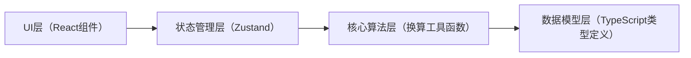

## 1. 架构设计

本项目为纯前端工具应用，无需后端服务。所有计算逻辑在浏览器端完成，支持离线使用和打印导出。



## 2. 技术描述
- **前端框架**：React@18 + TypeScript
- **构建工具**：Vite
- **样式方案**：TailwindCSS@3
- **状态管理**：Zustand
- **路由**：React Router DOM
- **图标**：Lucide React
- **后端**：无（纯前端应用）
- **数据库**：无（数据仅存在内存和localStorage）

## 3. 路由定义
| 路由 | 页面 | 用途 |
|-------|------|------|
| / | 首页（配方输入+结果展示） | 主工作区，输入配方并查看换算结果 |

> 说明：单页应用，通过Tab切换不同视图版本，无需多路由。

## 4. 数据模型

### 4.1 核心类型定义

```typescript
// 原料单位
type Unit = 'g' | 'kg' | '%';

// 原料项
interface Ingredient {
  id: string;
  name: string;        // 原料名称：面粉/水/盐/糖/黄油/酵母/老面等
  value: number;       // 数值
  unit: Unit;          // 单位
  isHydrated?: boolean; // 是否含水（针对老面等预含水原料）
  hydrationRatio?: number; // 含水量百分比（如老面含水65%）
}

// 环境参数
interface EnvironmentParams {
  targetYield: number;      // 目标出品量（g）
  flourAbsorption: number;  // 面粉吸水率（%，如62表示62%）
  roomHumidity: number;     // 室内湿度（%）
  starterRatio: number;     // 老面比例（%，相对于面粉量）
  starterHydration: number; // 老面含水量（%）
}

// 换算结果
interface ConversionResult {
  // 调整后的最终配方（统一为克）
  finalRecipe: { name: string; value: number; note?: string }[];
  
  // 计算过程（店长版显示）
  calculationSteps: {
    description: string;
    formula: string;
    result: number;
  }[];
  
  // 调整说明
  adjustments: {
    type: 'water' | 'salt' | 'sugar' | 'fat' | 'yeast' | 'warning';
    description: string;
  }[];
  
  // 边界警告
  boundaryWarnings: string[];
  
  // 输入参数快照（用于留档）
  inputSnapshot: {
    baseRecipe: Ingredient[];
    envParams: EnvironmentParams;
    timestamp: number;
  };
}
```

## 5. 核心算法说明

### 5.1 单位换算逻辑
- 百分比以**面粉总量**为基准（烘焙百分比 Baker's Percentage）
- kg → g：乘以 1000
- % → g：`面粉总量 × 百分比 / 100`

### 5.2 水量调整公式
```
基准水量 = 面粉总量 × 面粉吸水率 / 100
湿度修正系数 = 1 - (室内湿度 - 60) × 0.003  // 湿度60%为基准，每高1%减水0.3%
修正后总水量 = 基准水量 × 湿度修正系数
老面含水量 = 老面重量 × 老面含水量 / 100
实际需加水量 = 修正后总水量 - 老面含水量
```

### 5.3 盐糖油酵母调整
- 盐：面粉量的 1.8%-2.2%（按配方基准比例放大）
- 糖：按配方比例等比放大
- 油：按配方比例等比放大
- 酵母：新鲜酵母约面粉量 1%-2%，干酵母约 0.5%-1%
- 老面比例高时可减少酵母用量

### 5.4 放大边界判断
- 单次放大超过 5 倍：警告"建议分批次制作，避免揉面不均"
- 总水量超过 5kg：警告"大量水建议分次加入，观察面团状态"
- 老面比例超过 40%：警告"高比例老面发酵速度快，注意缩短发酵时间"
