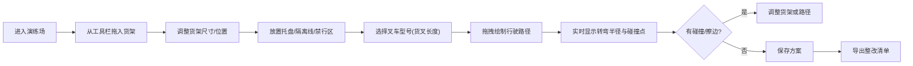
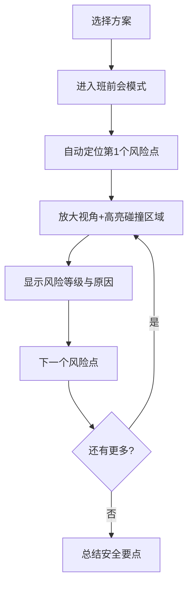

# 叉车窄道演练场 - 产品需求文档

## 1. 产品概述

叉车窄道演练场是一款面向仓储物流场景的3D安全演练工具，解决仓库货架调整后窄道通行安全难以评估的问题。通过可视化3D场景，让安全员、主管和叉车司机能够直观规划行驶路径、预判碰撞风险、优化货架布局。

- **目标用户**：仓库安全员、仓储主管、叉车司机、仓储经理
- **核心价值**：将"凭经验感觉"转化为"数据化可视"，降低窄道剐蹭事故，提升仓库空间利用率
- **使用场景**：新货架布局评估、司机岗前安全培训、通行方案评审、整改方案导出

## 2. 核心功能

### 2.1 用户角色

| 角色 | 使用方式 | 核心诉求 |
|------|----------|----------|
| 安全员 | 日常演练、班前会 | 找出危险路段，给司机讲清楚风险点 |
| 仓储主管 | 方案规划、保存回放 | 多方案对比，选最优布局 |
| 叉车司机 | 参与演练、学习 | 直观理解自己开车的转弯半径 |
| 仓储经理 | 查看报告 | 拿到整改清单，决策移货/画线 |

### 2.2 功能模块

1. **3D场景编辑器**：拖放货架、托盘、隔离线、禁行区、行人通道
2. **路径规划器**：鼠标拖拽绘制行驶路径，实时显示转弯半径
3. **碰撞检测引擎**：实时计算碰撞点、擦边距离、行人通道间距
4. **安全提醒系统**：托盘伸出、货叉长度、单位错误、禁行区穿越等告警
5. **方案管理**：保存多条方案、回放对比、删除编辑
6. **整改清单导出**：生成需移货的货架、需加警示线的路段清单
7. **班前会模式**：聚焦擦边弯道，放大展示关键风险点

### 2.3 页面详情

| 页面名称 | 模块名称 | 功能描述 |
|----------|----------|----------|
| 主工作台 | 3D视口 | 可旋转、缩放、平移的3D场景，货架/叉车/地面网格 |
| 主工作台 | 左侧工具栏 | 物体选择器：货架、托盘、隔离线、禁行区、行人通道、叉车 |
| 主工作台 | 右侧属性面板 | 选中物体的参数：尺寸、位置、货叉长度、托盘伸出量 |
| 主工作台 | 底部信息栏 | 实时数据：最小转弯半径、最近碰撞距离、行人通道净距、路径总长度 |
| 主工作台 | 顶部菜单栏 | 方案保存/加载/导出、班前会模式切换、单位切换 |
| 方案管理弹窗 | 方案列表 | 已保存方案缩略图、名称、创建时间，支持回放/删除/重命名 |
| 整改清单弹窗 | 导出预览 | 需移货架清单、需加警示线段落、整改建议，支持复制/下载 |
| 班前会模式 | 风险点轮播 | 自动聚焦每个擦边弯道，放大视角，语音/文字提示风险 |

## 3. 核心流程

### 3.1 场景搭建与路径演练流程

### 3.2 班前会讲解流程

## 4. 用户界面设计

### 4.1 设计风格

- **整体风格**：工业科技风，深色主题，强调安全警示感
- **主色调**：深灰蓝底色 (`#0f172a`)，搭配工业橙 (`#f97316`) 作为主强调色
- **安全色**：安全绿 (`#10b981`)、警告黄 (`#eab308`)、危险红 (`#ef4444`)
- **字体**：等宽字体 `JetBrains Mono` 用于数据显示，`Noto Sans SC` 用于中文正文
- **按钮风格**：硬朗直角，细微边框，按下有凹陷感
- **图标风格**：线性轮廓图标，统一2px描边
- **质感**：磨砂玻璃面板 (`backdrop-blur`)，霓虹发光边框用于选中状态

### 4.2 页面设计概览

| 页面名称 | 模块名称 | UI元素 |
|----------|----------|--------|
| 主工作台 | 3D视口 | 深色地面网格、货架蓝色半透明、叉车黄色、碰撞点红色脉冲、路径青色发光线 |
| 主工作台 | 左侧工具栏 | 竖向图标栏，hover展开文字，选中项有橙色发光边框 |
| 主工作台 | 右侧属性面板 | 可折叠卡片，数值输入框带单位切换(米/厘米/毫米) |
| 主工作台 | 底部状态栏 | 横向排列数据卡片，绿色=安全，黄色=警告，红色=危险 |
| 主工作台 | 顶部导航 | 深色半透明条，左侧logo，中间方案名称，右侧操作按钮 |
| 班前会模式 | 全屏覆盖层 | 黑色渐变遮罩，中央大号风险提示，左右切换按钮 |

### 4.3 3D场景设计

- **环境**：暗色工业仓库氛围，地面有发光网格线，远处有轻微雾效
- **光照**：三点布光 + 半球光，物体有清晰轮廓和阴影
- **相机**：默认45°俯视角，支持轨道控制，班前会模式自动相机动画
- **特效**：
  - 碰撞点：红色脉冲球体 + 文字标签
  - 路径线：青色发光TubeGeometry，转弯处有半径圆弧
  - 选中物体：橙色发光轮廓线
  - 禁行区：红色半透明地面区域 + 斜线纹理
  - 行人通道：黄色虚线 + 行人图标

### 4.4 响应式

- 桌面端为主要设计目标，左侧工具栏+右侧属性面板+中央3D视口的三栏布局
- 平板端：属性面板可收起为图标，工具栏移到底部
- 不支持移动端（操作复杂，需鼠标精确拖拽）

## 5. 关键指标与约束

### 5.1 性能指标
- 3D场景帧率 ≥ 60fps（普通配置笔记本）
- 同时支持 50 个货架物体不卡顿
- 路径碰撞检测响应延迟 < 100ms

### 5.2 数据精度
- 距离计算精确到厘米
- 角度计算精确到 1°
- 转弯半径计算考虑叉车轴距和货叉长度
