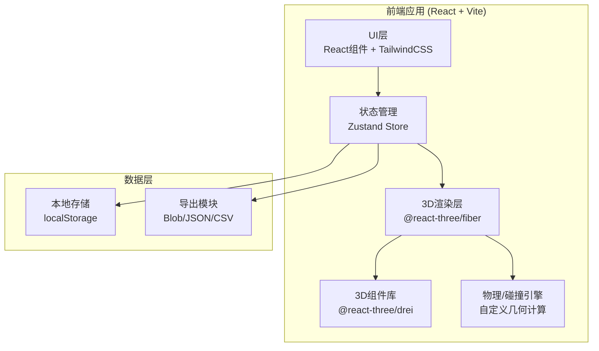

# 叉车窄道演练场 - 技术架构文档

## 1. 架构设计



## 2. 技术栈描述

- **前端框架**：React 18 + TypeScript
- **构建工具**：Vite 5
- **样式方案**：TailwindCSS 3
- **状态管理**：Zustand
- **3D引擎**：three.js + @react-three/fiber + @react-three/drei
- **图标库**：lucide-react
- **数据存储**：localStorage（纯前端，无后端）
- **导出格式**：JSON（方案保存）、CSV/文本（整改清单）

## 3. 模块划分与文件结构

```
src/
├── components/          # UI组件
│   ├── Toolbar/         # 左侧工具栏
│   ├── PropertyPanel/   # 右侧属性面板
│   ├── StatusBar/       # 底部状态栏
│   ├── TopNav/          # 顶部导航
│   ├── Modal/           # 通用弹窗
│   ├── SchemeManager/   # 方案管理弹窗
│   ├── ExportReport/    # 整改清单导出
│   └── BriefingMode/    # 班前会模式
├── store/               # Zustand状态管理
│   └── useSceneStore.ts # 场景数据、物体、路径、方案
├── hooks/               # 自定义hooks
│   ├── useCollision.ts  # 碰撞检测逻辑
│   ├── usePathDrawing.ts# 路径绘制逻辑
│   └── useExport.ts     # 导出功能
├── three/               # 3D场景相关
│   ├── Scene.tsx        # 主3D场景
│   ├── objects/         # 3D物体组件
│   │   ├── Shelf.tsx    # 货架
│   │   ├── Pallet.tsx   # 托盘
│   │   ├── Forklift.tsx # 叉车
│   │   ├── Zone.tsx     # 区域(禁行/行人)
│   │   └── Path.tsx     # 行驶路径
│   └── utils/
│       ├── geometry.ts  # 几何计算工具
│       └── collision.ts # 碰撞算法
├── types/               # TypeScript类型定义
│   └── scene.ts
├── utils/               # 通用工具
│   ├── units.ts         # 单位转换
│   └── storage.ts       # 本地存储
├── pages/
│   └── Workbench.tsx    # 主工作台页面
├── App.tsx
├── main.tsx
└── index.css
```

## 4. 数据模型

### 4.1 核心类型定义

```typescript
// 物体基础类型
interface BaseObject {
  id: string;
  type: 'shelf' | 'pallet' | 'forklift' | 'zone' | 'line';
  position: { x: number; y: number; z: number };
  rotation: number; // Y轴旋转角度(度)
  name?: string;
}

// 货架
interface ShelfObject extends BaseObject {
  type: 'shelf';
  width: number;   // 宽度(米)
  depth: number;   // 深度(米)
  height: number;  // 高度(米)
  levels: number;  // 层数
  hasPallet: boolean; // 是否有托盘
  palletOverhang: number; // 托盘伸出量(米)
}

// 托盘
interface PalletObject extends BaseObject {
  type: 'pallet';
  width: number;
  depth: number;
  height: number;
  overhang: number; // 超出货架的量
}

// 叉车
interface ForkliftObject extends BaseObject {
  type: 'forklift';
  forkLength: number;  // 货叉长度(米)
  wheelbase: number;   // 轴距(米)
  width: number;       // 车身宽度(米)
  turningRadius: number; // 最小转弯半径(米)
}

// 区域(禁行区/行人通道)
interface ZoneObject extends BaseObject {
  type: 'zone';
  zoneType: 'forbidden' | 'pedestrian';
  width: number;
  depth: number;
}

// 隔离线
interface LineObject extends BaseObject {
  type: 'line';
  length: number;
  lineType: 'warning' | 'divider';
}

// 路径点
interface PathPoint {
  x: number;
  z: number;
  radius?: number; // 转弯半径(米)，转弯点有值
}

// 路径
interface Path {
  id: string;
  points: PathPoint[];
  forkliftId: string;
}

// 碰撞点
interface CollisionPoint {
  position: { x: number; z: number };
  distance: number;  // 距离(米)，负值表示已碰撞
  objectId: string;
  severity: 'danger' | 'warning' | 'safe';
  description: string;
}

// 演练方案
interface Scheme {
  id: string;
  name: string;
  createdAt: number;
  objects: BaseObject[];
  paths: Path[];
  thumbnail?: string; // base64缩略图
}

// 整改清单
interface RectificationItem {
  type: 'move_shelf' | 'add_warning_line' | 'adjust_path' | 'remove_obstacle';
  location: string;
  description: string;
  priority: 'high' | 'medium' | 'low';
}
```

### 4.2 状态结构 (Zustand Store)

```typescript
interface SceneState {
  // 场景物体
  objects: BaseObject[];
  
  // 路径
  paths: Path[];
  currentPathId: string | null;
  isDrawing: boolean;
  
  // 选中状态
  selectedObjectId: string | null;
  
  // 碰撞检测结果
  collisions: CollisionPoint[];
  
  // 方案管理
  schemes: Scheme[];
  currentSchemeId: string | null;
  
  // 显示设置
  showGrid: boolean;
  showTurnRadius: boolean;
  showCollisionZones: boolean;
  
  // 单位设置
  unit: 'm' | 'cm' | 'mm';
  
  // Actions
  addObject: (obj: BaseObject) => void;
  updateObject: (id: string, updates: Partial<BaseObject>) => void;
  removeObject: (id: string) => void;
  selectObject: (id: string | null) => void;
  
  startPath: () => void;
  addPathPoint: (x: number, z: number) => void;
  finishPath: () => void;
  
  computeCollisions: () => void;
  computeTurningRadii: () => void;
  
  saveScheme: (name: string) => void;
  loadScheme: (id: string) => void;
  deleteScheme: (id: string) => void;
  
  exportReport: () => RectificationItem[];
}
```

## 5. 核心算法

### 5.1 转弯半径计算

基于叉车轴距和转向角，使用阿克曼转向几何模型计算：
- 转弯半径 = 轴距 / sin(最大转向角)
- 路径转弯处通过拟合三点圆弧计算曲率半径
- 考虑货叉长度，计算外侧转弯半径

### 5.2 碰撞检测

采用简化的2D俯视图碰撞检测（性能优先）：
- 将货架、托盘等投影到XZ平面
- 使用AABB（轴对齐包围盒）做初步检测
- 对旋转物体使用OBB（有向包围盒）精确检测
- 计算叉车沿路径运动时的 swept volume 与障碍物的距离
- 分离轴定理 (SAT) 用于OBB碰撞检测

### 5.3 路径平滑

- 使用三次贝塞尔曲线平滑路径拐点
- 自动计算转弯半径
- 确保转弯半径 ≥ 叉车最小转弯半径

## 6. 性能优化策略

- **InstancedMesh**：相同类型的货架使用实例化渲染
- **LOD**：远处物体降低细节
- **碰撞检测节流**：拖拽时每100ms计算一次
- **按需渲染**：只有场景变化时才重新渲染
- **WebWorker**：复杂碰撞计算放在Worker中

## 7. 路由定义

| 路由 | 页面 | 说明 |
|------|------|------|
| / | 主工作台 | 3D场景编辑与演练 |

（单页应用，只有一个主页面，功能通过面板和弹窗呈现）
