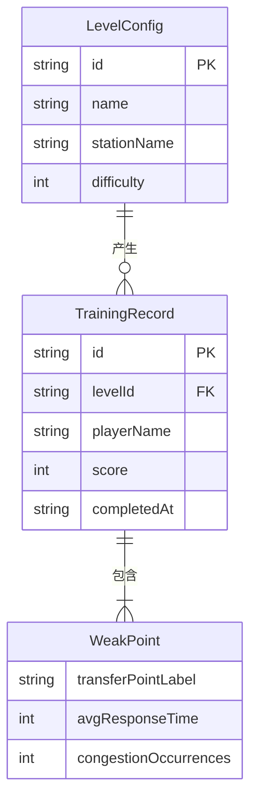

## 1. 架构设计

```mermaid
graph TB
    subgraph "前端层"
        "React App" --> "页面路由"
        "页面路由" --> "游戏主页"
        "页面路由" --> "调度游戏页"
        "页面路由" --> "关卡编辑器页"
        "页面路由" --> "回放分析页"
        "页面路由" --> "成绩管理页"
    end
    subgraph "核心引擎层"
        "调度游戏页" --> "客流模拟引擎"
        "调度游戏页" --> "碰撞检测器"
        "调度游戏页" --> "事件调度器"
        "调度游戏页" --> "评分引擎"
    end
    subgraph "数据持久层"
        "游戏主页" --> "LocalStorage"
        "关卡编辑器页" --> "LocalStorage"
        "回放分析页" --> "LocalStorage"
        "成绩管理页" --> "LocalStorage"
    end
```

## 2. 技术说明

- **前端框架**：React 18 + TypeScript + Vite
- **样式方案**：Tailwind CSS 3
- **状态管理**：Zustand
- **地图渲染**：Canvas 2D（客流模拟和地图渲染）
- **图表**：recharts（成绩趋势、雷达图）
- **图标**：lucide-react
- **数据持久化**：LocalStorage（关卡配置、训练记录、回放数据）
- **无后端**：纯前端应用，所有数据存储在浏览器本地

## 3. 路由定义

| 路由 | 用途 |
|------|------|
| `/` | 游戏主页：关卡选择、成绩概览、快速开始 |
| `/game/:levelId` | 调度游戏页：站厅地图、客流模拟、工具面板 |
| `/editor` | 关卡编辑器页：地图绘制、客流配置、事件编排 |
| `/editor/:levelId` | 编辑已有关卡 |
| `/replay/:recordId` | 回放分析页：回放播放器、瓶颈标注、绕行统计 |
| `/scores` | 成绩管理页：训练记录、薄弱点分析、趋势图表 |

## 4. 核心数据模型

### 4.1 关卡配置

```typescript
interface LevelConfig {
  id: string
  name: string
  stationName: string
  difficulty: 1 | 2 | 3 | 4 | 5
  gridSize: { cols: number; rows: number }
  cellSize: number
  walls: Array<{ x: number; y: number }>
  passages: Array<{ x: number; y: number; direction: "up" | "down" | "left" | "right" }>
  entrances: Array<{
    id: string
    x: number
    y: number
    label: string
    color: string
    passengerRate: number
    destinationIds: string[]
  }>
  exits: Array<{
    id: string
    x: number
    y: number
    label: string
    color: string
  }>
  escalators: Array<{
    id: string
    x: number
    y: number
    direction: "up" | "down"
    capacity: number
    initiallyOpen: boolean
  }>
  transferPoints: Array<{
    id: string
    x: number
    y: number
    label: string
  }>
  timeLimit: number
  events: Array<{
    id: string
    type: "escalator_stop" | "exit_close" | "passenger_surge"
    triggerTime: number
    params: Record<string, unknown>
  }>
  maxGuides: number
  maxFences: number
}
```

### 4.2 游戏状态

```typescript
interface GameState {
  levelId: string
  phase: "preparing" | "running" | "paused" | "finished"
  elapsedTime: number
  score: number
  fences: Array<{ id: string; x: number; y: number; orientation: "h" | "v" }>
  guides: Array<{ id: string; x: number; y: number; targetEntranceId: string }>
  escalatorStates: Record<string, boolean>
  passengers: Array<{
    id: string
    x: number
    y: number
    entranceId: string
    targetExitId: string
    state: "moving" | "congested" | "detouring" | "exited"
    pathIndex: number
    congestionTime: number
    detourDistance: number
  }>
  activeEvents: Array<{
    eventId: string
    triggeredAt: number
    resolvedAt?: number
  }>
}
```

### 4.3 训练记录

```typescript
interface TrainingRecord {
  id: string
  levelId: string
  levelName: string
  stationName: string
  playerName: string
  score: number
  passedRate: number
  avgCongestionTime: number
  avgDetourDistance: number
  completedAt: string
  duration: number
  weakPoints: Array<{
    transferPointId: string
    transferPointLabel: string
    avgResponseTime: number
    congestionOccurrences: number
  }>
  replayFrames: Array<{
    timestamp: number
    passengers: Array<{ id: string; x: number; y: number; state: string }>
    fences: Array<{ x: number; y: number }>
    guides: Array<{ x: number; y: number }>
    congestionHeatmap: number[][]
  }>
}
```

### 4.4 数据关系图



## 5. 客流模拟算法设计

### 5.1 路径计算

- 使用 BFS/A* 在网格地图上计算每个乘客从入口到目标出口的最短路径
- 围栏视为不可通行，关闭的扶梯视为不可通行
- 引导员改变相邻格子的优先通行方向，影响路径权重

### 5.2 碰撞检测

- 每个网格格子有容量上限（默认4人），超过视为拥堵
- 路线不可互相穿透：不同方向的客流在同一通道内相向而行时，宽度不足以容纳则产生拥堵
- 拥堵的乘客状态变为 "congested"，持续拥堵累计扣分

### 5.3 评分机制

| 评分项 | 计分规则 |
|--------|----------|
| 通过率 | 成功通过乘客数 / 总乘客数 × 40分 |
| 拥堵惩罚 | 每秒每人拥堵 -0.5分 |
| 绕行惩罚 | 绕行距离超过最短路径30%的乘客每人 -2分 |
| 时间奖励 | 剩余时间 × 0.5分 |
| 事件处理 | 突发事件30秒内有效应对 +5分 |

## 6. 目录结构

```
src/
├── components/
│   ├── game/              # 游戏核心组件
│   │   ├── StationMap.tsx  # Canvas 站厅地图
│   │   ├── ToolPanel.tsx   # 工具面板（围栏/扶梯/引导员）
│   │   ├── StatusBar.tsx   # 实时状态栏
│   │   ├── EventBanner.tsx # 事件通知横幅
│   │   └── ScoreBoard.tsx  # 评分结算面板
│   ├── editor/            # 编辑器组件
│   │   ├── EditorCanvas.tsx
│   │   ├── EditorToolbar.tsx
│   │   ├── FlowConfig.tsx
│   │   └── EventConfig.tsx
│   ├── replay/            # 回放组件
│   │   ├── ReplayPlayer.tsx
│   │   ├── HeatmapOverlay.tsx
│   │   └── DetourStats.tsx
│   ├── scores/            # 成绩组件
│   │   ├── RecordList.tsx
│   │   ├── WeakPointRadar.tsx
│   │   └── TrendChart.tsx
│   └── common/            # 通用组件
│       ├── Layout.tsx
│       └── Modal.tsx
├── engine/                # 核心引擎
│   ├── simulator.ts       # 客流模拟引擎
│   ├── pathfinding.ts     # A* 路径寻路
│   ├── collision.ts       # 碰撞检测
│   ├── scoring.ts         # 评分引擎
│   └── events.ts          # 事件调度器
├── store/                 # Zustand 状态
│   ├── gameStore.ts
│   ├── editorStore.ts
│   └── scoreStore.ts
├── hooks/                 # 自定义 Hooks
│   ├── useGameLoop.ts
│   ├── useReplay.ts
│   └── useLocalStorage.ts
├── pages/                 # 页面
│   ├── HomePage.tsx
│   ├── GamePage.tsx
│   ├── EditorPage.tsx
│   ├── ReplayPage.tsx
│   └── ScoresPage.tsx
├── utils/                 # 工具函数
│   ├── levelPresets.ts    # 预设关卡
│   └── storage.ts         # LocalStorage 封装
├── types/                 # 类型定义
│   └── index.ts
├── App.tsx
└── main.tsx
```
