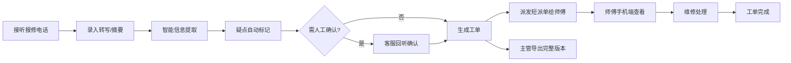

## 1. 产品概述

本系统是面向物业公司客服与维修团队的方言报修工单处理系统，解决方言录音转写误差导致的工单信息提取难题。通过智能识别加人工确认的混合模式，快速准确地从方言报修内容中提取关键报修信息，生成标准化工单，并实现双版本输出（维修师短派单、客服主管完整导出）。

- 核心目标：将模糊方言报修内容 → 结构化工单，解决数字/方位听错误差问题
- 目标用户：物业客服、维修师傅、客服主管
- 市场价值：提升报修处理效率，减少因信息不准确导致的派单错误，提高老人住户满意度

## 2. 核心功能

### 2.1 用户角色

| 角色 | 注册方式 | 核心权限 |
|------|-----------|----------|
| 物业客服 | 工号登录 | 录入报修内容、编辑工单、标记需确认项、派发工单 |
| 维修师傅 | 工号登录 | 查看分配给自己的短派单、标记处理状态 |
| 客服主管 | 工号登录 | 查看完整工单、导出含证据和修改历史的完整版本 |

### 2.2 功能模块

1. **客服工作台**：报修内容录入、智能信息提取、人工编辑确认、工单派发
2. **维修师傅端**：短派单列表、派单详情、处理状态更新
3. **主管导出中心**：完整工单列表、证据链查看、历史版本追溯、批量导出

### 2.3 页面详情

| 页面名称 | 模块名称 | 功能描述 |
|---------|----------|----------|
| 客服工作台 | 报修录入区 | 支持粘贴录音转写文本或输入人工摘要 |
| 客服工作台 | 智能提取区 | 自动识别小区、楼栋、房号、问题类型、紧急程度、回访句子 |
| 客服工作台 | 疑点标记区 | 自动标记听不清、多问题、外号、数字歧义等需确认项 |
| 客服工作台 | 人工编辑区 | 客服可修改提取结果、添加确认备注 |
| 客服工作台 | 工单派发 | 选择维修师傅、生成短派单语、提交派发 |
| 工单列表 | 工单列表 | 工单状态筛选、搜索、查看详情 |
| 维修端首页 | 我的派单 | 展示分配给当前师傅的短派单列表 |
| 维修端详情 | 派单详情 | 显示简短派单语、地址、联系方式、处理按钮 |
| 主管导出页 | 完整工单 | 显示完整工单含证据原文、修改历史、导出功能 |

## 3. 核心流程

物业客服接听老人方言报修电话 → 导入录音转写文本或人工记录摘要 → 系统智能提取关键信息 → 系统自动标记疑点（听不清/多问题/外号/数字歧义） → 客服回听确认并编辑 → 生成双版本工单 → 派发短版本给维修师傅 → 师傅手机端查看处理 → 客服主管可导出完整版本含证据和修改历史

## 4. 用户界面设计

### 4.1 设计风格
- 主色调：专业深蓝色 (#1e40af)，辅助色：警示橙 (#f59e0b)、确认绿 (#10b981)
- 按钮风格：圆角8px，悬停微上浮效果
- 字体：标题使用思源黑体，正文使用系统无衬线字体
- 布局风格：卡片式布局，左侧导航+右侧内容区
- 疑点项用醒目的橙色边框和警示图标标记

### 4.2 页面设计概述

| 页面名称 | 模块名称 | UI元素 |
|---------|----------|----------|
| 客服工作台 | 智能提取区 | 蓝色卡片布局，提取字段用标签展示，可编辑 |
| 客服工作台 | 疑点标记区 | 橙色高亮卡片，显示疑点类型与原文对照 |
| 维修端首页 | 我的派单 | 移动端友好的大卡片列表，突出简短派单语大字显示 |
| 主管导出页 | 完整工单 | 时间线式修改历史展示，证据原文与修改内容对照 |

### 4.3 响应性
- 桌面端优先设计，维修师傅端做移动端适配
- 维修端采用移动优先设计，大按钮、大字体，适合户外操作
- 触摸优化：按钮最小44x44px，滚动流畅
