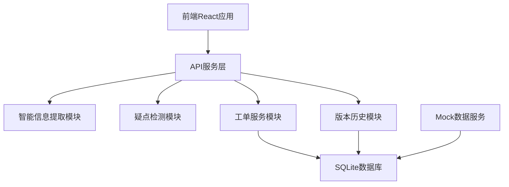
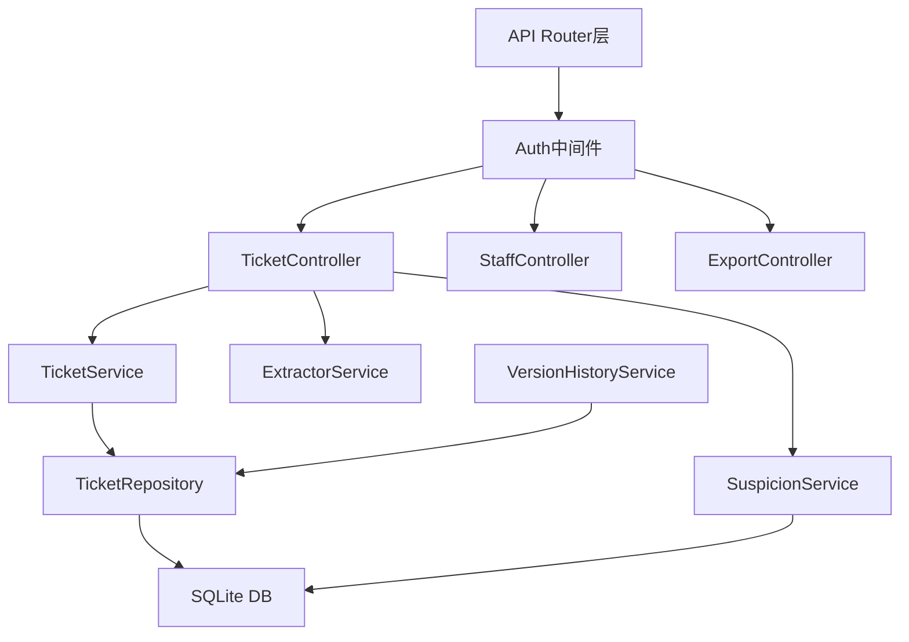
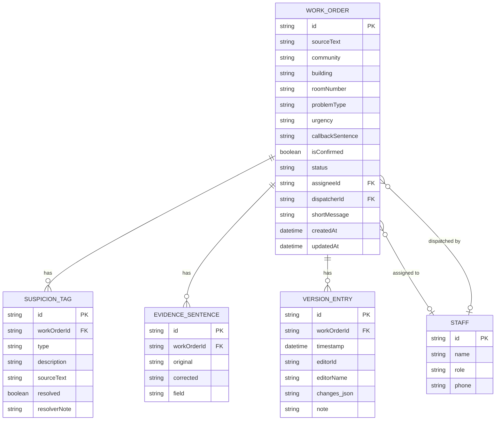

## 1. 架构设计



## 2. 技术描述

- 前端：React@18 + TypeScript + tailwindcss@3 + vite + React Router v6
- 后端：Express@4 + TypeScript
- 数据库：SQLite3（轻量级，适合物业本地部署）
- 状态管理：React Context + useReducer
- UI组件：自定义组件 + lucide-react 图标
- 日期处理：date-fns

## 3. 路由定义

| 路由 | 页面 | 访问角色 |
|------|------|----------|
| /login | 登录页 | 所有 |
| /cs/workbench | 客服工作台 | 客服 |
| /cs/tickets | 工单列表 | 客服、主管 |
| /cs/tickets/:id | 工单详情 | 客服、主管 |
| /tech/my-tickets | 我的派单（移动端） | 维修师傅 |
| /tech/my-tickets/:id | 派单详情（移动端） | 维修师傅 |
| /admin/export | 导出中心 | 客服主管 |

## 4. API 定义

```typescript
// 工单核心类型
interface WorkOrder {
  id: string;
  sourceText: string;           // 原始转写/摘要文本
  community: string | null;     // 小区
  building: string | null;      // 楼栋
  roomNumber: string | null;    // 房号
  problemType: string | null;   // 问题类型
  urgency: 'low' | 'medium' | 'high' | null; // 紧急程度
  callbackSentence: string | null; // 需回访句子
  suspicionTags: SuspicionTag[]; // 疑点标记
  isConfirmed: boolean;         // 是否已人工确认
  status: 'pending' | 'assigned' | 'processing' | 'completed';
  assigneeId: string | null;    // 维修师傅ID
  dispatcherId: string | null;  // 派单客服ID
  shortMessage: string | null;  // 短派单语
  evidenceSentences: EvidenceSentence[]; // 证据句
  versionHistory: VersionEntry[]; // 修改历史
  createdAt: Date;
  updatedAt: Date;
}

interface SuspicionTag {
  id: string;
  type: 'unclear' | 'multiple' | 'nickname' | 'date_ambiguous';
  description: string;
  sourceText: string;
  resolved: boolean;
  resolverNote: string | null;
}

interface EvidenceSentence {
  id: string;
  original: string;
  corrected: string | null;
  field: string;
}

interface VersionEntry {
  id: string;
  timestamp: Date;
  editorId: string;
  editorName: string;
  changes: Record<string, { old: any; new: any }>;
  note: string | null;
}

interface Staff {
  id: string;
  name: string;
  role: 'cs' | 'tech' | 'admin';
  phone: string;
}

// API端点
// POST   /api/tickets              创建工单（含智能提取）
// GET    /api/tickets              工单列表
// GET    /api/tickets/:id          工单详情
// PUT    /api/tickets/:id          更新工单（记录版本历史）
// POST   /api/tickets/:id/assign   派单
// PUT    /api/tickets/:id/status   更新状态
// POST   /api/tickets/:id/confirm  确认疑点
// GET    /api/tech/tickets         维修师傅的派单
// POST   /api/auth/login           登录
// GET    /api/staff/techs          获取维修师傅列表
// GET    /api/admin/export         导出版本
```

## 5. 服务器架构



## 6. 数据模型

### 6.1 ER 图



### 6.2 DDL 语句

```sql
CREATE TABLE staff (
    id TEXT PRIMARY KEY,
    name TEXT NOT NULL,
    role TEXT NOT NULL CHECK (role IN ('cs', 'tech', 'admin')),
    phone TEXT NOT NULL
);

CREATE TABLE work_orders (
    id TEXT PRIMARY KEY,
    source_text TEXT NOT NULL,
    community TEXT,
    building TEXT,
    room_number TEXT,
    problem_type TEXT,
    urgency TEXT CHECK (urgency IN ('low', 'medium', 'high')),
    callback_sentence TEXT,
    is_confirmed BOOLEAN DEFAULT 0,
    status TEXT NOT NULL DEFAULT 'pending' CHECK (status IN ('pending', 'assigned', 'processing', 'completed')),
    assignee_id TEXT REFERENCES staff(id),
    dispatcher_id TEXT REFERENCES staff(id),
    short_message TEXT,
    created_at DATETIME DEFAULT CURRENT_TIMESTAMP,
    updated_at DATETIME DEFAULT CURRENT_TIMESTAMP
);

CREATE TABLE suspicion_tags (
    id TEXT PRIMARY KEY,
    work_order_id TEXT NOT NULL REFERENCES work_orders(id) ON DELETE CASCADE,
    type TEXT NOT NULL CHECK (type IN ('unclear', 'multiple', 'nickname', 'date_ambiguous')),
    description TEXT NOT NULL,
    source_text TEXT NOT NULL,
    resolved BOOLEAN DEFAULT 0,
    resolver_note TEXT
);

CREATE TABLE evidence_sentences (
    id TEXT PRIMARY KEY,
    work_order_id TEXT NOT NULL REFERENCES work_orders(id) ON DELETE CASCADE,
    original TEXT NOT NULL,
    corrected TEXT,
    field TEXT NOT NULL
);

CREATE TABLE version_entries (
    id TEXT PRIMARY KEY,
    work_order_id TEXT NOT NULL REFERENCES work_orders(id) ON DELETE CASCADE,
    timestamp DATETIME DEFAULT CURRENT_TIMESTAMP,
    editor_id TEXT NOT NULL,
    editor_name TEXT NOT NULL,
    changes_json TEXT NOT NULL,
    note TEXT
);

CREATE INDEX idx_tickets_status ON work_orders(status);
CREATE INDEX idx_tickets_assignee ON work_orders(assignee_id);
CREATE INDEX idx_suspicion_resolved ON suspicion_tags(resolved);
```
