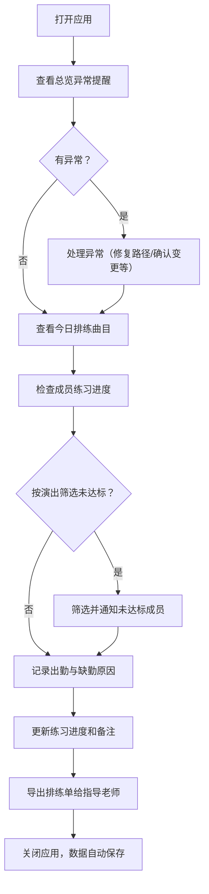
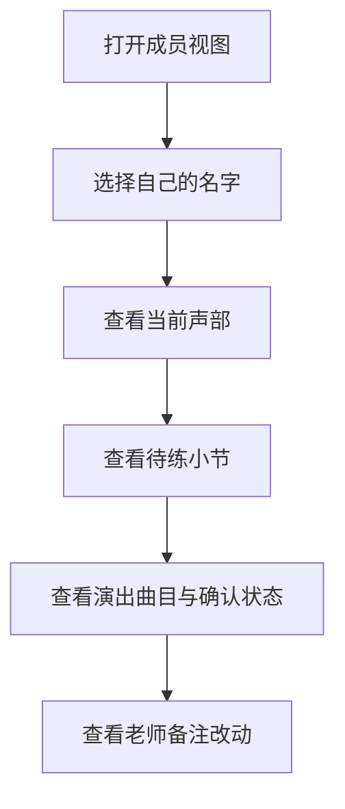

## 1. 产品概述

口琴社曲谱练习柜是一款面向口琴社团的桌面管理工具，解决排练前曲谱查找、声部分配、练习进度追踪、缺勤记录和演出曲目管理分散混乱的问题。将成员、声部、曲谱文件、练习进度、缺勤原因和演出曲目整合在一个窗口中，帮助社长高效管理排练事务。

### 核心价值
- 一站式管理：告别纸质签到与网盘文件对不上的痛点
- 异常一目了然：曲谱路径失效、换声部、未确认曲目、老师改动等提醒
- 数据持久化：关闭再打开数据不丢失
- 多视角：社长全功能版 + 成员个人版（仅显示自己的待练小节）
- 智能筛选：按演出日期快速找出未达标成员

## 2. 核心功能

### 2.1 用户角色
| 角色 | 说明 | 核心权限 |
|------|------|----------|
| 社长 | 社团管理者 | 全部功能：成员/声部/曲谱/演出管理、进度追踪、排练单导出、达标筛选 |
| 成员 | 社团普通成员 | 仅查看自己的声部、待练小节、演出曲目、练习备注 |

### 2.2 功能模块
1. **总览仪表盘**：异常提醒汇总、今日排练概览、近期演出
2. **成员管理**：成员信息增删改、声部分配、声部变更历史
3. **声部管理**：声部类型定义（高音部、中音部、低音部等）
4. **曲谱管理**：曲谱PDF文件路径管理、曲谱路径有效性检测、曲谱与声部关联
5. **练习进度**：按成员+曲谱记录练习小节、练习备注、老师改动标记
6. **出勤记录**：排练出勤签到、缺勤原因记录
7. **演出曲目**：演出日期、曲目单、全员确认状态追踪
8. **排练单导出**：生成给指导老师的排练单
9. **达标筛选**：按演出日期筛选练习未达标成员

### 2.3 页面详情
| 页面名称 | 模块名称 | 功能描述 |
|---------|---------|----------|
| 总览仪表盘 | 异常提醒卡片 | 显示曲谱失效、声部变更、未确认演出、老师改动等异常数量 |
| 总览仪表盘 | 今日排练概览 | 显示今日排练曲目、出勤情况、待办事项 |
| 总览仪表盘 | 近期演出列表 | 按日期排序显示即将到来的演出 |
| 成员管理 | 成员列表 | 显示所有成员，可搜索、筛选声部 |
| 成员管理 | 成员详情 | 查看/编辑成员信息、声部历史、练习记录 |
| 声部管理 | 声部列表 | 管理声部类型，可增删改 |
| 曲谱管理 | 曲谱列表 | 显示所有曲谱，标记路径有效/失效状态 |
| 曲谱管理 | 曲谱详情 | 查看曲谱信息、关联声部、设置文件路径 |
| 练习进度 | 进度总览 | 按曲谱查看各成员练习完成度 |
| 练习进度 | 进度编辑 | 记录练习小节、添加备注、标记老师改动 |
| 出勤记录 | 出勤日历 | 按日期查看/记录出勤情况和缺勤原因 |
| 演出曲目 | 演出列表 | 管理演出信息、曲目单、确认状态 |
| 演出曲目 | 演出详情 | 编辑曲目单、追踪成员确认状态 |
| 排练单导出 | 导出界面 | 选择日期范围、生成排练单、下载/打印 |
| 成员视图 | 个人概览 | 成员仅看到自己的声部、待练小节、演出曲目 |

## 3. 核心流程

### 社长排练管理流程

### 成员查看流程

## 4. 用户界面设计

### 4.1 设计风格
- **设计理念**：温暖木质风格 + 乐谱元素，体现音乐社团的文艺气质
- **主色调**：深胡桃木色 (#4A3728) 为主，搭配暖金色 (#D4A853) 点缀
- **辅助色**：象牙白 (#F5F0E8) 背景，暗红棕色 (#8B4513) 强调
- **按钮风格**：圆角矩形，轻微阴影，悬停时有微上浮效果
- **字体**：标题用有衬线字体（优雅），正文用清晰易读的无衬线字体
- **布局风格**：左侧导航栏 + 右侧主内容区，卡片式布局
- **图标风格**：线性图标，与音乐相关的元素用音符、乐谱等装饰
- **质感**：轻微木纹纹理背景，纸张质感的内容卡片

### 4.2 页面设计概览
| 页面名称 | 模块名称 | UI 元素 |
|---------|---------|---------|
| 总览仪表盘 | 异常提醒 | 四色警告卡片（红/黄/橙/蓝），带图标和数字徽章 |
| 总览仪表盘 | 今日排练 | 大卡片，曲谱名、声部列表、进度条 |
| 成员管理 | 成员列表 | 表格布局，头像+姓名+声部标签，搜索框在顶部 |
| 曲谱管理 | 曲谱列表 | 卡片网格，每个卡片显示曲谱封面、标题、状态标签 |
| 练习进度 | 进度总览 | 热力图风格，行是成员，列是曲谱，颜色表示完成度 |
| 演出曲目 | 演出列表 | 时间线布局，按日期纵向排列 |
| 成员视图 | 个人概览 | 简洁卡片式，大字显示待练小节，进度圆环 |

### 4.3 响应式
- Desktop-first 设计，主窗口固定宽度 1280px，最小宽度 960px
- 内容区支持内部滚动，保持导航栏可见
- 表格在窄屏时可横向滚动

## 5. 数据与异常提醒

### 5.1 异常检测规则
| 异常类型 | 检测条件 | 提醒方式 |
|---------|---------|---------|
| 曲谱路径失效 | 文件路径不存在或无法访问 | 曲谱卡片红色边框 + 总览红色警告 |
| 成员换声部 | 声部分配有变更记录 | 成员标签旁金色闪烁标记 + 总览黄色提醒 |
| 演出未全员确认 | 演出曲目有成员未确认 | 演出卡片橙色角标 + 总览橙色提醒 |
| 老师改动备注 | 练习备注中有"老师"标记或编辑来源为老师 | 备注旁蓝色铅笔图标 + 总览蓝色提醒 |

### 5.2 数据持久化
- 所有数据存储在浏览器 localStorage 中
- 支持导出 JSON 备份文件
- 支持导入 JSON 恢复数据
