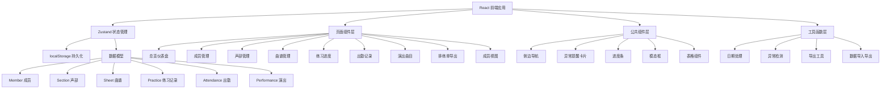
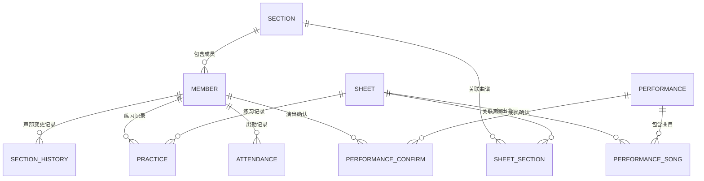

## 1. 架构设计



## 2. 技术描述

- **前端框架**: React 18 + TypeScript
- **构建工具**: Vite 5
- **样式方案**: Tailwind CSS 3
- **状态管理**: Zustand
- **路由**: React Router DOM v6
- **图标**: Lucide React
- **数据持久化**: localStorage + 自定义中间件
- **无后端**: 纯前端单页应用，数据全部本地存储

## 3. 路由定义

| 路由路径 | 页面名称 | 说明 |
|---------|---------|------|
| `/` | 总览仪表盘 | 异常提醒、今日排练、近期演出 |
| `/members` | 成员管理 | 成员列表、增删改、声部变更 |
| `/sections` | 声部管理 | 声部类型管理 |
| `/sheets` | 曲谱管理 | 曲谱列表、路径管理、声部关联 |
| `/practice` | 练习进度 | 进度总览、小节记录、备注 |
| `/attendance` | 出勤记录 | 按日期记录出勤与缺勤原因 |
| `/performances` | 演出曲目 | 演出列表、曲目单、确认状态 |
| `/export` | 排练单导出 | 生成并导出排练单 |
| `/member-view` | 成员视图 | 成员个人视角，仅显示自己的信息 |

## 4. 数据模型

### 4.1 实体关系图



### 4.2 数据类型定义

```typescript
// 成员
interface Member {
  id: string;
  name: string;
  avatar?: string;
  sectionId: string;       // 当前声部ID
  joinDate: string;
  phone?: string;
  email?: string;
  note?: string;
  isLeader: boolean;       // 是否社长
}

// 声部
interface Section {
  id: string;
  name: string;             // 高音部、中音部、低音部等
  color: string;            // 标签颜色
  description?: string;
}

// 声部变更历史
interface SectionHistory {
  id: string;
  memberId: string;
  fromSectionId: string | null;
  toSectionId: string;
  changeDate: string;
  reason?: string;
}

// 曲谱
interface Sheet {
  id: string;
  title: string;
  composer?: string;
  filePath: string;         // PDF文件路径
  totalBars: number;        // 总小节数
  difficulty: 'easy' | 'medium' | 'hard';
  sectionIds: string[];     // 关联的声部
  createdAt: string;
  updatedAt: string;
}

// 练习记录
interface Practice {
  id: string;
  memberId: string;
  sheetId: string;
  practicedBars: string;    // 已练习小节，如 "1-16, 20-24"
  mastery: number;          // 掌握程度 0-100
  note: string;             // 练习备注
  teacherModified: boolean; // 是否有老师改动
  lastPracticeDate: string;
}

// 出勤记录
interface Attendance {
  id: string;
  date: string;
  memberId: string;
  status: 'present' | 'absent' | 'late' | 'leave';
  reason?: string;          // 缺勤/请假原因
  note?: string;
}

// 演出
interface Performance {
  id: string;
  name: string;
  date: string;
  location?: string;
  description?: string;
  songIds: string[];        // 曲目ID列表（引用Sheet）
  requiredMastery: number;  // 要求掌握程度（达标线）
}

// 演出曲目确认
interface PerformanceConfirm {
  id: string;
  performanceId: string;
  memberId: string;
  confirmed: boolean;
  confirmedAt?: string;
}
```

## 5. 状态管理设计

### 5.1 Store 划分

```typescript
// useMemberStore - 成员与声部管理
// useSheetStore - 曲谱管理
// usePracticeStore - 练习进度
// useAttendanceStore - 出勤记录
// usePerformanceStore - 演出与确认
// useUiStore - UI状态（当前视图、侧边栏折叠等）
```

### 5.2 持久化中间件

使用 Zustand persist 中间件，所有数据存储到 localStorage，key 为 `harmonica-club-data`。

## 6. 异常检测逻辑

### 6.1 曲谱路径失效检测
- 由于浏览器安全限制，无法直接检查本地文件路径是否存在
- 采用"标记"机制：社长手动标记路径是否有效
- 或者使用 File API 让用户重新选择文件，记录最后验证时间

### 6.2 声部变更检测
- 查询 SectionHistory 表，近7天内有变更记录的成员视为"换声部"
- 显示金色标记提醒

### 6.3 演出未全员确认检测
- 对每个演出，统计已确认成员数与总成员数
- 未全部确认则显示橙色提醒

### 6.4 老师改动备注检测
- Practice.teacherModified 为 true 的记录
- 显示蓝色铅笔图标提醒

## 7. 导出功能

### 7.1 排练单导出
- 生成 HTML 格式排练单，可直接打印
- 内容包括：排练日期、曲目列表、各声部成员、出勤情况、练习进度摘要
- 支持导出为 PDF（浏览器打印功能）

### 7.2 数据备份导出
- 导出全部数据为 JSON 文件
- 支持导入 JSON 恢复数据

## 8. 目录结构

```
src/
├── components/          # 公共组件
│   ├── layout/         # 布局组件（侧边栏、顶部栏）
│   ├── ui/             # 基础UI组件（按钮、卡片、模态框等）
│   └── features/       # 业务组件
├── pages/              # 页面组件
├── store/              # Zustand stores
├── types/              # TypeScript 类型定义
├── utils/              # 工具函数
├── hooks/              # 自定义 hooks
├── data/               # 模拟数据/初始数据
├── App.tsx
├── main.tsx
└── index.css
```
