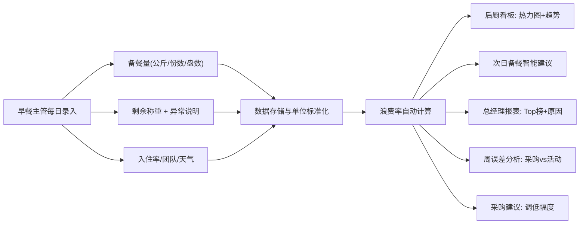

## 1. 产品概述

酒店早餐浪费分析与智能备餐建议系统，通过记录每日菜品备餐量、剩余称重、入住率、团队客和天气数据，自动计算浪费率并可视化呈现，为后厨、主管、总经理和采购提供分层决策支持。

- 解决问题：备餐估算不准、食材浪费高、原因追溯困难、凭经验决策
- 目标用户：早餐主管、后厨厨师、总经理、采购经理
- 核心价值：降低食材成本、优化备餐精度、减少食物浪费

## 2. 核心功能

### 2.1 用户角色

| 角色 | 核心诉求 | 主要功能 |
|------|----------|----------|
| 早餐主管 | 每日快速录入数据、查看次日备餐建议、连续误差趋势 | 数据录入、后厨看板、周误差分析 |
| 后厨厨师 | 知道第二天该备多少、历史备餐参考 | 次日备餐建议、菜品历史曲线 |
| 总经理 | 全局浪费情况、Top浪费菜品、误差原因报表 | 总经理报表、浪费排行榜 |
| 采购经理 | 易剩菜品清单、采购量调整建议 | 采购建议看板 |

### 2.2 功能模块

1. **数据录入页**：每日备餐与剩余录入、单位混合支持、异常备注
2. **后厨看板**：浪费率热力图、次日备餐建议、菜品趋势图
3. **总经理报表**：浪费Top榜、原因分布、成本节约估算
4. **周误差分析**：连续多周误差趋势、采购问题vs活动异常识别
5. **采购建议**：易剩菜品清单、建议调整幅度

### 2.3 页面详情

| 页面名称 | 模块名称 | 功能描述 |
|----------|----------|----------|
| 数据录入页 | 日期选择 | 选择录入日期，支持回溯补录 |
| 数据录入页 | 菜品备餐录入 | 菜品名称搜索/选择，备餐量（支持公斤/份数/盘数混合单位） |
| 数据录入页 | 剩余称重录入 | 剩余量录入，支持"缺称重"标记并附说明 |
| 数据录入页 | 运营数据 | 入住率%、团队客数量/说明、天气备注（晴/雨/阴/雪） |
| 数据录入页 | 特殊事件 | 团队客临时取消、菜品改名等异常标记与说明 |
| 后厨看板 | 浪费率热力图 | 日期×菜品二维热力图，颜色深浅表示浪费率高低 |
| 后厨看板 | 次日备餐建议 | 根据历史数据+天气+入住率给出每个菜品的建议备餐量 |
| 后厨看板 | 菜品趋势曲线 | 单个菜品近7-30天备餐-消耗-剩余曲线 |
| 后厨看板 | 异常标注 | 在图表上标注团队取消、天气异常等事件点 |
| 总经理报表 | 浪费Top榜 | 按月/周统计浪费率最高和浪费金额最高的菜品 |
| 总经理报表 | 原因分布饼图 | 误差原因分类占比（天气/团队/估算/其他） |
| 总经理报表 | 成本趋势 | 食材浪费金额月度趋势，估算可节约金额 |
| 周误差分析 | 周误差趋势 | 各菜品连续4-8周的平均误差率折线 |
| 周误差分析 | 问题识别 | 自动标注系统性偏高（采购问题）vs 单点异常（特殊活动） |
| 采购建议 | 易剩菜品清单 | 按浪费率/浪费金额排序的菜品列表 |
| 采购建议 | 调整建议 | 每个菜品建议调低采购量的百分比 |

## 3. 核心流程

数据录入流程：
1. 早餐主管选择日期（默认当天）
2. 逐个菜品录入备餐量（选择单位：公斤/份数/盘数）
3. 早餐结束后录入剩余量，如缺称重则标记并说明
4. 填写当日入住率、团队客数量/备注、天气情况
5. 如有特殊事件（团队取消、菜品改名等），在备注中说明
6. 系统自动计算浪费率并同步更新所有看板和报表

## 4. 用户界面设计

### 4.1 设计风格
- 主色调：深灰蓝 (#1e293b) 搭配暖橙 (#f97316) 强调色，体现专业餐饮工业感
- 辅助色：森林绿 (#10b981) 表示正常，玫瑰红 (#f43f5e) 表示高浪费，琥珀黄 (#f59e0b) 表示警告
- 按钮风格：圆角 8px，主色填充，hover 轻微上浮阴影
- 字体：标题用 Lora（衬线，稳重），正文用 Inter（清晰易读），数字用 JetBrains Mono（等宽对齐）
- 布局风格：顶部导航 + 左侧数据筛选 + 右侧主内容卡片式布局
- 视觉风格：工业仪表盘风，带微妙噪点纹理背景，数据卡片有细腻内阴影
- 图表：暗色主题图表，数据点带发光效果，异常点用脉冲动画标注

### 4.2 页面设计概述

| 页面名称 | 模块名称 | UI元素 |
|----------|----------|--------|
| 数据录入页 | 录入表单 | 卡片式分组，日期选择器，菜品搜索下拉，数字输入框带单位切换，标签式异常选择 |
| 后厨看板 | 热力图 | 大尺寸矩阵图，行=菜品，列=日期，hover显示详情tooltip |
| 后厨看板 | 备餐建议卡 | 每个菜品一张卡片，图标+建议量+历史对比，渐变色边框区分正常/偏高/偏低 |
| 总经理报表 | Top榜单 | 带排名徽章的列表，浪费率用进度条可视化，金额用红色强调 |
| 周误差分析 | 趋势折线 | 多条菜品折线，不同颜色，带置信区间阴影带，异常点红色脉冲点 |

### 4.3 响应式
- 桌面端优先（1440px+），后厨和管理层主要在电脑端查看
- 平板端（768px+）适配：热力图可横向滚动，卡片自动换行
- 移动端（375px+）：数据录入页优先适配，方便主管在厨房手机录入

### 4.4 动效设计
- 页面加载：卡片依次淡入上浮（staggered reveal，延迟 50ms 递增）
- 数字更新：浪费率变化时数字滚动动画
- 异常点标注：红色脉冲动画（scale 1→1.2→1，2s 循环）
- 热力图 hover：单元格轻微放大 + 发光阴影
- 建议卡片：hover 时轻微上浮 2px + 阴影增强
