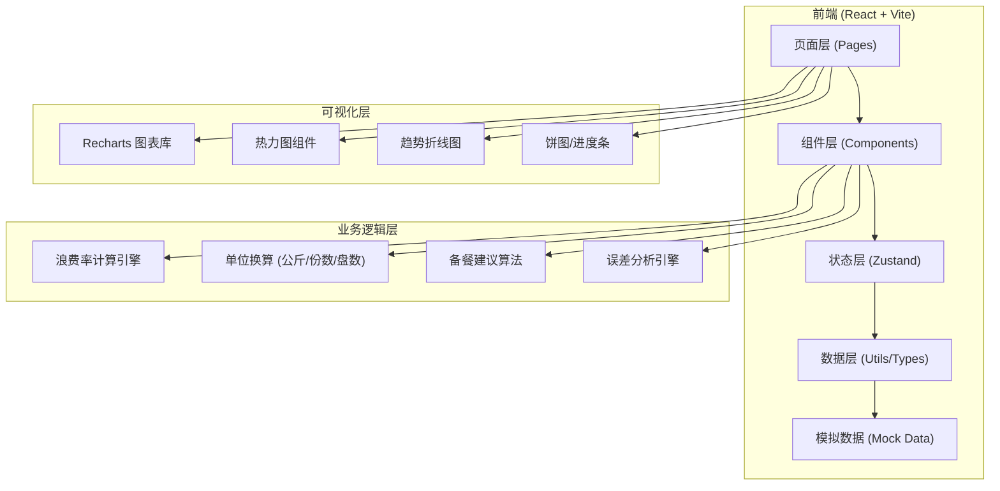
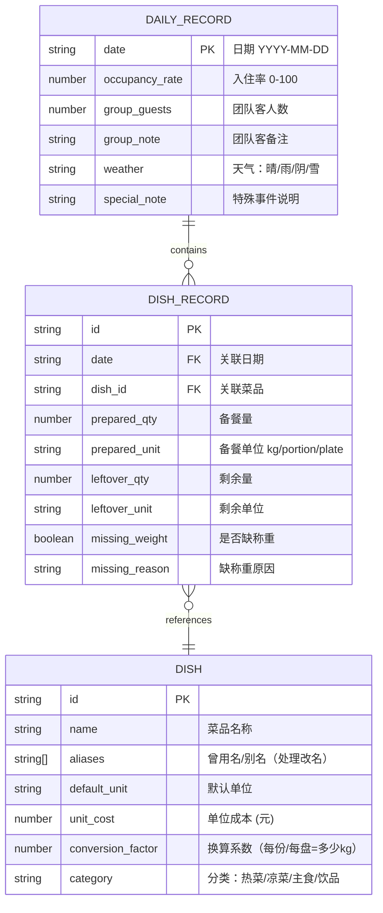

## 1. 架构设计



## 2. 技术说明

- **前端框架**: React@18 + TypeScript
- **构建工具**: Vite@5
- **样式方案**: TailwindCSS@3
- **状态管理**: Zustand
- **图表库**: Recharts（React生态成熟，支持折线/饼/柱状等）
- **路由**: React Router DOM@6
- **图标**: Lucide React
- **后端**: 无后端，纯前端 + LocalStorage 持久化 + Mock 数据演示
- **数据存储**: LocalStorage（浏览器本地持久化）

## 3. 路由定义

| 路由 | 页面 | 目的 |
|------|------|------|
| `/` | 后厨看板 | 浪费率热力图、次日备餐建议、菜品趋势 |
| `/entry` | 数据录入 | 每日备餐量、剩余称重、运营数据录入 |
| `/report` | 总经理报表 | 浪费Top榜、原因分布、成本趋势 |
| `/analysis` | 周误差分析 | 连续周误差趋势、问题识别 |
| `/procurement` | 采购建议 | 易剩菜品清单、调整建议 |

## 4. 数据模型

### 4.1 数据模型ER图



### 4.2 TypeScript 类型定义

```typescript
// 单位类型
export type Unit = 'kg' | 'portion' | 'plate';

// 天气类型
export type Weather = 'sunny' | 'rainy' | 'cloudy' | 'snowy';

// 菜品分类
export type DishCategory = 'hot' | 'cold' | 'staple' | 'beverage';

// 菜品
export interface Dish {
  id: string;
  name: string;
  aliases: string[];
  defaultUnit: Unit;
  unitCost: number;
  conversionFactor: number; // 1 portion/plate = X kg，用于标准化
  category: DishCategory;
}

// 单菜品日记录
export interface DishRecord {
  id: string;
  date: string;
  dishId: string;
  preparedQty: number;
  preparedUnit: Unit;
  leftoverQty: number | null; // null 表示缺称重
  leftoverUnit: Unit | null;
  missingWeight: boolean;
  missingReason?: string;
}

// 每日运营记录
export interface DailyRecord {
  date: string;
  occupancyRate: number; // 0-100
  groupGuests: number;
  groupNote?: string;
  weather: Weather;
  specialNote?: string;
  dishRecords: DishRecord[];
}

// 浪费分析结果
export interface WasteAnalysis {
  date: string;
  dishId: string;
  dishName: string;
  wasteRate: number; // 0-100 (%)
  wastedKg: number; // 标准化到公斤
  wastedCost: number; // 浪费金额
  isEstimated: boolean; // 是否为估算（缺称重）
  note?: string;
}

// 备餐建议
export interface PrepSuggestion {
  dishId: string;
  dishName: string;
  suggestedQty: number;
  suggestedUnit: Unit;
  historicalAvg: number;
  adjustmentReason: string; // 'weather' | 'occupancy' | 'group' | 'trend'
  confidence: 'high' | 'medium' | 'low';
}

// 周误差分析
export interface WeeklyErrorAnalysis {
  dishId: string;
  dishName: string;
  weekNumber: number;
  avgErrorRate: number;
  errorTrend: 'increasing' | 'decreasing' | 'stable';
  isSystematic: boolean; // true=采购问题(持续偏高)，false=单点异常
  anomalyDates: string[];
}
```

## 5. 核心算法设计

### 5.1 单位标准化
```
目标：将所有单位统一换算为公斤(kg)进行浪费率计算

换算规则：
- kg → kg: ×1
- portion → kg: ×conversionFactor (菜品配置，如1份=0.15kg)
- plate → kg: ×conversionFactor (菜品配置，如1盘=2.5kg)
```

### 5.2 浪费率计算
```
wasteRate = (leftoverQty_kg / preparedQty_kg) × 100%

特殊情况处理：
- missingWeight=true: 标记为估算，使用同菜品近7天平均浪费率填充，带*标注
- 团队客取消: 在note中标记，计算趋势时可选择排除
- 菜品改名: 通过aliases字段关联历史数据
```

### 5.3 备餐建议算法
```
输入：
  - 近14天同菜品平均消耗量（排除异常日）
  - 明日预报天气：雨天×1.15，雪天×1.1，晴天×1.0
  - 明日入住率：基础量 × (明日入住率 / 平均入住率)
  - 明日团队客：团队客人数 × 人均消耗量
  - 近期趋势：近3天浪费率持续偏高则×0.9，持续偏低则×1.05

输出：
  suggestedQty = baseConsumption × weatherFactor × occupancyFactor + groupExtra
  并根据历史波动幅度给出 confidence 等级
```

### 5.4 系统性误差识别
```
判断条件（连续4周）：
  - 周均浪费率 > 30% 且周周波动率 < 15% → 标记为"系统性偏高(采购估算问题)"
  - 某1-2天浪费率突增 > 60%，但其余天正常 → 标记为"单点异常(特殊活动)"
  - 浪费率在 15%-30% 间波动 → 标记为"正常波动"
```
