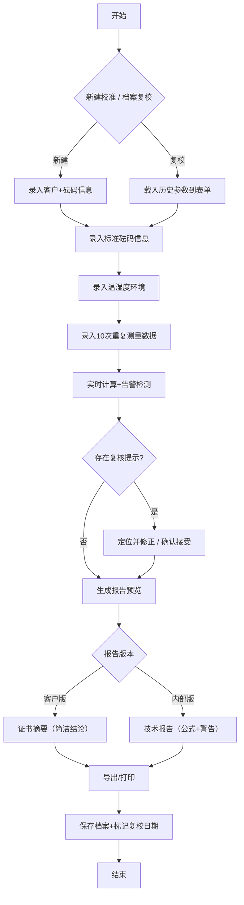

## 1. 产品概述

砝码校准误差合成系统，面向计量室计量员，解决砝码校准原始记录的人工计算问题。系统输入多次测量数据（天平示值、温湿度、标准砝码信息），自动计算修正值、合成标准不确定度、扩展不确定度及合格判定，生成面向客户的证书摘要与面向内部的完整报告（含公式、边界警告），并支持客户/证书编号归档以便次年复校追溯。

## 2. 核心功能

### 2.1 用户角色
| 角色 | 注册方式 | 核心权限 |
|------|----------|----------|
| 计量员 | 系统内置（本地使用） | 数据录入、计算分析、报告生成、档案管理 |

### 2.2 功能模块
1. **校准工作台**：基础信息录入、测量数据录入、环境条件录入、标准砝码信息录入
2. **不确定度合成引擎**：A类评定（重复测量）、B类评定（标准砝码、天平分辨力、温湿度）、合成与扩展
3. **复核告警系统**：单位混用检测、测量次数不足告警、温湿度超范围告警、标准证书过期告警
4. **报告生成器**：客户证书摘要（简洁版）、内部技术报告（含公式与警告）
5. **档案管理**：客户信息保存、证书编号归档、历史记录检索、复校提醒

### 2.3 页面详情
| 页面名称 | 模块名称 | 功能描述 |
|----------|----------|----------|
| 校准工作台 | 基础信息卡 | 客户名称、证书编号、被校砝码标称值/等级/编号、校准日期 |
| 校准工作台 | 标准砝码卡 | 标准砝码等级、标称值、证书编号、有效期、修正值 |
| 校准工作台 | 环境条件卡 | 温度、湿度、录入时刻、超范围实时高亮 |
| 校准工作台 | 测量数据卡 | 10次重复测量示值录入（每行支持 mg/g/kg 单位切换）、粘贴批量导入 |
| 校准工作台 | 实时计算面板 | 修正值、合成标准不确定度、扩展不确定度(k=2)、各来源贡献占比、合格判定 |
| 复核告警中心 | 告警列表 | 所有复核提示按严重级别（红/黄/蓝）分组展示，可点击定位到录入区域 |
| 报告预览 | 客户证书摘要 | 只展示结论、修正值、扩展不确定度、合格状态、校准日期 |
| 报告预览 | 内部技术报告 | 含数学模型、各不确定度分量公式与数值、合成/扩展过程、所有边界警告、原始数据 |
| 档案中心 | 客户档案列表 | 按客户名称/证书编号搜索、按复校日期排序、一键复校（载入上次参数） |
| 档案中心 | 复校详情 | 查看历史记录、对比上次校准结果 |

## 3. 核心流程

计量员登录 → 新建校准或从档案复校 → 录入基础信息/标准砝码/环境/测量数据 → 系统实时计算与告警 → 修正问题或确认告警 → 生成双版本报告 → 导出/打印 → 保存档案 → 系统标记次年复校日期

## 4. 用户界面设计

### 4.1 设计风格
- **主色调**：计量蓝 (#1e40af) 作为主色，辅以权威深灰 (#1f2937) 与警示琥珀 (#d97706)、危险红 (#dc2626)
- **按钮风格**：圆角 8px、轻微阴影、hover 上浮 1px；主按钮填充，次要按钮描边
- **字体**：标题用「思源宋体」体现计量权威感，正文用「JetBrains Mono」保证数字对齐
- **布局风格**：顶部全局导航 + 左侧步骤进度条 + 右侧双栏（录入区 | 实时结果），卡片式分区
- **图标风格**：Lucide 线性图标，告警配圆形色标，合格配绿色对勾盾形

### 4.2 页面设计概述
| 页面名称 | 模块名称 | UI 元素 |
|----------|----------|---------|
| 校准工作台 | 步骤进度条 | 5步横向时间轴，当前步蓝色实心，已完成绿色对勾，未完成灰色空心 |
| 校准工作台 | 数据录入卡 | 卡片白底+细蓝边，标签左对齐，输入框数字右对齐，单位下拉紧贴右侧 |
| 实时计算面板 | 贡献度条形图 | 横向堆叠条，5个不确定度来源用不同蓝色调，鼠标悬停显示数值与占比 |
| 复核告警中心 | 告警条 | 红/黄/蓝三色左竖条 + 图标 + 文字描述 + 「定位」按钮 |
| 报告预览 | Tab 切换 | 客户证书 / 内部报告 双标签，客户版白底大字，内部版灰色背景配等宽字体公式 |
| 档案中心 | 搜索+卡片列表 | 顶部搜索框，结果为客户卡片（客户名+最近证书编号+复校倒计时徽章） |

### 4.3 响应式
桌面优先（≥1280px 三栏布局），平板（768–1279px 双栏：左录入右结果），手机（<768px 单栏纵向滚动，步骤条改顶部胶囊切换）；所有表格支持横滑；粘贴导入支持多行文本。
