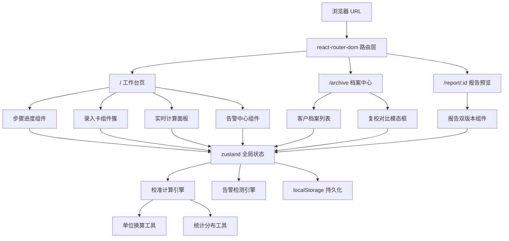
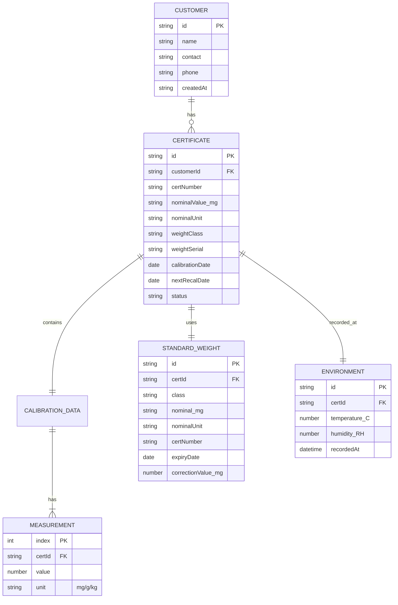

## 1. 架构设计

纯前端单页应用，数据使用浏览器 localStorage 持久化；无需后端服务。架构分为五层：路由层 → 页面层 → 组件层 → 状态层 → 工具层（含不确定度计算引擎）。



## 2. 技术选型

- **前端框架**：React@18 + TypeScript（严格模式）
- **构建工具**：Vite@5
- **样式方案**：TailwindCSS@3 + 自定义 CSS 变量（计量蓝主题）
- **路由**：react-router-dom@6
- **状态管理**：zustand@4（分 slice：calibration / alerts / archive）
- **数据持久化**：localStorage（zustand persist 中间件）
- **图标库**：lucide-react
- **打印样式**：@media print 自定义 CSS，区分客户版 / 内部版
- **初始化模板**：react-ts（纯前端，无需 Express 后端）

## 3. 路由定义

| 路由 | 页面 | 用途 |
|------|------|------|
| `/` | CalibrationPage | 校准工作台：录入+实时计算+告警 |
| `/archive` | ArchivePage | 档案中心：客户/证书检索+一键复校 |
| `/report/:id` | ReportPage | 报告预览：Tab 切换客户版/内部版 |
| `*` | 重定向 `/` | 兜底路由 |

## 4. 数据模型

### 4.1 核心实体



### 4.2 localStorage Schema

```json
{
  "customers": [
    { "id": "uuid", "name": "XX公司", "contact": "张三", "phone": "13800000000" }
  ],
  "certificates": [
    {
      "id": "uuid",
      "customerId": "uuid",
      "certNumber": "JL2026001",
      "nominalValue": 100,
      "nominalUnit": "g",
      "weightClass": "E2",
      "weightSerial": "F-12345",
      "calibrationDate": "2026-06-12",
      "nextRecalDate": "2027-06-11",
      "standardWeight": {
        "class": "E1",
        "nominalValue": 100, "nominalUnit": "g",
        "certNumber": "STD-E1-2025",
        "expiryDate": "2026-12-31",
        "correctionValue_mg": 0.02
      },
      "environment": {
        "temperature_C": 20.5,
        "humidity_RH": 50,
        "recordedAt": "2026-06-12T09:30:00"
      },
      "measurements": [
        { "index": 1, "value": 100.0012, "unit": "g" },
        { "index": 2, "value": 100.0015, "unit": "g" }
      ],
      "results": {
        "correction_mg": 1.2,
        "u_std_mg": 0.05,
        "u_combined_mg": 0.08,
        "U_expanded_mg": 0.16,
        "k_factor": 2,
        "contributions": [
          { "source": "A类(重复测量)", "u_mg": 0.03, "percent": 37.5 },
          { "source": "B类(标准砝码)", "u_mg": 0.05, "percent": 62.5 }
        ],
        "tolerance_mg": 0.5,
        "isPass": true
      },
      "alerts": [
        { "level": "warning", "code": "HUMIDITY_HIGH", "msg": "湿度50%超范围(≤45%)", "field": "environment.humidity_RH" }
      ]
    }
  ]
}
```

## 5. 不确定度合成算法

### 5.1 数学模型

修正值 \( C = \bar{x} - m_s + \Delta C_s \)

其中：
- \( \bar{x} \)：n 次测量示值平均值
- \( m_s \)：标准砝码标称值
- \( \Delta C_s \)：标准砝码证书修正值

### 5.2 不确定度来源
| 编号 | 来源 | 类型 | 分布 | 计算式 |
|------|------|------|------|--------|
| u1 | 重复测量示值 | A类 | t分布 | \( s / \sqrt{n} \)，s 为实验标准差 |
| u2 | 标准砝码不确定度 | B类 | 正态 | \( U_{MPEV} / k \)，按等级取 MPE |
| u3 | 天平分辨力 | B类 | 矩形 | \( \delta / \sqrt{12} \)，δ 为分度值 |
| u4 | 温度偏差 | B类 | 矩形 | \( |\Delta T| \cdot \alpha \cdot m / \sqrt{3} \) |
| u5 | 湿度影响 | B类 | 矩形 | 按规程经验值 / √3 |

### 5.3 合成与扩展
合成标准：\( u_c = \sqrt{u_1^2 + u_2^2 + u_3^2 + u_4^2 + u_5^2} \)

扩展不确定度：\( U = k \cdot u_c \)，k=2（约 95% 置信概率）

### 5.4 合格判定
\( |修正值| + U \le MPE \) 判合格，否则不合格或给出条件声明。

## 6. 告警规则引擎

遍历字段与阈值，产出 `{level, code, msg, field}` 列表：

| code | level | 触发条件 |
|------|-------|----------|
| MEASURE_COUNT_LOW | warning | n < 6 |
| UNIT_MIXED | info | measurements 中 unit 不唯一 |
| TEMP_OUT_OF_RANGE | warning | T < 18 或 T > 23 ℃ |
| HUMIDITY_OUT_OF_RANGE | warning | RH < 30% 或 RH > 60% |
| STD_CERT_EXPIRED | danger | standardWeight.expiryDate < today |
| STD_CERT_EXPIRE_SOON | warning | 距离过期 < 30 天 |
| MISSING_REQUIRED | danger | 任一字段为空 |
| DEVIATION_LARGE | warning | 单次测量与均值偏差 > 3σ |
