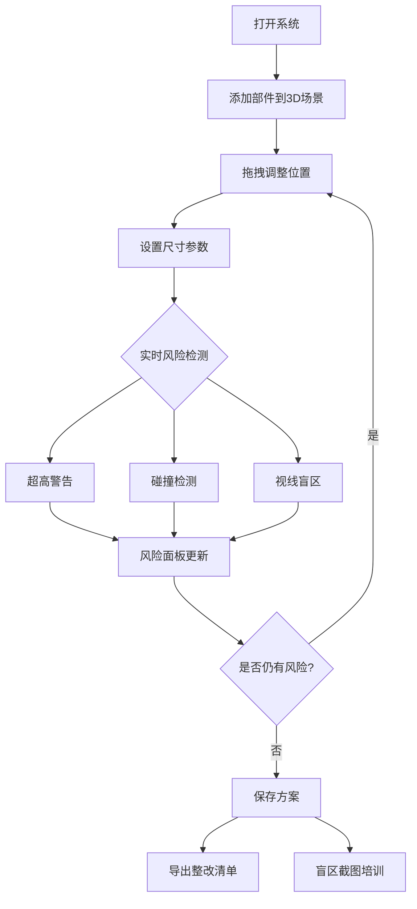

## 1. 产品概述

儿童乐园攀爬预演系统——在 3D 场景中放置攀爬架部件（平台、滑梯、软包、围栏、看护点），实时检测超高、碰撞、视线盲区等安全风险，帮助店长在换装前预判隐患并导出整改清单给厂家，同时支持盲区截图用于看护员培训。

- 目标用户：儿童乐园店长、安全巡检员、看护员培训师
- 核心价值：将平面图无法体现的立体风险可视化，减少开业后安全隐患返工，提升看护员对盲区的认知

## 2. 核心功能

### 2.1 用户角色

| 角色 | 使用方式 | 核心权限 |
|------|----------|----------|
| 店长 | 直接使用 | 布局编辑、参数设置、风险审核、导出整改清单、截图培训 |
| 看护员 | 培训场景 | 查看盲区截图、理解风险提示 |
| 厂家对接人 | 收到导出清单 | 接收整改需求 |

### 2.2 功能模块

1. **3D 场景编辑页**：3D 场景画布 + 左侧部件面板 + 右侧参数与风险面板
2. **方案管理页**：保存/加载方案列表

### 2.3 页面详情

| 页面名称 | 模块名称 | 功能描述 |
|----------|----------|----------|
| 3D 场景编辑页 | 3D 场景画布 | Three.js 渲染的场景，支持 OrbitControls 旋转/缩放、部件拖拽移动、看护点视线锥可视化 |
| 3D 场景编辑页 | 部件面板 | 左侧面板列出可添加的部件（平台、滑梯、软包、围栏、看护点），点击添加到场景 |
| 3D 场景编辑页 | 属性面板 | 选中部件后右侧显示尺寸参数（高度/宽度/缓冲范围），带单位校验与覆盖检查 |
| 3D 场景编辑页 | 风险面板 | 实时风险列表：超高警告、碰撞检测、视线盲区提示，按严重程度排序，拖动部件后自动更新 |
| 3D 场景编辑页 | 工具栏 | 保存方案、导出整改清单、盲区截图、重置视角 |
| 方案管理页 | 方案列表 | 已保存方案列表，支持加载/删除/重命名 |

## 3. 核心流程

用户打开系统 → 从部件面板添加部件到 3D 场景 → 拖拽部件调整位置 → 设置尺寸参数 → 系统实时检测风险（超高/碰撞/盲区）→ 风险面板动态更新 → 确认安全后保存方案 → 导出整改清单给厂家 → 截取盲区图用于培训

## 4. 用户界面设计

### 4.1 设计风格

- 主色调：安全橙（#FF6B35）+ 深蓝灰（#1E293B），传达"安全警示+专业工具"气质
- 辅助色：警示红（#EF4444）、注意黄（#F59E0B）、安全绿（#22C55E）
- 按钮：圆角微凸，风险按钮用红色系，确认按钮用绿色系
- 字体：标题用 Noto Sans SC Bold，正文用 Noto Sans SC Regular
- 布局：左侧部件面板（240px）+ 中央 3D 画布（自适应）+ 右侧属性/风险面板（320px）
- 图标风格：线性图标，与安全/建筑行业图标风格一致

### 4.2 页面设计概览

| 页面名称 | 模块名称 | UI 元素 |
|----------|----------|---------|
| 3D 场景编辑页 | 3D 画布 | 深色背景网格地面、部件用彩色半透明几何体、看护点用锥形视线锥、风险区域用红色半透明高亮 |
| 3D 场景编辑页 | 部件面板 | 白底卡片列表，每项含图标+名称+拖拽手柄，hover 时微抬阴影 |
| 3D 场景编辑页 | 属性面板 | 表单式布局，输入框带单位后缀（cm/m），错误时红框+文字提示，软包覆盖不足时橙色条纹背景 |
| 3D 场景编辑页 | 风险面板 | 卡片列表，每项含风险等级图标+描述+定位按钮，严重→轻微用红→黄→绿渐变 |
| 3D 场景编辑页 | 工具栏 | 顶部半透明条，图标按钮+文字，保存/导出/截图/重置 |

### 4.3 响应式

- 桌面端优先（1920×1080 为基准）
- 1366px 以下：左右面板可折叠为抽屉
- 不适配移动端（3D 操作需鼠标精度）

### 4.4 3D 场景指引

- 环境：浅灰天空渐变，地面为 1m 网格线
- 灯光：环境光 + 方向光，确保部件无阴影遮挡
- 相机：45° 俯视等距视角，可 OrbitControls 自由旋转缩放
- 交互：点击选中部件（高亮边框）、拖拽移动（XZ 平面）、右键取消选中
- 部件渲染：平台=蓝色半透明长方体、滑梯=绿色半透明倾斜长方体、软包=橙色半透明薄层、围栏=黄色半透明薄壁、看护点=红色人形标记+视线锥
- 盲区可视化：看护点视线锥覆盖不到的区域用红色半透明叠加层显示
- 性能预算：场景部件数 ≤ 50，帧率 ≥ 30fps
