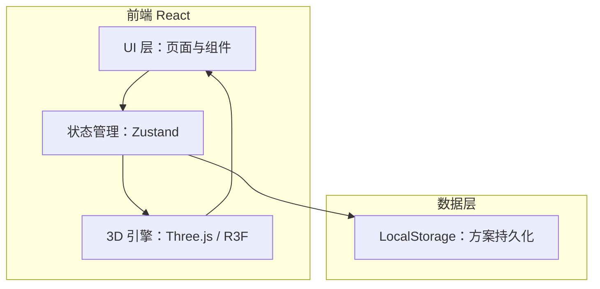
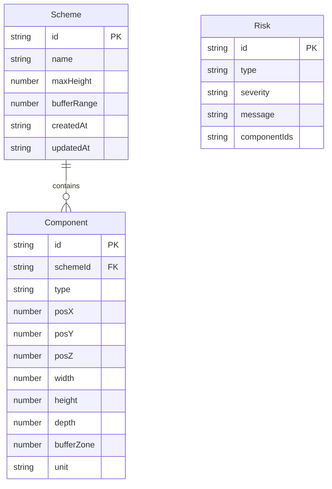

## 1. 架构设计



纯前端架构，无后端服务。方案数据通过 LocalStorage 持久化，整改清单通过前端生成文件下载。

## 2. 技术说明

- 前端：React@18 + TypeScript + Tailwind CSS@3 + Vite
- 3D 渲染：three + @react-three/fiber + @react-three/drei
- 状态管理：zustand
- 初始化工具：vite-init（react-ts 模板）
- 后端：无
- 数据库：无（使用 LocalStorage）

## 3. 路由定义

| 路由 | 用途 |
|------|------|
| / | 3D 场景编辑页（主页面） |
| /schemes | 方案管理页 |

## 4. API 定义

无后端 API。所有数据操作通过 Zustand store + LocalStorage 完成。

### 4.1 核心 Store 数据结构

```typescript
interface PlaygroundComponent {
  id: string;
  type: "platform" | "slide" | "softpad" | "fence" | "supervisor";
  position: { x: number; y: number; z: number };
  dimensions: { width: number; height: number; depth: number };
  bufferZone: number;
  unit: "cm" | "m";
  parentId?: string;
}

interface RiskItem {
  id: string;
  type: "height_exceed" | "collision" | "blind_spot" | "unit_error" | "coverage_insufficient";
  severity: "critical" | "warning" | "info";
  componentIds: string[];
  message: string;
}

interface PlaygroundState {
  components: PlaygroundComponent[];
  selectedId: string | null;
  risks: RiskItem[];
  schemeName: string;
  maxHeight: number;
  bufferRange: number;
}
```

## 5. 服务器架构图

无后端服务。

## 6. 数据模型

### 6.1 数据模型定义



### 6.2 LocalStorage 键设计

- `playground_schemes`：方案列表 JSON
- `playground_current`：当前编辑方案 JSON
