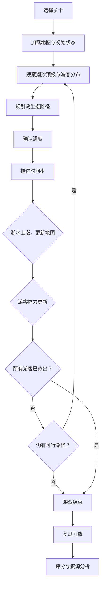

## 1. 产品概述

海岛潮汐救援棋是一款面向景区救援员新人的策略训练模拟游戏。玩家在六边形网格地图上调度救生艇，在潮水不断上涨的过程中营救被困礁石区的游客。潮汐变化会实时淹没通道，游客等待过久风险升高，艇位有限需要合理分配。游戏结束后提供决策复盘，标注错失的潮汐窗口和资源浪费点，帮助教练有针对性地指导学员，而非仅靠背诵安全手册。

## 2. 核心功能

### 2.1 用户角色

| 角色 | 说明 | 核心权限 |
|------|------|----------|
| 学员 | 新入职救援员 | 进行关卡训练、查看个人复盘 |
| 教练 | 资深救援员/培训师 | 配置关卡、查看所有学员复盘数据、资源使用分析 |

### 2.2 功能模块

1. **游戏主界面**：关卡选择、难度设置、开始训练
2. **棋盘战场**：核心游戏区域，六边形网格地图，实时潮汐渲染
3. **调度面板**：救生艇派遣、路径规划、游客状态监控
4. **复盘回放**：逐步回放决策、潮汐窗口标注、评分报告
5. **关卡编辑器**：教练自定义地图、潮汐曲线、游客分布
6. **训练报告**：资源使用分析、常见失误统计、对比排名

### 2.3 页面详情

| 页面名称 | 模块名称 | 功能描述 |
|----------|----------|----------|
| 游戏主界面 | 关卡列表 | 按真实景区区域分类的关卡卡片，含潮汐曲线预览和难度标识 |
| 游戏主界面 | 开始面板 | 选择角色、难度、是否启用提示模式 |
| 棋盘战场 | 六边形地图 | 渲染礁石、浅滩、深水、安全区等地形，潮位动态覆盖 |
| 棋盘战场 | 潮汐指示器 | 左侧竖向潮位刻度，实时水位线动画，关键时间节点倒计时 |
| 棺盘战场 | 单位层 | 游客图标（体力条+等待计时）、救生艇图标（容量+状态） |
| 调度面板 | 路径规划器 | 点击艇→点击目标礁石，自动寻路（避开已淹没格），显示预计到达时间 |
| 调度面板 | 状态仪表盘 | 所有游客分组卡片：位置、体力、预计风险等级、等待时长 |
| 调度面板 | 回合控制 | 确认调度→推进一步潮汐，撤销当前回合 |
| 复盘回放 | 时间轴 | 可拖拽的回放时间轴，标注关键决策点和潮汐窗口 |
| 复盘回放 | 决策标注 | 每步操作旁标注"最佳窗口"/"窗口即将关闭"/"已错过窗口" |
| 复盘回放 | 评分报告 | 综合评分：救援效率、资源利用率、风险控制，含雷达图 |
| 关卡编辑器 | 地图绘制 | 六边形网格画笔：放置地形、设置初始水位、标记安全区 |
| 关卡编辑器 | 潮汐曲线编辑 | 拖拽控制点编辑潮汐曲线，预览各时间步水位 |
| 关卡编辑器 | 游客配置 | 设置游客分组、初始位置、体力值、人数 |
| 训练报告 | 资源分析 | 救生艇派遣热力图，标识高/低风险区域派遣比例 |
| 训练报告 | 失误统计 | 最常见失误类型排名：错过窗口、低风险优先、路径低效等 |

## 3. 核心流程

玩家进入关卡后，地图展示初始退潮状态，游客分布在各礁石区。玩家在每回合开始时查看潮汐预报，决定救生艇的派遣路线。确认后推进一个时间步，潮水上涨淹没低地通道，已派遣的艇沿路径移动。游客在等待中体力下降，体力耗尽则风险升级。当所有游客被救至安全区或无法再救援时，游戏结束并进入复盘。

## 4. 用户界面设计

### 4.1 设计风格

- **主色调**：深海蓝 `#0A2540` 为底，潮汐蓝绿 `#00C9A7` 为强调色，危险珊瑚红 `#FF6B6B` 标记风险
- **辅助色**：沙洲米 `#F5E6CA`（浅滩/安全区）、礁石灰 `#6B7B8D`（礁石）、深水靛 `#1A365D`（深水区）
- **按钮风格**：圆角微3D，按下有下沉效果，主要操作用潮汐蓝绿，危险操作用珊瑚红
- **字体**：标题用 "Orbitron"（科技感/仪表盘风），正文用 "Noto Sans SC"
- **布局风格**：左侧地图为主（占70%宽度），右侧调度面板（30%），顶部潮汐时间轴
- **图标风格**：线性图标（lucide-react），搭配小型动画指示器

### 4.2 页面设计概览

| 页面名称 | 模块名称 | UI元素 |
|----------|----------|--------|
| 游戏主界面 | 关卡列表 | 卡片式布局，每卡含景区缩略地图、潮汐曲线缩略图、难度星标 |
| 棋盘战场 | 六边形地图 | SVG六边形网格，潮水用半透明蓝绿渐变覆盖，礁石用灰色纹理 |
| 棋盘战场 | 潮汐指示器 | 左侧竖向温度计式刻度，水位线有波浪动画 |
| 棋盘战场 | 单位图标 | 游客：圆形头像+弧形体力条；救生艇：船形图标+容量数字 |
| 调度面板 | 路径线 | 虚线动画路径，颜色从绿→黄→红表示安全性递减 |
| 复盘回放 | 时间轴 | 底部横向时间轴，关键节点用圆点+文字标注，潮汐窗口用绿色区间高亮 |
| 复盘回放 | 雷达图 | 五维雷达图：速度/效率/风险/资源/决策 |
| 关卡编辑器 | 画布 | 六边形网格画布，左侧工具栏（地形笔刷/橡皮擦/放置器） |

### 4.3 响应式设计

- 桌面端优先（训练场景主要在电脑上进行）
- 平板适配：地图占满屏幕，面板改为底部抽屉
- 移动端暂不支持（训练设备固定）

### 4.4 动效设计

- 潮水上涨：六边形逐格从边缘向内淹没，带水波纹扩散动画
- 救生艇移动：沿路径滑行，经过浅滩有减速效果
- 游客体力下降：体力条从绿→黄→红渐变，闪烁表示危险
- 复盘回放：决策点弹出气泡标注，窗口关闭时潮汐线红色闪烁
