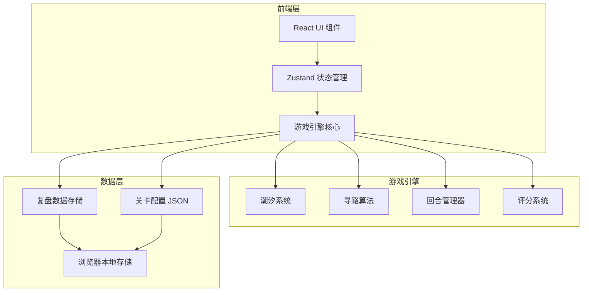

## 1. 架构设计



## 2. 技术说明

- **前端框架**：React 18 + TypeScript + Vite
- **样式方案**：Tailwind CSS 3
- **状态管理**：Zustand（游戏状态 + UI状态分离）
- **地图渲染**：SVG 六边形网格（性能优于Canvas用于交互式棋盘）
- **寻路算法**：A* 算法适配六边形网格，动态水位权重
- **数据持久化**：localStorage 存储关卡配置和复盘数据
- **无后端**：纯前端应用，数据本地存储

## 3. 路由定义

| 路由 | 用途 |
|------|------|
| `/` | 游戏主界面，关卡选择 |
| `/game/:levelId` | 棋盘战场，核心游戏界面 |
| `/replay/:sessionId` | 复盘回放界面 |
| `/editor` | 关卡编辑器 |
| `/report` | 训练报告与资源分析 |

## 4. 核心数据结构

### 4.1 六边形网格地图

```typescript
interface HexCell {
  q: number
  r: number
  terrain: "reef" | "shallow" | "deep" | "safe" | "rock"
  baseElevation: number
  currentWaterLevel: number
  isSubmerged: boolean
}
```

### 4.2 潮汐系统

```typescript
interface TidalCurve {
  steps: TidalStep[]
}

interface TidalStep {
  turn: number
  waterLevel: number
  label: string
}

interface TidalWindow {
  startTurn: number
  endTurn: number
  description: string
  pathIds: string[]
}
```

### 4.3 游客单位

```typescript
interface TouristGroup {
  id: string
  position: HexCell
  count: number
  stamina: number
  maxStamina: number
  waitTurns: number
  riskLevel: "low" | "medium" | "high" | "critical"
  rescued: boolean
}
```

### 4.4 救生艇

```typescript
interface RescueBoat {
  id: string
  position: HexCell
  capacity: number
  currentLoad: number
  status: "idle" | "moving" | "loading" | "returning"
  path: HexCell[]
  pathProgress: number
  assignedGroup: string | null
}
```

### 4.5 回合与复盘

```typescript
interface GameTurn {
  turnNumber: number
  waterLevel: number
  decisions: Decision[]
  stateSnapshot: GameStateSnapshot
}

interface Decision {
  boatId: string
  action: "dispatch" | "recall" | "wait"
  targetPosition: HexCell | null
  targetGroupId: string | null
  timestamp: number
  tidalWindowStatus: "optimal" | "closing" | "missed" | "none"
}

interface ReplaySession {
  id: string
  levelId: string
  startTime: number
  endTime: number
  turns: GameTurn[]
  score: GameScore
  missedWindows: TidalWindow[]
  resourceAnalysis: ResourceAnalysis
}

interface GameScore {
  rescueEfficiency: number
  resourceUtilization: number
  riskControl: number
  speed: number
  decision: number
  total: number
}

interface ResourceAnalysis {
  boatDispatchCount: Record<string, number>
  highRiskDispatchRatio: number
  lowRiskDispatchRatio: number
  idleTurns: Record<string, number>
  averageResponseTime: number
}
```

### 4.6 关卡配置

```typescript
interface LevelConfig {
  id: string
  name: string
  region: string
  difficulty: 1 | 2 | 3 | 4 | 5
  description: string
  mapSize: { width: number; height: number }
  cells: HexCell[]
  tidalCurve: TidalCurve
  tidalWindows: TidalWindow[]
  touristGroups: TouristGroup[]
  boats: RescueBoat[]
  safeZoneCells: HexCell[]
  maxTurns: number
}
```

## 5. 关键算法

### 5.1 六边形网格寻路（A*）

- 使用轴向坐标系 (q, r)
- 6个方向邻居计算
- 水位动态权重：已淹没格子不可通行，浅滩格子高代价
- 预估潮汐变化：考虑路径执行期间水位变化

### 5.2 潮汐窗口检测

- 遍历所有游客位置到安全区的路径
- 计算每条路径在当前水位下的可用时间窗口
- 当水位上涨使最短路径不可用时，窗口关闭
- 标注窗口状态：optimal（当前可通行且时间充裕）、closing（1-2回合后关闭）、missed（已关闭）

### 5.3 风险等级计算

- 基于：等待回合数 × 游客体力衰减率 × 当前水位接近度
- 体力每回合衰减，衰减速率与地形（礁石 vs 浅滩）有关
- 水位到达游客所在格子时，直接变为 critical
