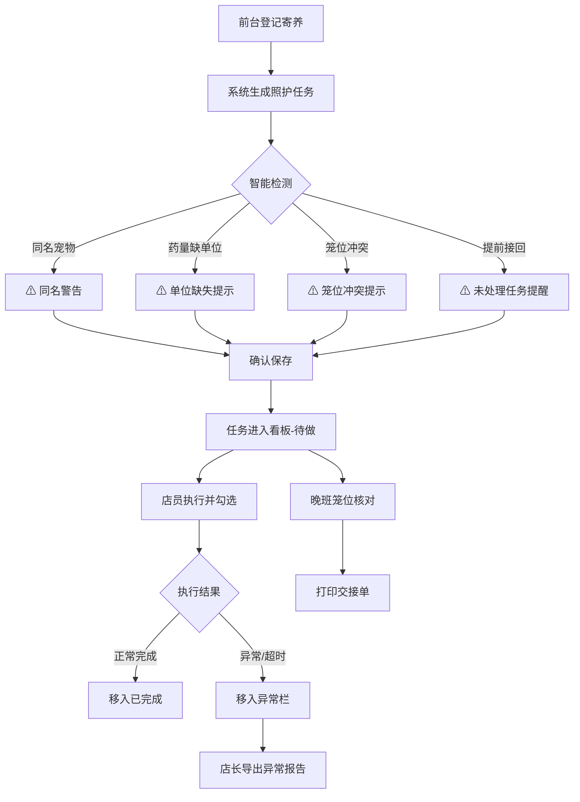

## 1. 产品概述

宠物店节假日寄养喂药管理系统——解决前台手工笼卡容易遗漏喂药、喂食、遛放等照护任务的问题。面向宠物店前台、晚班店员和店长，提供寄养登记、任务看板、智能提示、笼位核对、打印交接和导出异常报告等全流程能力。

- 核心痛点：前台忙时漏记/漏做、同名宠物喂错药、笼位冲突、主人提前接回未处理
- 目标：零遗漏照护、安全喂药、顺畅交接

## 2. 核心功能

### 2.1 用户角色

| 角色 | 使用场景 | 核心权限 |
|------|----------|----------|
| 前台店员 | 登记寄养、录入任务、完成任务 | 登记/编辑/完成 |
| 晚班店员 | 按笼位核对任务、打印交接单 | 核对/完成/打印 |
| 店长 | 查看异常、导出报告 | 全部权限 + 导出 |

### 2.2 功能模块

1. **寄养登记页**：录入宠物信息、主人信息、笼位、喂食计划、喂药剂量、遛放时间、特殊备注
2. **任务看板页**：按今日待做、已完成、异常三栏分组展示照护任务
3. **笼位核对页**：按笼位分组展示任务，防止只看宠物名字喂错药
4. **交接与导出页**：打印交接单、导出异常/延迟照护事项

### 2.3 页面详情

| 页面名称 | 模块名称 | 功能描述 |
|----------|----------|----------|
| 寄养登记页 | 宠物信息录入 | 宠物名、种类、品种、年龄、体重、特征描述 |
| 寄养登记页 | 主人信息录入 | 主人姓名、手机号、预计接回日期 |
| 寄养登记页 | 笼位分配 | 笼位编号选择，冲突检测 |
| 寄养登记页 | 喂食计划 | 食物类型、份量、时间点、过敏食物标记 |
| 寄养登记页 | 喂药计划 | 药品名、剂量（含单位校验）、频次、时间点 |
| 寄养登记页 | 遛放安排 | 遛放时间段、时长、特殊要求 |
| 寄养登记页 | 特殊备注 | 自由文本备注区 |
| 寄养登记页 | 智能提示 | 同名宠物警告、药量缺单位、笼位冲突、提前接回未处理 |
| 任务看板页 | 今日待做栏 | 按时间排序的待完成照护任务卡片 |
| 任务看板页 | 已完成栏 | 当日已完成任务，显示完成时间 |
| 任务看板页 | 异常栏 | 过期未做、药量异常、备注提醒等异常任务 |
| 任务看板页 | 任务操作 | 勾选完成、标记异常、快速查看详情 |
| 笼位核对页 | 笼位列表 | 按笼位分组展示所有在住宠物及任务 |
| 笼位核对页 | 核对模式 | 逐笼位逐项勾选核对，确保不遗漏 |
| 交接与导出页 | 交接单打印 | 生成当班交接单，包含待做/异常/备注 |
| 交接与导出页 | 异常导出 | 店长导出异常和被延迟照护事项为CSV |

## 3. 核心流程

1. **登记流程**：前台录入寄养信息 → 系统自动生成照护任务 → 智能提示冲突/异常 → 确认保存
2. **照护流程**：看板查看今日待做 → 按时执行 → 勾选完成 → 异常自动归入异常栏
3. **核对流程**：晚班店员切换笼位核对视图 → 按笼位逐项核对 → 确认无遗漏
4. **交接流程**：晚班生成交接单 → 打印 → 店长导出异常报告

## 4. 用户界面设计

### 4.1 设计风格

- **主色调**：暖棕 #8B6F47（温馨宠物店氛围）+ 薄荷绿 #4CAF7D（健康/护理感）
- **辅色**：警告琥珀 #E8A838、危险红 #D9534F、背景暖灰 #FAF8F5
- **按钮风格**：圆角 8px，轻微阴影，hover 时微微上浮
- **字体**：标题用 Noto Serif SC（有品质感），正文用 Noto Sans SC（清晰易读）
- **布局风格**：左侧导航 + 右侧内容区，卡片式布局
- **图标风格**：Lucide 线性图标，搭配少量宠物 emoji 点缀

### 4.2 页面设计概览

| 页面名称 | 模块名称 | UI元素 |
|----------|----------|--------|
| 寄养登记页 | 表单区域 | 分步卡片布局，左侧宠物头像占位，右侧表单分组（基础/喂食/喂药/遛放/备注） |
| 寄养登记页 | 提示条 | 页面顶部悬浮提示条，按严重程度分色（黄/红），可关闭 |
| 任务看板页 | 三栏看板 | 左"待做"(暖黄边框)、中"已完成"(绿色边框)、右"异常"(红色边框) |
| 任务看板页 | 任务卡片 | 宠物名+笼位号突出显示，任务类型标签，时间线，操作按钮 |
| 笼位核对页 | 笼位网格 | 笼位编号大号显示，宠物信息缩略，核对项清单式布局 |
| 笼位核对页 | 核对勾选 | 大号勾选框，核对进度条，全部核对后显示✓ |
| 交接与导出页 | 交接单预览 | A4排版预览，打印按钮，导出按钮 |

### 4.3 响应式设计

- 桌面优先（1280px+）：三栏看板 + 侧边导航
- 平板适配（768px-1279px）：看板变为纵向堆叠，导航收为汉堡菜单
- 手机适配（<768px）：单列视图，底部标签导航

### 4.4 数据持久化

- 所有数据使用 localStorage 存储，页面刷新不丢失
- 数据结构支持导入导出，方便备份
